# 多租户 RBAC 权限管理与全链路监控看板迭代方案

- **作者**：浩浩
- **创建时间**：2026-07-23
- **最新更新时间**：2026-07-27
- **版本号**：v1.4

---

## 一、Situation（背景/现状）

`zuo-ai-agent` 目前已经完成了知识库 RAG 检索、多候选模型熔断路由、智能流水线（改写/意图分类/多通道检索/重排序/Prompt 组装）等核心能力，并已经在 `trace/` 模块（`RagTraceRunDO`/`RagTraceNodeDO`，对应 `t_rag_trace_run`/`t_rag_trace_node`）里为流水线的每个阶段都记录了输入输出 JSON、耗时、状态，数据采集层已经就位。

但项目在以下三个方面处于"零基础设施"状态，与老大本轮提出的迭代需求存在明显落差：

1. **无任何用户/鉴权体系**：全仓库检索 `tenant\|userId\|user_id\|UserDO\|t_user` 均无命中；`pom.xml` 未引入任何鉴权框架（如 Sa-Token）相关依赖；所有实体的 `createdBy`/`updatedBy` 字段是硬编码字符串 `"system"`（`KnowledgeDocumentServiceImpl.java:86-87,123`、`KnowledgeBaseServiceImpl.java:60-61,93,115`），没有真实用户上下文。
2. **无租户/数据隔离概念**：`t_knowledge_base`、`t_knowledge_document`、`t_chat_memory` 等核心表均无归属字段，任何人传入任意 `kbId`/`docId`/`conversationId` 都能读取。这一现状正是 `docs/代码问题扫描报告.md` 中被老大明确搁置的 **H4**（`CorsConfig` 的 `allowCredentials(true)` + `allowedOriginPatterns("*")` 组合过宽）与 **H5**（`conversationId`/`docId`/`kbId` 无归属校验，越权/IDOR 风险）的根因——没有用户/租户上下文，越权校验根本无从谈起。
3. **链路追踪数据"只采不用"**：`SmartRagPipeline` 已经把 rewrite/classify/retrieve/rerank/prompt 每个阶段的输入输出、耗时、状态都写入了 `t_rag_trace_run`/`t_rag_trace_node`，但项目里**没有任何 Controller 或统计查询接口**把这些数据暴露出来，也没有任何聚合统计（成功率、P95 耗时、错误率趋势等）。
4. **纯后端形态**：项目目前只有 Swagger UI / Knife4j 接口文档页面，没有任何前端工程，所有接口都只能通过 API 调用或调试工具验证。
5. **无工具调用/动作执行能力**：`pom.xml` 已引入 Spring AI 1.0.0（`spring-ai-starter-model-openai`/`spring-ai-alibaba-starter-dashscope` 等均锁定 1.0.0，原生支持 `@Tool` 注解与 `ToolCallback`/`FunctionCallback` 机制），但全仓库检索 `@Tool`/`ToolCallback`/`FunctionCallback` 均无命中——现有 `SmartRagPipeline`/`IntentClassifier`（`src/main/java/com/example/zuoaiagent/intent/service/IntentClassifier.java`）只能"理解问题、检索知识、生成回答"，理解意图之后无法触发任何真实的业务动作（如发起审批、修改数据）。这正是老大在评审"全局知识库"设计时进一步提出的**模块五**诉求的直接背景：把系统从"知识问答助手"升级为老大所说的"企业内部通用组件 Agent"。

老大在本轮提出的迭代需求（已澄清）覆盖五个方向：①用户登录鉴权 + 标准 RBAC（用户-角色-权限三层模型，不单独建"身份"实体）；②知识库、对话记录按用户/租户维度隔离；③全链路监控看板（从用户输入到重排结果的全流程统计）；④配套的 Vue3 前端页面（登录页、知识库管理页、对话聊天页、RBAC 用户/角色管理页、监控看板页，"全部都要规划进去"，允许分阶段实现但不能遗漏任何模块）；⑤**智能助手 Agent 化改造**——在讨论"全局知识库"设计时老大进一步提出的范围扩展，明确要求并入同一份文档，不单独出新文档（v1.2 新增，见本文档 3.2/3.3/3.4/4.5 的模块五相关内容）。

项目同时是老大的简历/面试作品集（`docs/简历版-项目介绍.md`、`docs/面试版-项目详解.md`），技术选型倾向"适度展示完整技术栈广度"，因此本方案在涉及具体选型的地方（登录态方案、多租户实现方式、预聚合策略、前端脚手架）均给出候选对比，而非直接拍板，最终选型留待老大在评审时确认。

本文档**仅覆盖**本轮五个模块的方案设计，**不包含**上一轮 `docs/知识库入库与对话记忆Redis改造执行计划.md` 中知识库入库异步化、对话记忆 Redis 化的具体实现（该方案仍在独立推进，两者互不影响，本方案中涉及知识库/对话记忆表结构的改动会明确标注"与上一轮方案的衔接点"，避免两份方案对同一张表做冲突设计）；也不包含扫描报告中 H4/H5 的具体修复动作本身——本方案只指出"RBAC + 租户基建落地后，H4/H5 自然具备了修复条件"这一关联，H4/H5 是否借本次一并修复、何时修复，仍由老大另行决定。

**v1.4 由来说明**：老大在评审过程中，参考了自己简历/面试作品集里另一个假想项目"智能销售数据分析 Agent"的项目描述（技术架构含 Spring Boot 3 + LangChain4j + Spring AI + PGVector + Redis + MinIO 等，亮点覆盖统一 Orchestrator-Worker 编排、ReAct 工具调用、向量+全文混合召回+RRF融合+Reranker精排、查询改写+HyDE多路召回、数据权限硬约束、短期+长期记忆体系、Agent工程化评测与成本治理七个方面），认为其中体现的**通用 Agent 工程能力**（而非销售业务本身）值得借鉴到 `zuo-ai-agent` 现有的"知识库问答 + 审批动作执行"场景上，从而进一步提升项目在 RAG 检索链路深度、记忆体系完整性、Agent 工程化评测能力方面的技术展示深度。老大已明确拍板两点边界（详见 3.5 GLOBAL-02）：①**不做销售业务域本身**，不新增订单/客户画像/跟进记录/客户洞察等销售数据表，不新增"销售 Worker"，只借鉴通用能力；②本次内容**并入本文档**，升级为 v1.4，不新建文档。因此 v1.4 在原有五个模块基础上，新增"模块六：RAG 检索链路增强""模块七：查询改写增强（HyDE 多路召回）""模块八：长期用户记忆体系""模块九：Agent 工程化评测与成本治理"四个模块，并对模块二/模块五的现有设计做了补充说明（数据权限收敛、知识库权限双重校验），详见 3.2/3.3/3.4/3.5/4.7~4.13。

## 二、Task（目标/待解决问题）

### 总体目标

在不破坏现有 RAG 核心链路的前提下，为项目补齐"用户登录鉴权 + 标准 RBAC 权限模型 + 租户级数据隔离 + 全链路监控看板 + 配套 Vue3 前端 + 智能助手 Agent 化改造"这六块能力，把项目从"单体验证型后端"升级为"具备完整企业级基座能力、且能理解意图并执行真实业务动作"的作品，同时保留技术选型上的可讨论空间供老大拍板。**v1.4 在此基础上进一步补齐"RAG 检索链路增强 + 查询改写增强(HyDE) + 长期用户记忆体系 + Agent 工程化评测与成本治理"四块通用 Agent 工程能力**（已排除销售业务域本身，见 3.5 GLOBAL-02），使项目在检索质量、记忆体系完整性、工程化评测三个维度上具备更完整的技术展示深度。

### 分模块目标

- **模块一（用户登录鉴权 + RBAC 权限体系）**：设计用户注册/登录、密码存储、登录态方案，落地标准 RBAC 五表（用户表、角色表、权限表、用户角色关联表、角色权限关联表），设计登录拦截层与方法级权限校验方式，为模块二、模块三提供"当前登录用户"这一最基础的上下文。
- **模块二（多租户数据隔离）**：设计租户模型、`tenant_id` 落地范围、租户上下文传递方式、MyBatis-Plus 层面的自动隔离方案，并给出存量数据迁移方案。
- **模块三（全链路监控看板 - 后端统计聚合层）**：基于已存在的 `trace/` 数据，设计统计聚合 API（成功率、P50/P95/P99 耗时、错误率趋势、调用量趋势等），评估是否需要给追踪表补充租户维度字段，评估实时查询 vs 定时预聚合的选型。
- **模块四（Vue3 前端工程）**：从零搭建 Vue3 前端工程，规划登录页、知识库管理页、对话聊天页、RBAC 管理页、监控看板页五大页面，明确每个页面依赖的后端接口与联调方案。
- **模块五（智能助手 Agent 化改造，v1.2 新增）**：在现有 `IntentClassifier` 基础上扩展"知识问答 vs 动作执行"意图维度、知识问答再细分检索范围（仅全局库 / 全局+个人库），基于 Spring AI 原生 `@Tool` 机制设计工具调用能力，落地模块一审批表的写入与多步骤链式衔接机制，把 Agent 从"一问一答"升级为"理解意图后能真正执行业务动作"的企业内部通用组件 Agent。
- **模块六（RAG 检索链路增强，v1.4 新增）**：在现有 `MultiChannelRetriever`（双通道均为向量检索）基础上补齐"向量+全文混合召回"，用 RRF 融合替代现有"优先级拼接去重"的合并方式，并在 `DocumentReranker` 之后新增置信度过滤与 Token 预算裁剪环节。
- **模块七（查询改写增强：HyDE 多路召回，v1.4 新增）**：在现有 `QueryRewriter`（单次改写）基础上扩展多路等价查询改写与假设文档（HyDE）生成，多路检索结果接入模块六的 RRF 机制做二次融合。
- **模块八（长期用户记忆体系，v1.4 新增）**：从对话中抽取用户偏好等结构化事实，构建独立于短期对话记忆（`docs/知识库入库与对话记忆Redis改造执行计划.md` 中 Redis 化的会话历史）的用户记忆文档，按路由决策注入 Prompt。
- **模块九（Agent 工程化评测与成本治理，v1.4 新增）**：设计评估 Harness（路由准确率、RAG 检索 Hit Rate/MRR）与 Token 埋点、成本治理机制，与模块三的监控看板形成互补而非重复。

按团队协作机制约定，本任务涉及 9 个独立模块（远超"≥2 个独立模块需先出需求文档"的门槛），因此本文档第三节按"需求策划汇总"格式产出，供小银后续拆分任务时直接引用；在 3.5 节悬而未决问题得到老大明确答复之前，不建议进入编码阶段。

---

## 三、需求策划汇总（职责二）

### 3.1 总体目标描述

一句话概括：给项目补上"谁在用、只能看自己租户的数据、每一次 RAG 调用效果如何被量化监控、能让人在浏览器里点开看到这一切、以及能听懂指令去真正执行一个业务动作"这五件事，同时保持技术选型的可讨论性，不预先替老大拍板。**v1.4 再补上"检索得更准、改写得更全、记得住用户长期偏好、评测与成本可量化治理"这四件事**（借鉴参考项目的通用 Agent 工程能力，不涉及销售业务域本身）。

### 3.2 模块划分、功能清单与任务状态

> 状态字段初始值统一为"等待"，由小银在任务调度阶段更新。

#### 模块一：用户登录鉴权 + RBAC 权限体系

| 序号 | 任务 | 状态 |
|---|---|---|
| 1-1 | 设计并建表：`t_user`（用户表，含密码哈希、状态、租户归属字段，字段设计与模块二联动，见 4.2.1） | 等待 |
| 1-2 | 设计并建表：`t_role`（角色表）、`t_permission`（权限表） | 等待 |
| 1-3 | 设计并建表：`t_user_role`（用户角色关联表）、`t_role_permission`（角色权限关联表） | 等待 |
| 1-4 | 实现注册接口（密码 BCrypt 加密存储） | 等待 |
| 1-5 | 实现登录接口，登录态采用 Sa-Token 标准模式（`StpUtil.login(userId)`，服务端存储 + Redis 持久化，见 4.1.2，已确认） | 等待 |
| 1-6 | 注册 Sa-Token 全局拦截器（`SaInterceptor`，校验登录态、解析当前用户注入上下文） | 等待 |
| 1-7 | 接入 Sa-Token 内置权限校验注解（`@SaCheckLogin`/`@SaCheckPermission`/`@SaCheckRole`，见 4.1.3，已确认），应用到现有 Controller | 等待 |
| 1-8 | 初始化种子数据：至少一个超级管理员角色 + 一批基础权限点（对应现有接口） | 等待 |
| 1-9 | 引入 Sa-Token 依赖并完成基础配置（`SaTokenConfig` 注册全局拦截器与白名单，见 4.1.1，已确认采用 Sa-Token），处理与现有 `CorsConfig` 的协同关系 | 等待 |

#### 模块二：多租户数据隔离

| 序号 | 任务 | 状态 |
|---|---|---|
| 2-1 | 建表：`t_tenant`（独立租户实体，已确认采用，见 4.2.2） | 等待 |
| 2-2 | `t_knowledge_base`、`t_knowledge_document`、`t_chat_memory`（及上一轮方案中规划的新表，已同步预留 `tenant_id`，见 `docs/知识库入库与对话记忆Redis改造执行计划.md` v1.1）新增 `tenant_id` 字段与索引 | 等待 |
| 2-3 | 设计租户上下文传递方案（ThreadLocal + Sa-Token 拦截器，见 4.2.3） | 等待 |
| 2-4 | 落地已确认的多租户隔离方案：MyBatis-Plus 官方 `TenantLineInnerInterceptor` 为主 + 对已知手写 SQL（`KnowledgeDocumentServiceImpl` 中 `jdbcTemplate` 直写文件字节部分）做专项排查补漏（已确认，见 3.5 已确认决策、4.2.4） | 等待 |
| 2-5 | 存量数据迁移方案：为已有数据分配默认租户（见 3.5 TENANT-04） | 等待 |
| 2-6 | 补充越权校验：结合模块一的用户上下文，对 `kbId`/`docId`/`conversationId` 等参数做归属校验（与 H5 的关联说明，见 4.2.5，不强制本轮修复） | 等待 |
| 2-7 | 补充设计说明（v1.4 新增）：明确"数据权限按角色层级收敛"与现有 `TenantContextHolder` 租户上下文 + Sa-Token 权限点体系的关系——本质已被模块一/二现有设计覆盖，不新增机制，仅补充文档说明，见 4.13 | 等待 |

#### 模块三：全链路监控看板（后端统计聚合层）

| 序号 | 任务 | 状态 |
|---|---|---|
| 3-1 | 设计统计聚合 API：总体成功率、各节点类型 P50/P95/P99 耗时、错误率趋势、调用量趋势，均支持 GLOBAL/TENANT/USER 三维度参数化查询（见 4.3.2） | 等待 |
| 3-2 | 为 `t_rag_trace_run`/`t_rag_trace_node` 新增 `tenant_id`/`user_id` 字段并支持三维度聚合查询（已确认，见 3.5 已确认决策、4.3.2） | 等待 |
| 3-3 | 落地已确认的 Phase 1 方案：后端实时查询 + 前端手动/自动刷新模式（已确认，见 3.5 已确认决策、4.3.3、4.4.3） | 等待 |
| 3-4 | 若后续切换为预聚合方案，设计预聚合表结构与定时任务（Phase 2，暂不启动） | 等待 |
| 3-5 | 新增看板查询 Controller/Service，接入模块一权限校验（看板数据是否需要单独的"监控查看"权限点，见 3.5 DASH-03） | 等待 |

#### 模块四：Vue3 前端工程

| 序号 | 任务 | 状态 |
|---|---|---|
| 4-1 | 前端工程脚手架初始化（Vue3 + Vite + 候选 UI 库，见 4.4.1） | 等待 |
| 4-2 | 登录页开发（依赖模块一 1-5 登录接口） | 等待 |
| 4-3 | 知识库管理页面开发（列表/创建/上传/详情，依赖现有知识库接口 + 模块二租户过滤） | 等待 |
| 4-4 | 对话聊天页面开发（依赖现有 `ChatController` SSE 流式接口 + 模块二租户过滤） | 等待 |
| 4-5 | RBAC 用户管理页面开发（依赖模块一用户管理接口，需新增，见 4.1.4） | 等待 |
| 4-6 | RBAC 角色/权限管理页面开发（依赖模块一角色/权限管理接口，需新增） | 等待 |
| 4-7 | 监控看板页面开发（依赖模块三统计聚合接口，图表库选型见 4.4.1；含维度选择器与刷新模式选择器，见 4.4.3） | 等待 |
| 4-8 | 前后端本地联调方案落地（Vite devServer 代理 `/api`，见 4.4.4） | 等待 |
| 4-9 | 审批列表/审批操作页面开发（依赖模块五新增 `ApplyController`，见模块五 5-8；已确认需要独立页面，见 3.5 AGENT-02，沿用 `web/src/views/apply/` 目录，具体交互细节待模块五链式衔接机制选型确定后可能调整，见 3.5 AGENT-04） | 等待 |

#### 模块五：智能助手 Agent 化改造（v1.2 新增）

| 序号 | 任务 | 状态 |
|---|---|---|
| 5-1 | 扩展 `IntentResult`（`intent/model/IntentResult.java`）与 `IntentClassifier` 分类逻辑，新增 `requestType`（KNOWLEDGE_QA/ACTION_EXECUTION）、`retrievalScope`（GLOBAL_ONLY/GLOBAL_AND_TENANT）字段与解析，见 4.5.2 | 等待 |
| 5-2 | 扩展分类 Prompt 模板 `prompts/intent-classify.st`，覆盖请求类型/检索范围的判定说明与输出格式约束 | 等待 |
| 5-3 | 新增 `AgentToolService`（`@Tool` 方法：`applyTenant`/`applyRolePermission`），接入 Spring AI 工具调用机制，见 4.5.3 | 等待 |
| 5-4 | 新增 `AgentOrchestrator`（动作执行链路编排：意图判定 → 二次确认 → 调用 Tool → 返回受理结果），见 4.5.3 | 等待 |
| 5-5 | 建表：`t_tenant_apply`（租户开通申请表）、`t_role_apply`（角色权限申请表，审批人=平台管理员），见 4.5.4 | 等待 |
| 5-6 | `MultiChannelRetriever` 按 `retrievalScope` 补充检索过滤条件（依赖模块二租户上下文 + 模块二"知识库访问授权表" `t_knowledge_base_access`，已确认采用授权表+申请单模型，见 4.5.2） | 等待 |
| 5-7 | 选型并落地多步骤链式衔接机制（事件监听 / 定时轮询 / 组合方案），需同时支持"平台管理员审批触发"（`t_tenant_apply`/`t_role_apply`）与"资源 owner 审批触发"（`t_kb_access_apply`）两种审批人来源，见 4.5.5、3.5 AGENT-04 | 等待 |
| 5-8 | 新增审批操作接口 `ApplyController`（审批列表查询、通过/拒绝），接入模块一权限校验；审批人校验逻辑需区分平台管理员权限点与"当前用户是否为该知识库 owner" | 等待 |
| 5-9 | 风险缓解措施落地：动作型请求二次确认交互、检索范围过滤条件的专项单元测试，见 3.3 风险说明 | 等待 |
| 5-10 | 建表：`t_knowledge_base_access`（知识库访问授权表）、`t_kb_access_apply`（知识库访问申请表，审批人=知识库 owner），见 4.5.4 | 等待 |
| 5-11 | 新增 `AgentToolService.applyKnowledgeBaseAccess` 工具方法及"审批通过后自动重放原始查询"的衔接逻辑，见 4.5.3/4.5.6 | 等待 |
| 5-12 | 建表：`t_agent_action_policy`（动作策略配置表）、`t_action_policy_apply`（策略变更申请表，审批人=平台管理员），并新增对应 DO/Mapper/Service，见 4.5.8（已确认，v1.3 新增） | 等待 |
| 5-13 | `AgentOrchestrator` 调用 Tool 前新增策略判定逻辑（查询 `t_agent_action_policy` 判断是否命中 AUTO_EXECUTE，未命中默认 REQUIRE_APPROVAL），并复用 `ApplyController`/`ApplyApprovedListener` 事件驱动机制把"策略变更"接入第四种申请类型，见 4.5.8（已确认，v1.3 新增） | 等待 |
| 5-14 | 补充设计说明（v1.4 新增）：明确"编排入口"（`SmartRagPipeline` 调用 `MultiChannelRetriever` 前的 `requestType`/`retrievalScope` 判定）与"检索阶段"（`MultiChannelRetriever` 内部按授权表过滤）两层 KB 权限校验点的关系，避免遗漏中间层，见 4.13 | 等待 |
| 5-15 | 待 TECH-01 拍板后视选型结果执行（v1.4 新增，暂缓）：若确认引入 LangChain4j，评估 `AgentOrchestrator` 是否迁移到 LangChain4j Agent 编排或与现有 Spring AI `ChatClient` 方案共存，见 4.12 | 等待 |
| 5-16 | 待 ORCH-01 拍板后视选型结果执行（v1.4 新增，暂缓）：若确认需要，设计可插拔通用 Worker 注册机制（技术能力展示用途，不实现真实销售 Worker），见 4.13 | 等待 |

### 3.3 已知风险与异常情况说明

#### 模块六：RAG 检索链路增强（v1.4 新增）

| 序号 | 任务 | 状态 |
|---|---|---|
| 6-1 | 现状核对确认：`MultiChannelRetriever` 当前双通道均为向量相似度检索（全局 + 意图定向 kbId 过滤），合并方式为"意图定向结果优先 + 全局结果去重追加"，无 RRF、无全文检索通道，见 4.7 | 等待 |
| 6-2 | 全文检索通道技术选型（PostgreSQL `tsvector`/`tsquery` 原生全文检索 vs 引入 Elasticsearch，见 3.5 RAGENH-01、4.8.2） | 等待 |
| 6-3 | 实现全文检索通道，接入 `MultiChannelRetriever` 作为第三路并行检索（复用现有 `retrievalExecutor` 并行模式） | 等待 |
| 6-4 | 用 RRF（Reciprocal Rank Fusion）融合算法替换现有 `merge()` 的"优先级拼接去重"逻辑，融合向量（全局+定向）与全文两类通道的排名 | 等待 |
| 6-5 | 在 `DocumentReranker` 现有 LLM 打分基础上新增绝对置信度阈值过滤（区别于现有仅做 topK 截断，允许"检索质量差时返回空上下文"） | 等待 |
| 6-6 | 新增 Token 预算裁剪环节，在 `RAGPromptService.build()` 组装 Prompt 前按预算上限裁剪文档列表，避免上下文超限/成本失控 | 等待 |

#### 模块七：查询改写增强（HyDE 多路召回 + 二次 RRF 融合，v1.4 新增）

| 序号 | 任务 | 状态 |
|---|---|---|
| 7-1 | 现状核对确认：`QueryRewriter` 当前仅做单次改写（一次 LLM 调用，失败降级返回原始 query），无多路查询扩展、无 HyDE，见 4.7 | 等待 |
| 7-2 | 是否接受 HyDE 引入的额外 LLM 调用延迟/成本（见 3.5 HYDE-01） | 等待 |
| 7-3 | 扩展 `QueryRewriter`：新增生成 N 个等价查询改写（query expansion）与 1 个假设答案文档（HyDE）的能力 | 等待 |
| 7-4 | 多路查询（原始改写 + N 个等价改写 + HyDE 假设文档）分别接入模块六检索器并行检索，对多路结果做二次 RRF 融合 | 等待 |

#### 模块八：长期用户记忆体系（v1.4 新增）

| 序号 | 任务 | 状态 |
|---|---|---|
| 8-1 | 现状核对确认：`chatmemory/` 现有 `DbBasedChatMemory` 仅做会话内短期历史（`historyKeep` 默认 20 条）与摘要压缩，全仓库无任何长期用户偏好抽取迹象，见 4.7 | 等待 |
| 8-2 | 明确长期记忆与短期记忆（`docs/知识库入库与对话记忆Redis改造执行计划.md` 的 Redis 化改造）的边界与协作关系（已确认，见 3.5 MEMORY-01、4.10） | 等待 |
| 8-3 | 长期记忆存储与检索方式选型（结构化字段表 vs 向量化存入 PGVector 独立 collection，见 3.5 MEMORY-02） | 等待 |
| 8-4 | 建表/实现：用户记忆抽取服务（从对话中抽取偏好、默认区域、常用检索范围等结构化事实） | 等待 |
| 8-5 | `SmartRagPipeline` 按路由决策判断是否需要注入长期记忆到 system prompt，避免无关历史/偏好污染当前问题 | 等待 |

#### 模块九：Agent 工程化评测与成本治理（v1.4 新增）

| 序号 | 任务 | 状态 |
|---|---|---|
| 9-1 | 现状核对确认：`trace/`（`RagTraceRunDO`/`RagTraceNodeDO`）现有字段无 Token 用量、无成本统计、无 Hit Rate/MRR 评估集、无评测 Harness 迹象，见 4.7 | 等待 |
| 9-2 | 模块划分判断说明确认：评测 Harness 与成本治理是否独立成模块（已判断为独立模块九，理由见 4.11） | 等待 |
| 9-3 | Token 埋点：`RagTraceNodeDO` 新增 `promptTokens`/`completionTokens` 等字段，各 LLM 调用节点（rewrite/classify/rerank/HyDE/长期记忆抽取/最终生成）记录用量 | 等待 |
| 9-4 | 模块三看板新增 Token 消耗/成本统计维度（复用模块三已有的 `dimension`(GLOBAL/TENANT/USER) 参数化设计） | 等待 |
| 9-5 | 评估 Harness 落地范围选型：是否接入 CI 持续验证 / 是否需要人工标注评估数据集，还是仅做可手动跑批的最小闭环（见 3.5 EVAL-01） | 等待 |
| 9-6 | 构建评估数据集（问题—期望路由类型/期望命中文档 pairs），实现路由准确率、检索 Hit Rate、MRR 指标计算脚本/服务 | 等待 |
| 9-7 | 成本治理：结合 Redis 缓存（对相同/相似 query 的改写、分类结果做短期缓存）与模块六 Token 预算裁剪，降低重复 LLM 调用成本 | 等待 |


**模块一：用户登录鉴权 + RBAC**

- 项目当前是纯 API 服务，引入 Sa-Token 全局拦截器（`SaInterceptor`）后，如果配置为拦截所有路径，现有的 Swagger UI/Knife4j、健康检查等接口需要显式加入放行名单（拦截器 `excludePathPatterns` 或 `SaRouter` 路由匹配），否则会出现"改造后 Swagger 打不开"的回归问题，需要在实现阶段专门梳理白名单。
- Sa-Token 标准模式下，Token-Session 数据默认存储在内存，若不配置 `sa-token-redis-jackson` 持久化到 Redis，多实例部署会导致会话不共享（同一用户请求被路由到不同实例会出现"登录状态丢失"的假象）；本方案已确认复用上一轮方案即将引入的 Redis 基础设施做持久化存储，具体权衡见 4.1.2。若后续切换为 Sa-Token 的 JWT 插件模式，会退化为无状态方案，登出/强制下线等场景需要额外的黑名单机制。
- 现有 `MyMetaObjectHandler` 的 `createdBy`/`updatedBy` 目前完全没有被自动填充逻辑覆盖（是在各 ServiceImpl 里手写硬编码 `"system"`），引入真实用户上下文后，如果不同步把这些硬编码替换为"当前登录用户"，会出现"有了登录体系但审计字段仍然显示 system"的不一致现象，需要在编码阶段一并修正（这属于模块一落地的自然收尾项，不是新增范围）。
- 种子数据（超级管理员账号、初始密码）如果直接写入 SQL 脚本明文密码，会成为新的密钥泄漏风险点（参照扫描报告 H1 的教训），建议种子密码使用占位符 + 首次登录强制改密的方式处理，这属于通用安全实践，与鉴权框架选型无关。

**模块二：多租户数据隔离**

- "现有数据没有租户归属"是本模块最大的存量风险：`t_knowledge_base`/`t_knowledge_document`/`t_chat_memory` 里的所有历史记录在改造上线的一瞬间需要有一个明确的归属，否则新加的 `tenant_id NOT NULL` 约束会导致老数据无法通过校验、旧接口报错。必须在上线前完成一次性数据回填（如统一归到"默认租户"或"迁移管理员租户"），这本身是一次数据库迁移操作，需要给出回滚预案。
- 若选择 MyBatis-Plus 官方 `TenantLineInnerInterceptor` 做自动拼接，其原理是在 SQL 解析阶段自动追加 `WHERE tenant_id = ?` 条件，对**手写 SQL**（例如上一轮方案中可能出现的 `JdbcTemplate` 直接拼 SQL 场景，`KnowledgeDocumentServiceImpl` 当前就有 `jdbcTemplate` 直接写文件字节的操作）**不会自动生效**，需要逐一确认哪些数据访问路径绕过了 MyBatis-Plus 的 Mapper 层，这些路径必须手动补充租户过滤条件，否则会成为隔离漏洞。
- 租户上下文用 ThreadLocal 传递时，如果链路中存在异步执行（现有 `AsyncConfig` 线程池、`SmartRagPipeline` 内部虽然是同步调用但未来可能拆分异步阶段），ThreadLocal 不会自动传递到子线程，需要显式在提交异步任务时拷贝上下文（类似日志 MDC 的传递模式），否则异步阶段会丢失租户信息导致隔离失效或空指针。
- 多租户改造与"知识库/对话记忆 Redis 改造"（上一轮方案）在表结构层面有交叉：已确认由上一轮方案中的 `t_chat_message_raw`/`t_chat_message_compression` 两张新表提前预留 `tenant_id` 字段（已同步修订 `docs/知识库入库与对话记忆Redis改造执行计划.md` 至 v1.1，见该文档 4.2.2(c) 节），本方案落地时直接复用该字段即可，两轮方案无需再严格协调实施先后顺序。

**模块三：全链路监控看板**

- 若不做预聚合、每次看板刷新都对 `t_rag_trace_node` 做全表 `GROUP BY` 聚合，随着调用量增长（尤其是 `input_data`/`output_data` 是 TEXT 大字段）查询性能会明显下降，需要提前评估数据量级和看板刷新频率，决定是否需要预聚合表兜底（见 4.3.3）。
- 现有 `t_rag_trace_run`/`t_rag_trace_node` 没有租户/用户维度字段，如果模块二完成之前模块三先上线，看板只能做"全局统计"，无法按租户过滤；两个模块的实施顺序会直接影响看板功能的完整度，需要在路线图中明确先后关系（见 4.6 总体路线图）。
- `SmartRagPipeline` 目前对短路场景（命中系统/闲聊节点）只记录了 rewrite/classify 两个节点，没有 retrieve/rerank/prompt 节点，看板做"各节点耗时分布"统计时需要注意这批短路请求的节点覆盖不全，避免统计口径产生误导（例如"检索平均耗时"实际上只统计了走完整链路的请求，分母不含短路请求，这是符合预期的，但看板 UI 上需要有说明，避免被误读为数据缺失）。
- 看板数据可能暴露业务敏感信息（`t_rag_trace_node.input_data`/`output_data` 含用户原始问题和检索到的文档内容原文），看板功能本身也需要纳入模块一的权限体系，避免任意登录用户都能看到全平台所有用户的原始问题内容（是否需要脱敏或仅管理员可见，见 3.5 DASH-03）。

**模块四：Vue3 前端工程**

- 前端从零搭建，本身就是一块独立工作量（脚手架、路由、状态管理、请求封装、UI 组件库选型），不能低估其工期，尤其是 RBAC 管理页面（用户-角色-权限的三级联动配置界面）交互复杂度不低。
- 前端页面强依赖后端接口就绪：登录页依赖模块一、知识库/聊天页面的"按租户展示"依赖模块二、看板页面依赖模块三，如果后端接口设计和前端页面开发完全串行推进，整体周期会被拉得很长；建议采用"后端先出接口契约（OpenAPI/Swagger），前端基于契约 mock 先行开发，后端接口就绪后再联调替换"的并行模式，具体见 4.6 路线图。
- 开发环境跨域：后端 `context-path` 为 `/api`、端口 8123，且现有 `CorsConfig` 是 `allowedOriginPatterns("*")` + `allowCredentials(true)`，一旦引入真实登录态（Sa-Token Token 默认通过 Header 携带，也可切换为 Cookie 模式），CORS 配置需要重新审视是否要收紧到具体的前端开发/生产域名，这与 H4 问题的收尾时机也存在关联（见 4.2.5）。

**模块五：智能助手 Agent 化改造（v1.2 新增）**

- **Agent 误判用户意图导致误触发审批流程**：LLM 分类存在天然误判概率（现有 `IntentClassifier` 分类失败已有静默降级到 `unknown` 的先例），若把普通知识问答误判为动作执行、直接调用 Tool 写入审批记录，会产生大量垃圾申请记录、增加审批人负担，甚至可能被恶意诱导重复发起申请（类似 Prompt 注入风险）；反之若把动作执行误判为普通问答，则该做的事没有被执行。缓解措施：动作型请求在真正调用 Tool 前，先由 Agent 用自然语言向用户做一次二次确认（如"你是想申请开通一个名为 XXX 的租户吗？"），用户明确确认后才真正执行 Tool 调用；同时可在 Tool 内部对短时间内同一用户重复提交相同申请做去重限流。动作型请求是否分级、能否豁免部分低风险动作的问题已拍板确认（v1.3，见 3.5 已确认决策）：默认所有动作型请求仍全部走审批，新增"动作类型白名单/黑名单"配置机制（`t_agent_action_policy`）允许对特定动作类型例外配置为自动执行，且该配置本身的变更也需要走审批，具体设计见 4.5.8。
- **动作策略配置被误配置/滥用的风险（v1.3 新增）**：`t_agent_action_policy` 一旦被误将高风险动作类型（如租户开通、角色授权）配置为 `AUTO_EXECUTE`，会直接绕过人工审批、造成不可逆的业务变更，风险等级不亚于误判意图本身；缓解措施是"策略变更本身也是敏感操作，必须走审批"（`t_action_policy_apply`，审批人=平台管理员，与 `t_tenant_apply`/`t_role_apply` 同源，见 4.5.8），杜绝用户/租户自助绕过审批边界；同时约定"未匹配到任何策略记录时默认按 `REQUIRE_APPROVAL` 处理"这一安全兜底，避免因为漏配置策略而被意外当成自动放行。
- **多步骤链式衔接中间某一步被拒绝时的终止语义**：若 `t_tenant_apply` 被 REJECTED，不应也不会自动发起 `t_role_apply`（事件监听器只在 APPROVED 分支才编排下一步，REJECTED 分支只需把拒绝结果与理由回传/记录，不触发任何后续动作）；若 `t_role_apply` 或 `t_kb_access_apply` 被拒绝，同样只终止在当前这一步，不需要回滚上游已生效的申请（例如租户本身已审批通过并建好，只是角色权限没申请下来）。实现阶段需要明确"每一步拒绝只影响该步骤自身，不做上游回滚"这一终止语义，避免出现"角色申请被拒后误删除已建好租户"这类过度联动的错误实现。此外，`t_tenant_apply`/`t_role_apply` 的审批人是平台管理员，而 `t_kb_access_apply` 的审批人是资源 owner（`kb.createdBy` 对应的用户，见 4.5.4），链式衔接机制的事件监听器必须能根据申请单类型正确解析出"应该通知哪一类审批人"，如果审批人来源解析逻辑写死为"只查平台管理员"，会导致知识库访问申请永远没有人能审批。审批发生在用户可能已离线的情况下，最终结果如何回传给用户（站内信/WebSocket/下次登录展示）不在本轮设计范围，本轮先假设用户仍在同一对话会话或短期内会重新查看，若老大需要可作为模块五后续迭代方向。
- **全局知识库权限泄露风险**：本方案已确认采用"访问授权表 + 申请单"模型（`t_knowledge_base_access` + `t_kb_access_apply`，见 4.5.2/4.5.4），"设为全员可读"等价于 owner 主动插入一条 `grantee_type=ALL` 的授权记录，与原候选的 `is_public` 布尔标志位相比，过滤条件从简单的布尔判断变成了子查询（`tenant_id = ? OR kb_id IN (SELECT ... FROM t_knowledge_base_access WHERE ...)`），需要防范"技术类回答在生成过程中间接引用了非公开的租户私有知识"——例如检索阶段过滤条件写错（漏掉 `tenant_id` 判断、子查询条件拼接错误）导致 GLOBAL_ONLY 场景意外检索到未被授权的私有文档并被拼入 Prompt，会造成比"看不到"更严重的"看到了不该看的"跨租户信息泄露；同时新增了"owner 误操作插入 `grantee_type=ALL` 授权记录导致私有知识库意外全员可见"这一新风险点，需要在知识库管理页对"设为全员可读"这类操作也做二次确认（与 3.3 模块五第一条风险的"二次确认"缓解思路一致）。缓解措施：检索层过滤条件需要作为独立单元测试重点覆盖（分别验证 GLOBAL_ONLY 场景不返回任何未被 `grantee_type=ALL` 授权覆盖的私有文档、GLOBAL_AND_TENANT 场景只返回"当前租户 `tenant_id` 或已被授权访问"的文档），不能仅靠人工 Review 保证；Prompt 组装阶段建议保留文档来源标记（全局授权/租户私有/个人授权），便于排查泄露问题时溯源。

**模块六：RAG 检索链路增强（v1.4 新增）**

- **全文检索引入后与现有向量检索路径的过滤条件必须保持一致**：`MultiChannelRetriever` 现有的意图定向通道按 `kb_id` 过滤、模块五规划的 `retrievalScope` 过滤（全局授权表 `t_knowledge_base_access`）都是向量检索路径上的过滤逻辑；新增的全文检索通道（PostgreSQL `tsquery` 或 Elasticsearch）若不同步应用相同的租户/授权过滤条件，会出现"向量通道过滤严格、全文通道过滤宽松"的不一致，造成模块二/五已设计好的越权防护出现新的漏洞入口，实现阶段必须把过滤条件抽取为可复用的查询条件构造器，两个通道共用同一份过滤逻辑。
- **RRF 融合参数（如 `k` 值）需要实验调优**：RRF 公式 `score(d) = Σ 1/(k + rank_i(d))` 中的 `k` 值直接影响不同通道排名的融合效果，缺乏实际检索日志之前只能给出经验默认值（业界常见 `k=60`），上线后需要结合看板（模块三/模块九）的检索质量指标做调优，不是一次性拍板就能定型的参数。
- **置信度过滤可能导致"该有答案却返回空"的体验回退**：新增绝对分数阈值过滤后，如果阈值设置过高，会出现"文档其实相关但打分被压低、被误过滤"的情况，用户体验从"给出一个不太准的答案"变成"直接说不知道"，两种体验各有利弊，需要在实现阶段结合评估数据集（模块九）设定合理阈值，避免主观拍脑袋。

**模块七：查询改写增强 - HyDE 多路召回（v1.4 新增）**

- **延迟与成本显著增加**：HyDE 需要为每个用户问题额外生成假设答案（至少 1 次 LLM 调用），若再叠加 N 个等价查询改写，一次用户提问可能触发 `1(原改写) + 1(HyDE) + N(等价改写)` 次 LLM 调用外加对应的多路检索，链路总耗时和 Token 成本相对现状会成倍增加，是否接受这一取舍需要老大明确（见 3.5 HYDE-01），不能默认认为"效果更好就应该做"。
- **假设答案质量不稳定的风险**：HyDE 假设答案本身由 LLM 生成，如果 LLM 对该领域理解有偏差，生成的假设答案可能与真实相关文档语义偏离更远，反而拉低检索质量，属于 HyDE 方案本身的已知局限，需要靠模块九的评估 Harness 做 A/B 效果验证，而不是假设"引入即优化"。

**模块八：长期用户记忆体系（v1.4 新增）**

- **与短期记忆边界不清导致重复设计或相互污染的风险**：本模块与另一份《知识库入库与对话记忆Redis改造执行计划.md》中的"短期对话记忆 Redis 化"是两个不同层面的机制（已确认，见 3.5 MEMORY-01），若实现阶段没有清晰分层，可能出现"长期记忆表和短期 Redis 队列各自维护一份相似信息""该会话结束的短期上下文被误当作长期偏好持久化"等混淆，需要在编码阶段明确接口边界（例如长期记忆只在"会话结束"或"显式抽取触发点"写入，不参与短期消息队列的每条 `add()`）。
- **长期记忆误抽取/过时的风险**：从对话中自动抽取"用户偏好"本质上也是一次 LLM 推理，存在误判可能（如把一次性的临时说法误判为长期偏好持久化），且用户偏好可能随时间变化而未被更新，需要设计"记忆置信度"或"最近一次确认时间"这类元信息辅助判断是否仍然适用，避免过时记忆持续污染后续对话的 Prompt。

**模块九：Agent 工程化评测与成本治理（v1.4 新增）**

- **评估数据集维护成本容易被低估**：路由准确率、Hit Rate、MRR 等指标的计算依赖人工标注的"问题—期望结果"评估数据集，数据集本身需要持续维护（新增业务场景、修正标注错误），如果只做一次性评测就不再更新，评测结果会逐渐失去代表性，属于容易被低估的隐性工作量。
- **Token 埋点对现有链路的侵入性**：在 rewrite/classify/rerank/HyDE/长期记忆抽取/最终生成等多个节点补充 Token 用量记录，涉及修改现有 `SmartRagPipeline`、`RagTraceRecordService` 及各 LLM 调用点，需要确保埋点逻辑本身不引入新的性能开销或异常吞掉原有业务异常（埋点应放在业务逻辑之外，用 try-catch 包裹且失败不影响主链路，与现有 `traceService.finishNode` 失败降级模式保持一致）。

### 3.4 涉及的关键文件清单

**模块一：用户登录鉴权 + RBAC 权限体系**

| 文件 | 改动类型 |
|---|---|
| `pom.xml` | 修改（新增 `sa-token-spring-boot3-starter`；若采用 Redis 持久化会话，还需新增 `sa-token-redis-jackson`，可直接复用上一轮方案即将引入的 Redis 连接配置，见 4.1.2） |
| `src/main/resources/sql/user-rbac.sql`（新建） | 新增（`t_user`/`t_role`/`t_permission`/`t_user_role`/`t_role_permission` 建表脚本 + 种子数据） |
| 新增：`user/entity/UserDO.java`、`RoleDO.java`、`PermissionDO.java`、`UserRoleDO.java`、`RolePermissionDO.java` | 新增 |
| 新增：`user/mapper/*Mapper.java`（对应五张表） | 新增 |
| 新增：`user/service/UserService.java`、`RoleService.java`、`PermissionService.java` 及实现类 | 新增 |
| 新增：`user/controller/AuthController.java`（注册/登录/登出）、`UserController.java`、`RoleController.java`（RBAC 管理接口） | 新增 |
| 新增：`config/SaTokenConfig.java`（注册 Sa-Token 全局拦截器 `SaInterceptor`、配置白名单/放行路径） | 新增 |
| 新增：`security/CurrentUserContext.java`（当前登录用户上下文持有者，内部基于 `StpUtil.getLoginIdAsLong()`，供模块二租户上下文复用/组合） | 新增 |
| ~~自定义权限注解 + AOP 切面~~ | 不再需要——直接使用 Sa-Token 内置注解 `@SaCheckLogin`/`@SaCheckPermission`/`@SaCheckRole`，见 4.1.3（已确认） |
| `src/main/java/com/example/zuoaiagent/knowledge/service/impl/KnowledgeDocumentServiceImpl.java`、`KnowledgeBaseServiceImpl.java` | 修改（`createdBy`/`updatedBy` 由硬编码 `"system"` 改为读取当前登录用户） |
| `src/main/java/com/example/zuoaiagent/config/CorsConfig.java` | 视登录态方案可能修改（收紧跨域策略，具体是否本轮修改见 3.5） |

**模块二：多租户数据隔离**

| 文件 | 改动类型 |
|---|---|
| `src/main/resources/sql/tenant-migration.sql`（新建） | 新增（`t_tenant` 建表脚本 + `tenant_id` 列新增语句 + 存量数据默认租户回填脚本，已确认采用独立租户实体方案，见 4.2.2） |
| `src/main/resources/sql/knowledge.sql` | 修改（评估是否直接改现有脚本追加列，还是新建迁移脚本，避免破坏幂等的 `CREATE TABLE IF NOT EXISTS` 语义，建议新建独立迁移脚本） |
| `src/main/resources/sql/chat-memory.sql`（及上一轮方案中规划的新表脚本，若已存在） | 修改（新增 `tenant_id`） |
| `src/main/java/com/example/zuoaiagent/knowledge/entity/KnowledgeBaseDO.java`、`KnowledgeDocumentDO.java` | 修改（新增 `tenantId` 字段） |
| 新增：`tenant/context/TenantContextHolder.java`（ThreadLocal 持有者） | 新增 |
| 新增：`tenant/interceptor/TenantContextInterceptor.java`（HandlerInterceptor，从当前登录用户解析并写入租户上下文） | 新增 |
| `src/main/java/com/example/zuoaiagent/config/MybatisPlusConfig.java` | 修改（追加 `TenantLineInnerInterceptor` 配置，已确认采用官方插件方案，见 3.5 TENANT-03、4.2.4；看板统计查询需 `@InterceptorIgnore`，见 4.3.2） | 
| `src/main/java/com/example/zuoaiagent/config/AsyncConfig.java` | 修改（如涉及异步任务，需要装饰 `Runnable`/`Callable` 以传递租户上下文，参考 MDC 传递模式） |
| `src/main/java/com/example/zuoaiagent/knowledge/service/impl/KnowledgeDocumentServiceImpl.java`（`jdbcTemplate` 直写文件字节部分）、`controller/ChatController.java` | 修改（补充归属校验/租户过滤，与 H5 关联但不强制本轮完成，见 4.2.5） |

**模块三：全链路监控看板（后端）**

| 文件 | 改动类型 |
|---|---|
| `src/main/resources/sql/rag-trace.sql` | 修改（新增 `tenant_id`、`user_id` 两个字段，已确认，见 3.5 DASH-01、4.3.2；若后续切换预聚合方案还需新增预聚合表建表语句） |
| `src/main/java/com/example/zuoaiagent/trace/entity/RagTraceRunDO.java`、`RagTraceNodeDO.java` | 修改（新增 `tenantId`、`userId` 字段，已确认，见 4.3.2） |
| `src/main/java/com/example/zuoaiagent/trace/service/RagTraceRecordService.java`、`impl/RagTraceRecordServiceImpl.java` | 修改（写入时补充 `tenantId`/`userId`，已确认，见 4.3.2） |
| 新增：`trace/mapper/RagTraceStatMapper.java`（自定义聚合 SQL：P50/P95/P99、成功率、趋势，均支持按 `dimension`(GLOBAL/TENANT/USER) 拼接过滤条件，见 4.3.2） | 新增 |
| 新增：`trace/service/RagTraceStatService.java` 及实现类（统计聚合业务逻辑，接收 `dimension`/`tenantId`/`userId` 参数并做参数校验，见 4.3.2） | 新增 |
| 新增：`trace/controller/RagTraceStatController.java`（看板查询接口，统一暴露 `dimension`/`tenantId`/`userId` 参数） | 新增 |
| 新增：`trace/model/vo/*StatVO.java`（各类统计结果 VO，回包附带回显 `dimension`/`tenantId`/`userId`，便于前端联动展示当前查询范围） | 新增 |
| 若后续切换预聚合方案，新增：`trace/task/RagTraceAggregationJob.java`（定时任务，需评估是否引入 `@EnableScheduling` 或 XXL-Job 等；预聚合表需同步按 `dimension` 维度存储） | 新增 |

**模块四：Vue3 前端工程（作为当前后端仓库 `zuo-ai-agent` 内的 `web/` 子目录，不单独建仓库，已确认，见 3.5 WEB-01）**

| 文件/目录 | 改动类型 |
|---|---|
| `web/`（前端工程根目录：`package.json`、`vite.config.ts`、`src/` 等） | 新增（整体脚手架） |
| `web/src/views/login/` | 新增（登录页） |
| `web/src/views/knowledge/` | 新增（知识库列表/创建/上传/详情页） |
| `web/src/views/chat/` | 新增（对话聊天页，含 SSE 流式渲染） |
| `web/src/views/rbac/user/`、`rbac/role/` | 新增（用户管理、角色权限管理页） |
| `web/src/views/dashboard/` | 新增（监控看板页，图表组件） |
| `web/src/api/` | 新增（Axios 请求封装，按模块拆分 `auth.ts`/`knowledge.ts`/`chat.ts`/`rbac.ts`/`dashboard.ts`） |
| `web/src/router/` | 新增（路由 + 登录态路由守卫） |
| `web/src/store/`（Pinia） | 新增（用户登录态、权限点缓存；监控看板"刷新模式"状态——当前模式 manual/auto、自动刷新间隔配置，见 4.4.3） |
| `web/src/views/dashboard/components/RefreshModeSelector.vue`（v1.3 新增，已确认，见 4.4.3） | 新增（刷新模式选择器：手动刷新按钮 + 自动刷新间隔下拉选项） |
| `web/vite.config.ts` | 新增（开发代理配置，转发 `/api` 到 `http://localhost:8123`） |
| `web/src/views/apply/`（审批列表/审批操作页，已确认需要独立页面，见 3.5 AGENT-02；具体交互细节待模块五链式衔接机制选型确定后可能调整，见 3.5 AGENT-04） | 新增（配合模块五 `ApplyController`；需区分"平台管理员审批列表"与"资源 owner 审批列表"两个视图，见 4.5.4） |

**模块五：智能助手 Agent 化改造（v1.2 新增）**

| 文件 | 改动类型 |
|---|---|
| `src/main/java/com/example/zuoaiagent/intent/model/IntentResult.java` | 修改（新增 `requestType`(KNOWLEDGE_QA/ACTION_EXECUTION)、`retrievalScope`(GLOBAL_ONLY/GLOBAL_AND_TENANT) 字段） |
| `src/main/java/com/example/zuoaiagent/intent/service/IntentClassifier.java` | 修改（分类 Prompt 模板与解析逻辑扩展，覆盖新维度，见 4.5.2） |
| `src/main/resources/prompts/intent-classify.st` | 修改（补充请求类型/检索范围的判定说明与输出格式约束） |
| 新增：`agent/tool/AgentToolService.java`（`@Tool` 方法：`applyTenant`/`applyRolePermission`/`applyKnowledgeBaseAccess`） | 新增 |
| 新增：`agent/model/ApplyResultVO.java` | 新增 |
| `src/main/java/com/example/zuoaiagent/pipeline/SmartRagPipeline.java` | 修改（按 `requestType` 分流：知识问答走现有链路并按 `retrievalScope` 传参过滤，动作执行转入新增的工具调用链路，见 4.5.2/4.5.3） |
| 新增：`agent/service/AgentOrchestrator.java`（编排动作执行链路：意图判定 → 二次确认 → **查询 `t_agent_action_policy` 判定是否命中 AUTO_EXECUTE**（v1.3 新增，已确认） → 调用 Tool，见 4.5.3/4.5.8） | 新增 |
| `src/main/java/com/example/zuoaiagent/rag/MultiChannelRetriever.java` | 修改（检索条件按 `retrievalScope` 补充"`tenant_id = ?` 或命中 `t_knowledge_base_access` 授权记录"的过滤逻辑，已确认采用授权表+申请单模型，见 4.5.2） |
| `src/main/java/com/example/zuoaiagent/knowledge/entity/KnowledgeBaseDO.java` | 不修改（原候选 `isPublic` 布尔字段方案已废弃，全局/共享可见性改由独立的 `t_knowledge_base_access` 表表达，见 4.5.2；`createdBy` 字段在模块一改造为真实用户 ID 后可直接作为知识库 owner 标识） |
| `src/main/resources/sql/agent-apply.sql`（新建） | 新增（`t_tenant_apply`/`t_role_apply` 建表脚本，见 4.5.4） |
| `src/main/resources/sql/kb-access.sql`（新建） | 新增（`t_knowledge_base_access`/`t_kb_access_apply` 建表脚本，见 4.5.4） |
| 新增：`agent/entity/TenantApplyDO.java`、`RoleApplyDO.java`、`knowledge/entity/KnowledgeBaseAccessDO.java`、`knowledge/entity/KbAccessApplyDO.java` | 新增 |
| 新增：`agent/mapper/TenantApplyMapper.java`、`RoleApplyMapper.java`、`knowledge/mapper/KnowledgeBaseAccessMapper.java`、`knowledge/mapper/KbAccessApplyMapper.java` | 新增 |
| 新增：`agent/service/TenantApplyService.java`、`RoleApplyService.java`、`knowledge/service/KbAccessApplyService.java` 及实现类（含审批操作方法，审批人解析逻辑分别对应平台管理员与知识库 owner，见 4.5.4） | 新增 |
| `src/main/resources/sql/agent-action-policy.sql`（新建，v1.3 新增，已确认） | 新增（`t_agent_action_policy`/`t_action_policy_apply` 建表脚本，见 4.5.8） |
| 新增：`agent/entity/AgentActionPolicyDO.java`、`ActionPolicyApplyDO.java`（v1.3 新增） | 新增 |
| 新增：`agent/mapper/AgentActionPolicyMapper.java`、`ActionPolicyApplyMapper.java`（v1.3 新增） | 新增 |
| 新增：`agent/service/AgentActionPolicyService.java`、`ActionPolicyApplyService.java` 及实现类（含策略判定方法 `resolveMode(actionType, scopeType, scopeId)`、审批操作方法，审批人=平台管理员，见 4.5.8） | 新增 |
| 新增：`agent/controller/ApplyController.java`（审批列表查询、审批通过/拒绝接口，依赖模块一权限校验或"当前用户是否为 kb owner"校验；v1.3 新增第四种申请类型——策略变更申请 `t_action_policy_apply`，见 4.5.8） | 新增 |
| 新增：`agent/event/TenantApplyApprovedEvent.java`、`RoleApplyApprovedEvent.java`、`knowledge/event/KbAccessApplyApprovedEvent.java`、`agent/event/ActionPolicyApplyApprovedEvent.java`（v1.3 新增）、`agent/listener/ApplyApprovedListener.java`（`@TransactionalEventListener(phase = AFTER_COMMIT)`，推荐方案，见 4.5.5/3.5 AGENT-04；v1.3 新增策略变更审批通过分支，审批通过后写入/更新 `t_agent_action_policy`，见 4.5.8） | 新增 |
| 若采纳补偿轮询兜底，新增：`agent/task/ApplyCompensationJob.java` | 新增（视 3.5 AGENT-04 结论） |

**模块六：RAG 检索链路增强（v1.4 新增）**

| 文件 | 改动类型 |
|---|---|
| `src/main/java/com/example/zuoaiagent/rag/MultiChannelRetriever.java` | 修改（新增全文检索通道方法、`merge()` 替换为 RRF 融合算法，见 4.8） |
| `src/main/resources/sql/knowledge.sql` 或新建迁移脚本 | 修改（若采用 PostgreSQL 原生全文检索，新增 `tsvector` 列与 GIN 索引；若采用 Elasticsearch 方案则不改此文件，改为新增 ES 索引映射配置） |
| `src/main/java/com/example/zuoaiagent/rag/DocumentReranker.java` | 修改（新增绝对置信度阈值过滤参数，区别于现有仅做 topK 截断） |
| 新增：`rag/TokenBudgetTrimmer.java`（或类似命名，Token 预算裁剪组件） | 新增 |
| `src/main/java/com/example/zuoaiagent/prompt/RAGPromptService.java` | 修改（组装 Prompt 前接入 Token 预算裁剪结果） |
| `src/main/java/com/example/zuoaiagent/pipeline/SmartRagPipeline.java` | 修改（新增置信度过滤、Token 预算裁剪两个流水线阶段及对应 trace 埋点） |

**模块七：查询改写增强 - HyDE 多路召回（v1.4 新增）**

| 文件 | 改动类型 |
|---|---|
| `src/main/java/com/example/zuoaiagent/rag/QueryRewriter.java` | 修改（新增多路等价查询改写、HyDE 假设文档生成方法） |
| `src/main/resources/prompts/query-rewrite.st` | 修改或新增：`prompts/hyde-generate.st`（HyDE 假设答案生成模板） |
| `src/main/java/com/example/zuoaiagent/rag/MultiChannelRetriever.java` | 修改（支持多路查询并行检索，复用模块六的 RRF 融合逻辑做二次融合） |
| `src/main/java/com/example/zuoaiagent/pipeline/SmartRagPipeline.java` | 修改（改写阶段按开关决定是否启用多路改写+HyDE，见 3.5 HYDE-01） |

**模块八：长期用户记忆体系（v1.4 新增）**

| 文件 | 改动类型 |
|---|---|
| `src/main/resources/sql/user-memory.sql`（新建） | 新增（用户记忆文档表建表脚本，字段设计见 3.5 MEMORY-02 选型结论） |
| 新增：`memory/entity/UserMemoryProfileDO.java` | 新增 |
| 新增：`memory/mapper/UserMemoryProfileMapper.java` | 新增 |
| 新增：`memory/service/UserMemoryExtractionService.java`（从对话中抽取用户偏好等结构化事实）及实现类 | 新增 |
| `src/main/java/com/example/zuoaiagent/pipeline/SmartRagPipeline.java` | 修改（按路由决策判断是否注入长期记忆到 system prompt） |
| `src/main/java/com/example/zuoaiagent/prompt/RAGPromptService.java` | 修改（Prompt 模板支持可选的长期记忆片段拼装） |

**模块九：Agent 工程化评测与成本治理（v1.4 新增）**

| 文件 | 改动类型 |
|---|---|
| `src/main/resources/sql/rag-trace.sql` | 修改（新增 `prompt_tokens`/`completion_tokens` 等 Token 用量字段） |
| `src/main/java/com/example/zuoaiagent/trace/entity/RagTraceNodeDO.java` | 修改（新增 Token 用量字段） |
| `src/main/java/com/example/zuoaiagent/trace/service/RagTraceRecordService.java`、`impl/RagTraceRecordServiceImpl.java` | 修改（各 LLM 调用节点记录 Token 用量） |
| 新增：`trace/mapper/RagTraceStatMapper.java` 追加 Token/成本统计聚合方法（复用模块三已有 `dimension` 参数化设计） | 修改 |
| 新增：`eval/entity/EvalDatasetItemDO.java`（评估数据集条目：问题、期望路由类型、期望命中文档等） | 新增 |
| 新增：`eval/service/EvalHarnessService.java`（跑批计算路由准确率、Hit Rate、MRR）及实现类 | 新增 |
| 新增：`eval/controller/EvalHarnessController.java`（触发评测跑批、查询评测结果，见 3.5 EVAL-01 选型结论） | 新增 |


### 3.5 已确认决策与待老大确认的问题

> v1.0 版本共列出 12 个悬而未决问题。本次修订（v1.1）老大已就其中 4 项拍板（原 Q3/Q4/Q10/Q11），其中原 Q3（鉴权框架选型确定为 Sa-Token）的拍板同时联动解决了原 Q1（登录态方案）、原 Q2（方法级权限校验方式）——因为这两个问题本质上是"在 Spring Security 体系下如何选型"，选定 Sa-Token 后已经有了明确的默认做法，不再是需要老大二选一的开放问题。因此本次共确认 **6** 项（原 Q1/Q2/Q3/Q4/Q10/Q11），剩余 **6** 项待确认问题（原 Q5/Q6/Q7/Q8/Q9/Q12）重新编号为下表的 Q1-Q6。
>
> v1.2 版本因新增**模块五：智能助手 Agent 化改造**，本拟补充 4 项待确认问题，但其中"全局知识库实现方式"一项在起草过程中老大已直接拍板（采用"访问授权表 + 申请单"模型，不再是 `is_public` 标志位方案），因此实际新增 **3** 项待确认问题，延续本节已有编号顺序追加为 Q7-Q9，不改变 Q1-Q6 的既有编号与结论。截至 v1.2，待老大确认的问题共 **9** 项（Q1-Q9）。
>
> v1.3 版本老大就其中 **5** 项拍板确认：多租户隔离落地方式（原 3.5.2 表格中的 Q1，对应更早的 v1.0 原始 Q5，确认采用官方插件为主 + 手写 SQL 专项补漏）、看板多维度统计（原 Q3，对应 v1.0 原始 Q7，确认新增 `tenant_id`/`user_id` 并支持 GLOBAL/TENANT/USER 三维度聚合，见 4.3.2）、看板刷新模式（原 Q4，对应 v1.0 原始 Q8，确认 Phase 1 沿用后端实时查询 + 新增前端手动/自动刷新交互设计，见 4.4.3）、审批流是否需要独立 UI 页面（v1.2 新增问题，原表格中同样标注为 Q8，与上一条并非同一问题，确认需要独立页面）、动作型请求是否分风险等级（v1.2 新增问题，原表格中的 Q9，确认默认全部审批 + 可配置白名单/黑名单例外 + 白名单黑名单变更本身也需审批，见 4.5.8）。上述 5 项从待确认问题移入已确认决策，本次修订前待确认问题为 9 项，移出 5 项后剩余"存量数据归属策略""监控看板可见范围""本轮范围确认""模块五多步骤链式衔接机制选型"共 **4** 项。截至 v1.3，已确认决策累计 **12** 项，待老大确认的问题剩余 **4** 项。
>
> **自 v1.3 起，待确认问题改用模块前缀 + 固定序号编号，编号一旦分配不再随版本重排，避免跨版本编号复用造成混淆。历史版本中出现的 Qx 编号仅在该版本上下文中有效。** 前缀约定：模块一（用户登录鉴权+RBAC）用 `RBAC-`，模块二（多租户数据隔离）用 `TENANT-`，模块三（全链路监控看板）用 `DASH-`，模块四（Vue3 前端工程）用 `WEB-`，模块五（智能助手 Agent 化改造）用 `AGENT-`；不便归属到具体某个模块的问题（如"本轮范围确认"）单独使用 `GLOBAL-` 前缀。3.5.1 已确认决策、3.5.2 待确认问题均已按此规则重新编号（原 Qx 与新编号的对照关系见文档版本变更记录，此处不再逐条列出）。
>
> **v1.4 版本新增前缀**：模块六（RAG 检索链路增强）用 `RAGENH-`，模块七（查询改写增强/HyDE）用 `HYDE-`，模块八（长期用户记忆体系）用 `MEMORY-`，模块九（Agent 工程化评测与成本治理）用 `EVAL-`；不便归属到具体新模块、而是关于"是否引入某项技术/编排能力"的横向问题分别使用 `TECH-`（技术选型广度问题）与 `ORCH-`（编排层扩展点问题）前缀，均延续"编号一旦分配不再重排"的规则。v1.4 新增 **2** 项已确认决策（GLOBAL-02、MEMORY-01）与 **6** 项待确认问题（RAGENH-01、HYDE-01、MEMORY-02、EVAL-01、TECH-01、ORCH-01），截至 v1.4，已确认决策累计 **14** 项，待老大确认的问题合计 **10** 项（v1.3 遗留 4 项 + v1.4 新增 6 项）。

#### 3.5.1 已确认决策

| 编号 | 决策项 | 结论 |
|---|---|---|
| RBAC-01 | 鉴权框架选型 | 不使用 Spring Security，采用 **Sa-Token**（`dev33/sa-token`），见 4.1.1。 |
| RBAC-02 | 登录态方案 | 默认采用 Sa-Token **标准模式**（服务端 Token-Session 存储 + 复用上一轮方案的 Redis 做持久化）；如需彻底无状态，可后续切换 Sa-Token 的 `sa-token-jwt` 插件模式，见 4.1.2。 |
| RBAC-03 | 方法级权限校验方式 | 直接使用 Sa-Token 内置注解 `@SaCheckLogin`/`@SaCheckPermission`/`@SaCheckRole`，不再自定义注解 + AOP，见 4.1.3。 |
| TENANT-01 | 租户模型 | 采用**独立租户实体**（`t_tenant` 表），见 4.2.2。 |
| TENANT-02 | 与上一轮方案的协调方式 | 上一轮方案（`docs/知识库入库与对话记忆Redis改造执行计划.md`）中的 `t_chat_message_raw`/`t_chat_message_compression` 两张新表提前预留 `tenant_id` 字段（已同步修订该文档至 v1.1），两轮方案无需再严格约定实施先后顺序，可各自独立推进。 |
| WEB-01 | 前端仓库组织方式 | Vue3 前端工程放在当前后端仓库内的 `web/` 子目录，不单独建仓库，见 3.4/4.4.5。 |
| AGENT-01 | 全局知识库实现方式 | 放弃 `is_public` 布尔标志位方案，改为**访问授权表 + 申请单模型**：新增 `t_knowledge_base_access`（`kb_id`/`grantee_type`(ALL/TENANT/USER)/`grantee_id`/`granted_by`/`create_time`，"全员可读"等价于 owner 插入一条 `grantee_type=ALL` 的记录）+ `t_kb_access_apply`（访问申请单，审批人=知识库 owner，与 `t_tenant_apply`/`t_role_apply` 的"平台管理员审批"是两套不同的审批人来源），见 4.5.2/4.5.4。 |
| TENANT-03 | 多租户隔离落地方式（v1.3 拍板） | 采纳 4.2.4 节推荐方案：**MyBatis-Plus `TenantLineInnerInterceptor` 官方插件为主**，标准 Mapper 查询自动拼接 `tenant_id` 过滤条件；同时对已知手写 SQL（`KnowledgeDocumentServiceImpl` 中 `jdbcTemplate` 直写文件字节部分）做专项排查补漏，不再作为候选对比呈现，见 4.2.4。 |
| DASH-01 | 看板多维度统计（v1.3 拍板） | 确认给 `t_rag_trace_run`/`t_rag_trace_node` 新增 `tenant_id`、`user_id` 两个字段；看板统计接口统一支持 GLOBAL（全局）/TENANT（按租户）/USER（按用户）三个维度的参数化筛选汇总，具体接口设计见 4.3.2（已重新设计）。 |
| DASH-02 | 看板刷新模式（v1.3 拍板） | 后端 **Phase 1 仍采用实时查询**（不引入预聚合表，与原方案 4.3.3 结论一致）；新增**前端**"刷新模式"交互设计：手动模式（用户点击"刷新"按钮才重新拉取一次统计接口）+ 自动模式（用户可选择 1 分钟/5 分钟等自动刷新间隔，前端定时器按间隔重复调用同一接口），两种模式复用同一套后端实时查询接口，后端不需要新增能力，见 4.4.3。 |
| AGENT-02 | 审批流独立 UI 页面（v1.2 提出，v1.3 拍板） | 确认需要独立的审批列表/操作页面，沿用已规划的 4-9 任务与 `web/src/views/apply/` 目录，具体交互细节仍受链式衔接机制选型（见 3.5.2 AGENT-04）影响。 |
| AGENT-03 | 动作型请求风险分级与白名单/黑名单治理（v1.2 提出，v1.3 拍板） | 默认行为不变——所有动作型请求仍全部走审批，不直接生效；新增一套"动作类型白名单/黑名单"配置机制（`t_agent_action_policy`），允许对特定动作类型配置为 `AUTO_EXECUTE`（自动执行）或 `REQUIRE_APPROVAL`（需要审批），未匹配到任何策略记录时默认按 `REQUIRE_APPROVAL` 处理（安全兜底）；且**修改该白名单/黑名单配置本身也是敏感操作**，必须走审批（`t_action_policy_apply`，审批人=平台管理员，复用 `ApplyController`/`ApplyApprovedListener` 事件驱动机制作为第四种申请类型），不允许用户/租户自助修改，具体设计见 4.5.8。 |
| GLOBAL-02 | v1.4 迭代范围确认（老大已拍板） | 本次 v1.4 借鉴参考项目"智能销售数据分析 Agent"里体现的**通用 Agent 工程能力**（RAG 检索链路增强、查询改写增强、长期记忆体系、Agent 工程化评测与成本治理），**明确不做销售业务域本身**：不新增订单/客户画像/跟进记录/客户洞察等销售数据表，不新增"销售 Worker"；参考项目仅作为能力设计的灵感来源，不作为本项目的实现范围，见 Situation 一节"v1.4 由来说明"。 |
| MEMORY-01 | 长期用户记忆与短期对话记忆的关系（v1.4 新增，结构性说明） | 二者是**两个独立机制，互不冲突、不重复设计**：短期记忆对应《知识库入库与对话记忆Redis改造执行计划.md》中"Redis List 队列 + 分布式锁"的会话内历史存储（粒度=单次会话，随会话/压缩自然滚动），长期记忆对应本文档模块八新增的"用户偏好/画像抽取"（粒度=单个用户，跨会话持久，不随任何单次会话的压缩或清空而丢失）；两者的注入时机也不同——短期记忆是 `ChatMemory` 接口天然承载的每轮对话上下文，长期记忆是否注入由路由决策（`SmartRagPipeline` 判断当前问题是否需要用户偏好上下文）显式决定，不是每次请求都注入，详见 4.10。 |

#### 3.5.2 需要老大确认的悬而未决问题（模块前缀 + 固定序号）

| 编号 | 问题 | 说明 |
|---|---|---|
| TENANT-04 | 存量数据默认租户归属策略 | 现有 `t_knowledge_base`/`t_knowledge_document`/`t_chat_memory` 的历史数据，是统一归到一个新建的"默认/系统租户"，还是归到未来第一个注册的管理员账号名下？这决定了迁移脚本的具体写法和上线后老数据的可见性。 |
| DASH-03 | 监控看板的可见范围：是否需要单独的"监控查看"权限点，是否所有登录用户都能看到全平台数据 | 看板数据可能包含其他用户的原始问题、检索文档内容等敏感信息，如果不做权限隔离，普通用户登录后也能看到别人的提问内容，属于新的越权风险点，需要老大明确看板访问范围（仅管理员可见 / 每个用户只能看自己的调用记录 / 全平台公开）。这也与已确认的 GLOBAL/TENANT/USER 三维度统计（见 DASH-01、4.3.2）存在联动：例如是否允许普通用户自行切换到 GLOBAL 维度查看全平台数据。 |
| GLOBAL-01 | 本轮范围确认 | 确认本轮方案不包含扫描报告 H4/H5 的具体修复动作（只做关联说明）、不包含上一轮方案中知识库入库/对话记忆 Redis 化的具体实现，避免评审时误认为这些已经被本方案一并覆盖。 |
| AGENT-04 | 多步骤链式衔接机制选型（模块五） | 见 4.5.5 详细对比：①定时轮询扫描 APPROVED 状态触发下一步、②审批操作触发事件/回调由监听器编排下一步（本方案推荐，需配合 `@TransactionalEventListener(phase = AFTER_COMMIT)`）、③依赖用户重新发起对话触发。本方案推荐"②事件驱动为主 + ①低频轮询为补偿兜底"的组合方案；该机制需要同时支持"平台管理员审批触发"（`t_tenant_apply`/`t_role_apply`/`t_action_policy_apply`）与"资源 owner 审批触发"（`t_kb_access_apply`）两种审批人来源，最终选型及补偿轮询频率待老大确认。 |
| RAGENH-01 | 全文检索通道技术选型（模块六，v1.4 新增） | 候选：①PostgreSQL 原生全文检索（`tsvector`/`tsquery` + GIN 索引，零新增基础设施，与现有 PGVector 同库，实现成本低，但检索能力/分词质量弱于专业搜索引擎）；②引入 Elasticsearch（检索能力更强、生态成熟，但新增一套独立基础设施，本地开发/部署成本上升，且与现有 PostgreSQL 数据形成双写一致性问题）。详细对比见 4.8.2，最终选型待老大确认。 |
| HYDE-01 | 是否接受 HyDE 多路召回引入的额外延迟与成本（模块七，v1.4 新增） | HyDE + 多路等价查询改写会使单次提问的 LLM 调用次数与检索次数成倍增加（见 3.3 模块七风险说明），是否在当前项目阶段接受这一取舍（作为面试可讲述的技术深度亮点），还是仅做候选设计、暂不实现，需要老大权衡"技术展示价值"与"实际调用成本/延迟"后确认，见 4.9。 |
| MEMORY-02 | 长期用户记忆存储与检索方式选型（模块八，v1.4 新增） | 候选：①结构化字段表（`t_user_memory_profile`，`key-value` 或固定字段存储偏好，查询简单、可解释性强，但扩展新的偏好类型需要改表结构或退化为宽表）；②向量化存入 PGVector 独立 collection（把抽取出的用户记忆文本 embedding 后与知识库同库不同 collection 存储，可通过语义相似度召回相关记忆，扩展性更好，但引入了"记忆检索"这一新的检索链路，与知识库检索的关系需要理清）。详细对比见 4.10，最终选型待老大确认。 |
| EVAL-01 | Agent 工程化评测 Harness 的落地范围（模块九，v1.4 新增） | 是否需要真正接入 CI 做持续验证（每次代码变更自动跑一遍评估数据集、监控指标回归），还是仅做一个可手动触发的最小可跑通闭环（跑一次、看一次报告，作为面试展示素材）？前者工程量更大（需要维护评估数据集、CI 集成、指标阈值告警），后者更轻量但持续性弱，需要老大结合项目投入预期确认，见 4.11。 |
| TECH-01 | 是否引入 LangChain4j 做 ReAct Agent 编排（模块五扩展，v1.4 新增） | 现有模块五已用 Spring AI 原生 `@Tool`/`ChatClient` 设计工具调用编排（见 4.5.3）。是否额外引入 LangChain4j 展示"两套 Agent 框架对比"的技术广度，候选方案对比见 4.12，本方案不代为拍板，最终是否引入、引入后与现有 Spring AI 方案是替代还是共存，需要老大确认。 |
| ORCH-01 | 编排层是否需要设计可插拔通用 Worker 注册机制（模块五扩展，v1.4 新增） | 参考项目采用"规则路由 + 按场景串联多个 Worker"的 Orchestrator-Worker 模式，四类执行链路无硬编码流程控制；现有模块五的路由是 KNOWLEDGE_QA/ACTION_EXECUTION 两类，属于相对简单的分支判断。是否需要在不实现真实销售 Worker 的前提下，设计一个可插拔的通用 Worker 注册机制作为技术能力展示（例如定义统一 `AgentWorker` 接口，KNOWLEDGE_QA/ACTION_EXECUTION 各自实现为一个 Worker，编排层按路由结果动态查找并调用对应 Worker，而非 if-else 硬编码），需要老大确认是否值得投入这部分工程量，见 4.13。 |

---

## 四、Action（执行计划：现状分析与实现思路）

### 4.1 模块一：用户登录鉴权 + RBAC 权限体系

#### 4.1.1 技术选型：Sa-Token（已确认）

本方案已确认采用 **Sa-Token**（`dev33/sa-token`）作为登录鉴权框架，不再引入 Spring Security，此前"Spring Security 全家桶 vs 轻量自研"的候选对比已经完成拍板，不再作为开放问题呈现。选用理由：

- Sa-Token 是国内主流的轻量级 Java 权限认证框架，API 简洁：`StpUtil.login(loginId)`/`StpUtil.logout()`/`StpUtil.checkLogin()` 等静态方法开箱即用，配合 `@SaCheckLogin`/`@SaCheckPermission`/`@SaCheckRole` 注解即可完成登录校验与权限校验，相比 Spring Security 的过滤链 + `AuthenticationManager` 体系，配置更轻量、接入成本更低。
- 虽然国际知名度不及 Spring Security，但在国内技术社区（掘金、Gitee、各类中后台脚手架）讨论度和使用率很高，在简历/面试中依然具备一定的认可度和可讲述性（可讲"注解式鉴权原理"、"Token-Session 双端分离设计"等）。
- 内置支持以 Redis 作为 Token-Session 的存储介质（`sa-token-redis-jackson`），可以和上一轮方案（`docs/知识库入库与对话记忆Redis改造执行计划.md`）即将引入的 Redis 基础设施复用同一套连接配置，做登录会话/Token 的分布式存储，不需要为鉴权单独引入新的中间件依赖。
- 相比"轻量自研"方案，Sa-Token 已经把权限注解体系、路由拦截、会话管理这些基础设施实现好了，不需要再从零写 JWT 过滤器、AOP 切面，降低了本项目当前"零安全框架基础"下的接入成本和踩坑面。

#### 4.1.2 登录态方案：Sa-Token 标准模式（已确认）

Sa-Token 默认采用**服务端维护 Token-Session 映射**的模式：本质上类似增强版 Session（服务端保存登录状态），但通过 Token（而非 Cookie）在前后端之间传递，天然适合前后端分离架构。Sa-Token 同时提供可选的 JWT 集成插件（`sa-token-jwt`），可以切换为完全无状态的 JWT 模式。

本方案默认推荐 **Sa-Token 标准模式**（服务端存储 + 复用上一轮方案引入的 Redis 做持久化，保证多实例部署下会话共享），主要理由：

- 同时具备"服务端可主动使当前会话失效"（`StpUtil.logout(loginId)`/`StpUtil.kickout(loginId)` 可直接踢人下线、强制登出）与"通过 Token 而非 Cookie 传递、规避跨域 Cookie 复杂性"两方面优点，不需要在 JWT 无状态与 Session 有状态之间二选一牺牲某一方的优点。
- 依赖上一轮方案即将引入的 Redis 做持久化，不新增基础设施负担。

备注：若老大后续需要彻底无状态方案，可以直接切换到 Sa-Token 的 `sa-token-jwt` 插件模式，业务代码基本不用改动（仍然是 `StpUtil.login()`/`@SaCheckLogin` 这套 API），仅需切换底层实现方式，属于低成本的后续优化项，本轮不需要为此预先设计。

#### 4.1.3 方法级权限校验方式：Sa-Token 内置注解（已确认）

本方案已确认直接使用 Sa-Token 内置的注解体系：`@SaCheckLogin`（校验登录）、`@SaCheckPermission("kb:upload")`（校验权限点）、`@SaCheckRole("admin")`（校验角色），标注在 Controller 方法或类上即可生效。其原理是基于 AOP + 自定义注解，Sa-Token 框架本身已经实现好了这套切面逻辑，业务侧不需要像原方案里"自定义注解 + AOP"候选那样从零编写切面代码和异常处理——这是 Sa-Token 相比自研方案的现成优势。此前"`@PreAuthorize` vs 自定义注解"的候选对比已不再适用（Sa-Token 不依赖 Spring Security，因此没有 `@PreAuthorize`）。

权限点字典仍由 `t_permission` 表承担（见 4.1.4），`perm_code` 命名规范与覆盖范围不变。涉及"这条具体数据是否属于当前租户"的数据权限校验，仍放在模块二的租户拦截器里统一处理，不额外为此扩展 Sa-Token 注解体系。

#### 4.1.4 表结构设计草案（供哈吉聂细化字段类型与索引）

```
t_user（用户表）
  id BIGINT PK
  username VARCHAR(64) UNIQUE
  password VARCHAR(128)        -- BCrypt 哈希，非明文
  nickname VARCHAR(64)
  email VARCHAR(128)
  tenant_id BIGINT             -- 归属租户，与模块二联动，见 4.2.2
  status SMALLINT DEFAULT 1    -- 1=正常 0=禁用
  create_time / update_time / deleted

t_role（角色表）
  id BIGINT PK
  role_code VARCHAR(64) UNIQUE  -- 如 ADMIN / KB_MANAGER / VIEWER
  role_name VARCHAR(128)
  tenant_id BIGINT              -- 角色是否做租户级隔离（即不同租户可自定义角色），细节在编码阶段结合独立租户实体模型（已确认，见 4.2.2）细化
  create_time / update_time / deleted

t_permission（权限表）
  id BIGINT PK
  perm_code VARCHAR(128) UNIQUE -- 如 kb:create / kb:upload / chat:use / rbac:manage / dashboard:view
  perm_name VARCHAR(128)
  resource_type VARCHAR(32)     -- 如 MENU / API，便于前端菜单权限联动
  create_time / update_time / deleted

t_user_role（用户角色关联表）
  id BIGINT PK
  user_id BIGINT
  role_id BIGINT
  UNIQUE(user_id, role_id)

t_role_permission（角色权限关联表）
  id BIGINT PK
  role_id BIGINT
  permission_id BIGINT
  UNIQUE(role_id, permission_id)
```

`t_permission` 的 `perm_code` 建议按"模块:动作"的命名规范设计，需要覆盖现有接口（知识库增删改查/上传、对话聊天）以及本轮新增接口（RBAC 管理、看板查看），具体权限点清单建议在编码阶段结合最终接口列表逐一枚举，本方案先给出命名规范和覆盖范围。

#### 4.1.5 登录鉴权链路示意

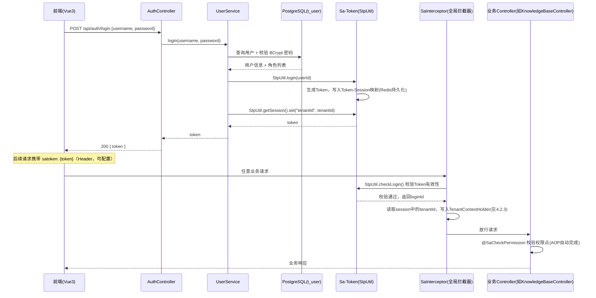

### 4.2 模块二：多租户数据隔离

#### 4.2.1 现状代码分析

`KnowledgeBaseDO`/`KnowledgeDocumentDO` 目前均无租户归属字段；`KnowledgeBaseServiceImpl`/`KnowledgeDocumentServiceImpl` 中 `createdBy`/`updatedBy` 硬编码为 `"system"`；`ChatController` 的 `conversationId` 完全由客户端传入，服务端不做任何归属校验（对应扫描报告 H5）。这意味着多租户改造不是"加一列就完事"，而是需要在查询链路的每一处入口补上过滤条件，否则加了字段也不会真正生效。

#### 4.2.2 租户模型：独立租户实体（已确认）

本方案已确认采用**独立租户实体**方案（`t_tenant` 表，`t_user.tenant_id` 指向租户，一个租户可有多个用户），此前"独立租户实体 vs 复用用户"的候选对比已经完成拍板，不再作为开放问题呈现。简要说明未选择"复用用户即租户"方案的原因：复用用户虽然实现成本更低（`tenant_id` 直接等于当前登录用户 ID，不需要额外的租户表和关联查询），但无法支持"同一租户下多个用户共享知识库"的团队协作场景，且会让"多租户"退化为普通的用户级隔离，与本轮需求的本意不完全贴合；独立租户实体更贴近真实企业级 SaaS 架构，也为后续可能的团队协作场景预留了扩展空间。

```
t_tenant（租户表）
  id BIGINT PK
  tenant_name VARCHAR(128)
  tenant_code VARCHAR(64) UNIQUE
  status SMALLINT DEFAULT 1
  create_time / update_time / deleted
```

#### 4.2.3 租户上下文传递方案

采用 **ThreadLocal + 拦截器** 的标准模式，与模块一的登录拦截天然衔接：

- Sa-Token 全局拦截器（`SaInterceptor`，模块一在 `SaTokenConfig` 中注册）完成登录校验后，通过 `StpUtil.getLoginIdAsLong()` 获取当前登录用户 ID；租户信息建议在登录时（`StpUtil.login(userId)` 之后）通过 `StpUtil.getSession().set("tenantId", tenantId)` 一并写入 Sa-Token 会话，避免每次请求都查库。业务侧可以在同一个拦截器（或紧随其后执行的一个轻量 `HandlerInterceptor`）里读取 `StpUtil.getSession().getLong("tenantId")`，写入 `TenantContextHolder`（基于 `ThreadLocal<Long>` 或 `InheritableThreadLocal`）。
- 每次请求处理完毕（`HandlerInterceptor#afterCompletion` 或 Filter 的 `finally` 块）必须清理 ThreadLocal，避免线程池复用导致的租户信息串号（这是 ThreadLocal 方案的经典陷阱，必须在实现阶段专门写测试验证）。
- 涉及异步执行的场景（现有 `AsyncConfig` 线程池提交的任务、未来 `SmartRagPipeline` 若拆分异步阶段），必须在任务提交前手动读取当前线程的租户上下文，包装进 `Runnable`/`Callable`，在异步线程内部重新 `set` 后执行、执行完 `remove`——这与日志框架的 MDC 跨线程传递是同一类问题，需要复用类似的"上下文快照 + 包装执行"模式，而不能假设 ThreadLocal 会自动传递。

#### 4.2.4 数据隔离落地方式：官方插件 vs 手动加条件（已确认采用官方插件方案，见 3.5 TENANT-03）

| 候选 | 优点 | 缺点 |
|---|---|---|
| **MyBatis-Plus `TenantLineInnerInterceptor`**（推荐） | 在 SQL 解析层自动为所有标准 Mapper 查询（`selectById`/`selectList`/`selectPage` 等）追加 `WHERE tenant_id = ?`，业务代码无感知，不会因为某个开发者忘记加条件而出现隔离漏洞；与现有 `MybatisPlusConfig` 里已经配置的 `PaginationInnerInterceptor` 是同一个拦截器链，接入成本低 | 仅对 MyBatis-Plus 生成的标准 SQL 生效，**对手写 SQL 不生效**——现有 `KnowledgeDocumentServiceImpl` 中用 `jdbcTemplate` 直接写文件字节到 `t_knowledge_document_file` 的部分（以及未来上一轮方案中可能出现的手写 SQL）必须单独排查并手动补充租户过滤，插件不会自动兜底；需要给不该被过滤的表（如 `t_role`/`t_permission` 若不做租户隔离）显式配置忽略表清单 |
| 手动在每个 Mapper 方法/查询条件里加 `tenant_id = #{tenantId}` | 实现直观，不依赖插件的隐式行为，排查问题时"所见即所得" | 依赖开发者自觉，接口数量增多后极易遗漏（本质上和当前 H5 问题的产生原因是同一类"依赖人工记得加校验"模式），维护成本随接口数量线性增长，且无法对遗漏做出编译期/框架层面的提示 |

本方案推荐 **官方插件为主 + 对已知手写 SQL 路径做专项排查补漏** 的组合方案：插件解决"绝大多数标准查询"的隔离问题，同时在方案交付清单里明确列出需要人工检查的手写 SQL 位置（当前已知至少一处：`KnowledgeDocumentServiceImpl` 里 `jdbcTemplate` 直写文件字节），避免"以为插件全覆盖了，实际有漏网之鱼"。该方案已确认采用（见 3.5 TENANT-03）。

#### 4.2.5 与 H4/H5 的关联说明（不作为本轮强制交付项）

本模块完成后，`ChatController`/`KnowledgeController` 等接口首次具备了"当前登录用户属于哪个租户"这一上下文，`conversationId`/`docId`/`kbId` 的归属校验（对应 H5）才第一次具备了实现基础——在此之前，即便想修复 H5，也没有"归属于谁"这个判断依据。同理，H4（CORS 配置过宽）的收紧也天然适合在引入真实登录态之后一并考虑（例如把 `allowedOriginPatterns("*")` 收紧为前端实际部署域名列表）。**但本方案不把 H4/H5 的具体修复动作纳入本轮强制交付范围**，仅在此处指出这层技术关联，是否借本轮顺带修复、修复到什么程度，由老大另行决定（对应 3.2 节 2-6 任务，状态为"等待"，具体是否执行需要老大确认）。

### 4.3 模块三：全链路监控看板（后端统计聚合层）

#### 4.3.1 现状复用说明

无需重新设计或重建数据采集：`SmartRagPipeline` 已经对 rewrite/classify/retrieve/rerank/prompt 五个阶段调用 `RagTraceRecordService.startNode`/`finishNode`，数据完整落在 `t_rag_trace_run`/`t_rag_trace_node`。本模块的核心新增工作量是"统计聚合查询层"，而不是数据采集本身。

#### 4.3.2 统计聚合 API 设计（已确认支持 GLOBAL/TENANT/USER 三维度，见 3.5 DASH-01，v1.3 修订）

老大已拍板：`t_rag_trace_run`/`t_rag_trace_node` 新增 `tenant_id`、`user_id` 两个字段，且看板统计接口需要支持"全局（GLOBAL）/按租户（TENANT）/按用户（USER）"三个维度的筛选汇总——这不是简单加字段就能满足的诉求，需要在接口参数设计上明确落地：

- 所有统计接口统一增加一个 `dimension` 参数（枚举：`GLOBAL`/`TENANT`/`USER`），并配合可选的 `tenantId`/`userId` 参数：
  - `dimension=GLOBAL`：不传 `tenantId`/`userId`，聚合 SQL 不追加任何维度过滤条件，直接对全表聚合，返回全平台汇总结果（面向管理员的全局视角）。
  - `dimension=TENANT`：必须传 `tenantId`，聚合 SQL 追加 `WHERE tenant_id = #{tenantId}` 条件，返回该租户维度的汇总结果。
  - `dimension=USER`：必须传 `userId`（可选再叠加 `tenantId` 做"某租户下某用户"的更细粒度组合查询），聚合 SQL 追加 `WHERE user_id = #{userId}`（叠加 `tenantId` 时再追加 `AND tenant_id = #{tenantId}`）条件，返回该用户维度的汇总结果。
  - 参数校验：`dimension=TENANT` 但未传 `tenantId`、或 `dimension=USER` 但未传 `userId`，接口层直接返回参数错误，不允许"选了维度却不给对应 ID"这类歧义请求；`RagTraceStatMapper` 的聚合 SQL 建议按 `dimension` 统一拼接过滤条件，而不是为三个维度各写一套独立 SQL，避免口径不一致。
  - 该维度机制需要模块二 `TenantLineInnerInterceptor` 显式忽略这批统计查询（`@InterceptorIgnore`），因为 GLOBAL/精确指定 `tenantId` 的查询逻辑由 `dimension` 参数自行控制，不能再被自动插件二次拼接 `tenant_id` 条件，否则会与 GLOBAL 维度"查全平台"的语义冲突。
- 该 `dimension` 参数对下述所有统计接口统一生效（保持 API 设计一致性，前端只需要在一处维护维度选择器组件即可驱动全部图表联动刷新）：
  - **总体概览**：指定维度范围内的总调用次数、整体成功率（`t_rag_trace_run.status = SUCCESS` 占比）、平均/P95 总耗时。
  - **节点耗时分布**：指定维度范围内按 `node_type`（REWRITE/CLASSIFY/RETRIEVE/RERANK/PROMPT）分组统计 P50/P95/P99 耗时（PostgreSQL 可用 `percentile_cont` 窗口函数直接在 SQL 层计算，无需应用层排序）。
  - **错误率趋势**：指定维度范围内按时间窗口（如按小时/按天）分组统计每个窗口内的成功/失败次数及错误率变化趋势，便于识别某次模型故障或熔断触发导致的批量失败（也可用于定位"某个租户/某个用户"专属的异常波动）。
  - **检索命中率/召回质量**：指定维度范围内基于 `retrieve` 节点的 `output_data`（含 `count` 字段）统计"零召回率"（检索到 0 篇文档的请求占比），作为知识库质量的间接指标；更精细的"检索是否真正命中了用户意图"这类质量评分，现有字段不足以支撑，如果老大需要，需要在 `finishNode` 调用处新增额外的质量打分字段（增量补充项，非本轮强制）。
  - **调用量趋势**：指定维度范围内按时间窗口统计 `t_rag_trace_run` 的调用量曲线，用于观察流量走势（GLOBAL 维度看整体流量趋势，TENANT/USER 维度看单一租户/用户的使用频次）。
- 这套三维度设计同时也是模块一权限体系与看板可见范围（见 3.5 DASH-03）的天然衔接点：例如后续若约定"租户管理员只能查看自己租户的 TENANT 维度数据、不能查 GLOBAL"，可以直接在 Controller 层结合当前登录用户角色对 `dimension`/`tenantId` 参数做二次校验，无需改动底层聚合 SQL 结构。

#### 4.3.3 实时查询 vs 定时预聚合（已确认 Phase 1 采用实时查询，见 3.5 DASH-02）

| 候选 | 优点 | 缺点 |
|---|---|---|
| **实时查询**（推荐作为 Phase 1） | 实现简单，数据永远最新，不需要额外的任务调度基础设施 | 每次看板刷新都对明细表做 `GROUP BY`/窗口函数聚合，`t_rag_trace_node` 的 `input_data`/`output_data` 是 TEXT 大字段，随着调用量增长，全表扫描的聚合查询会越来越慢；需要为聚合常用的过滤列（`node_type`、`create_time`、`tenant_id`、`user_id`）建好索引 |
| 定时预聚合表（如 `t_rag_trace_stat_hourly`，按小时/按天预先算好各项指标写入独立表） | 看板查询只读预聚合表，响应速度稳定，不受明细表数据量增长影响 | 需要引入定时任务调度（现有项目未使用 `@Scheduled`/XXL-Job 等），存在"预聚合窗口未到、数据还没算出来"的实时性滞后；需要设计预聚合表结构和补偿机制（如任务失败重跑），且预聚合表也需要同步按 `dimension`(GLOBAL/TENANT/USER) 预先分组存储，实现复杂度进一步上升 |

本方案已确认 **Phase 1 采用实时查询把看板功能跑通**（不引入预聚合表），验证统计口径和图表设计是否符合老大预期；等实际调用量增长到明细查询出现明显性能问题时，再考虑引入定时预聚合表作为 Phase 2 优化（不需要在功能验证阶段就过度设计）。与该决策配套的是**前端**新增的"刷新模式"交互设计（手动/自动刷新，见 4.4.3）——后端本身不因刷新模式的引入而新增任何能力，两种刷新模式调用的都是同一套本节实时查询接口。

#### 4.3.4 看板统计链路示意

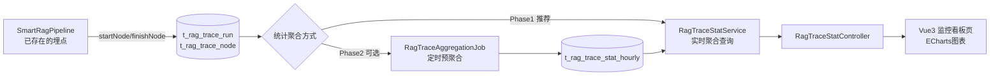

### 4.4 模块四：Vue3 前端工程

#### 4.4.1 技术栈选型

- **Vue3 + `<script setup>`**：已由老大明确指定，无需候选对比。
- **构建工具：Vite**：Vue3 官方推荐构建工具，冷启动和热更新速度远优于 Webpack，社区当前主流选择，无明显竞品需要对比。
- **UI 组件库候选**：

| 候选 | 优点 | 缺点 |
|---|---|---|
| **Element Plus**（推荐） | Vue3 生态最成熟的中后台组件库，表格/表单/弹窗等组件齐全，非常契合本项目"知识库管理/RBAC 管理/看板"这类中后台场景，中文文档完善 | 视觉风格偏"中后台系统"，若老大希望对话聊天页做得更有"C 端产品"质感，可能需要为聊天页单独定制样式而非直接套用组件库默认样式 |
| Ant Design Vue | 组件质量高，设计规范严谨 | 与 Element Plus 定位高度重合，生态成熟度在 Vue3 场景略逊于 Element Plus，无必要引入两套体系 |

- **图表库候选（用于监控看板）**：

| 候选 | 优点 | 缺点 |
|---|---|---|
| **ECharts**（推荐） | 功能最全面，折线图/柱状图/百分位分布图等看板所需图表类型全部支持，中文社区文档丰富，是国内中后台看板的事实标准 | 体积相对较大，但看板页面本身就是数据密集型页面，可接受 |

- **状态管理：Pinia**（Vue3 官方推荐，替代 Vuex，用于存储登录态、权限点缓存）。
- **HTTP 请求：Axios**，统一封装请求拦截器（自动携带 Sa-Token 的 `satoken` Header）和响应拦截器（统一处理 401 跳转登录页）。

#### 4.4.2 页面清单与依赖的后端接口

| 页面 | 依赖后端接口 | 依赖模块 |
|---|---|---|
| 登录页 | `POST /api/auth/login`、`POST /api/auth/register`（如需自助注册） | 模块一 |
| 知识库管理页（列表/创建/上传/详情） | 现有 `KnowledgeBaseController`（`/api/knowledge-base/*`）、`KnowledgeDocumentController`（`/api/knowledge-base/{kbId}/docs/*`），叠加模块二的租户过滤（同一接口，返回数据自动按当前租户过滤，前端无需感知） | 模块一（登录态）+ 模块二（租户过滤） |
| 对话聊天页 | 现有 `ChatController` 的 `/api/chat/stream/smart` 等 SSE 接口，叠加模块二的会话归属校验 | 模块一 + 模块二 |
| RBAC 用户管理页 | 模块一新增 `UserController`（用户增删改查、角色分配） | 模块一 |
| RBAC 角色/权限管理页 | 模块一新增 `RoleController`（角色增删改查、权限点分配） | 模块一 |
| 监控看板页 | 模块三新增 `RagTraceStatController`（概览/节点耗时分布/错误率趋势/调用量趋势，均带 `dimension`(GLOBAL/TENANT/USER) 参数，见 4.3.2）；页面需提供维度选择器 + 刷新模式选择器（手动/自动，见 4.4.3） | 模块一（登录态+权限点）+ 模块三 |
| 审批列表/审批操作页（v1.2 新增，已确认需要独立页面，见 3.5 AGENT-02；具体交互细节待模块五链式衔接机制选型确定后可能调整，见 3.5 AGENT-04） | 模块五新增 `ApplyController`（审批列表查询、通过/拒绝） | 模块一（登录态+权限点）+ 模块五 |

#### 4.4.3 看板刷新模式设计（前端交互，v1.3 新增，已确认，见 3.5 DASH-02）

该设计独立于模块三后端"实时查询 vs 定时预聚合"的选型（4.3.3 已确认 Phase 1 采用实时查询），是**纯前端交互层面**的补充：监控看板页在维度选择器之外，再提供一个"刷新模式"选择器，让用户自行决定统计数据以什么节奏更新，两种模式底层都调用同一套 4.3.2 节设计的后端实时查询接口，后端不需要为此新增任何能力：

- **手动模式（默认）**：页面展示当前已拉取到的数据快照（含"上次刷新时间"提示），用户需要点击"刷新"按钮，才会重新调用一次统计接口拉取最新数据。
- **自动模式**：用户可以从一组可配置的下拉选项中选择自动刷新间隔（如 1 分钟 / 5 分钟），前端用定时器（`setInterval`，页面卸载时清理）按选定间隔重复调用同一个统计接口，自动刷新图表。

两种模式的当前选择状态（`manual`/`auto`）与自动刷新间隔配置建议存放在 Pinia store 中（见 3.4 `web/src/store/`），便于看板页内的多个图表组件共享同一份刷新状态，而不是各图表各自维护一套定时器；切换维度（GLOBAL/TENANT/USER）与切换刷新模式是两个独立的交互维度，互不影响，用户可以任意组合（如"自动模式 + TENANT 维度，每 1 分钟刷新当前租户数据"）。

#### 4.4.4 本地开发联调方案

后端 `context-path` 为 `/api`、端口 8123（见 `application.yaml`）。前端本地开发建议使用 Vite 的 `server.proxy` 配置，将 `/api` 前缀的请求代理到 `http://localhost:8123`，开发环境下前端页面本身运行在 Vite 默认端口（如 5173），浏览器请求同源的 `/api/*` 由 Vite Dev Server 转发，从而在本地开发阶段完全规避跨域问题，不需要依赖后端 `CorsConfig` 放行。生产环境下，如果前后端分开部署（不同域名/端口），则需要依赖后端 `CorsConfig`（届时需要按 4.2.5 的说明收紧到实际前端部署域名）或者由 Nginx 反向代理统一域名对外提供服务（推荐生产环境采用 Nginx 统一域名方案，从根本上避免生产环境 CORS 问题，具体是否本轮一并规划 Nginx 部署方案，可在编码阶段视老大是否有生产部署计划再细化）。

由于前端工程现已确认落在后端仓库内的 `web/` 子目录（monorepo 结构，见 3.5.1），本地开发和联调方式不受影响；后续如需 CI/CD 或统一构建，可以简单在仓库根目录新增构建脚本分别触发 `mvn` 与 `web/` 下的 `npm run build`，前端产物是打包进 Spring Boot 的 `static/` 目录合并部署，还是独立产出静态资源交给 Nginx，属于后续部署阶段的细节，本方案不展开。

#### 4.4.5 前端工程初始化步骤（概要）

1. 在当前后端仓库 `zuo-ai-agent` 根目录下执行 `npm create vite@latest web -- --template vue-ts`（TypeScript 版本，与"技术栈广度展示"定位一致），在仓库内创建 `web/` 子目录作为前端工程根目录，不单独建仓库（已确认，见 3.5.1）。
2. 安装 Element Plus、ECharts、Pinia、Vue Router、Axios。
3. 搭建基础布局（登录页独立布局 + 登录后的侧边栏菜单布局，菜单项可结合模块一的权限点动态渲染，实现"无权限菜单不展示"）。
4. 封装 Axios 实例：请求拦截器自动携带 `Authorization: Bearer {token}`；响应拦截器统一处理 401（跳转登录页）和后端 `BaseResponse` 统一响应结构的解包。
5. 按模块四清单逐页开发，具体排期见 4.6 路线图。

### 4.5 模块五：智能助手 Agent 化改造（v1.2 新增）

#### 4.5.1 现状与目标

现状：`SmartRagPipeline` 目前的终点是"生成一段文本回答，通过 SSE 推送给用户"，`IntentClassifier` 只做了意图树叶子节点匹配 + 是否短路系统/闲聊两类判断（见 4.5.2 前置代码分析），全链路里没有任何一步能够"代表用户去执行一个真实的业务动作"。这意味着即便未来知识库/RBAC/多租户能力都落地，用户依然只能靠人工阅读回答、自己跑到别的页面手动操作（例如自己去 RBAC 管理页申请角色），Agent 本身没有"动手"的能力。

目标：在现有 RAG 主链路之外，为 Agent 新增"理解意图 → 调用工具/MCP 执行动作 → 写入模块一体系下的审批表 → 审批结果驱动下一步动作 → 结果回传用户"的完整闭环，把项目从"知识问答助手"升级为老大所说的"企业内部通用组件 Agent"；同时对现有知识问答场景做检索范围细分（仅全局库 / 全局+个人库），为"全局知识库"设计提供落地支撑。

本模块是老大在评审"全局知识库"设计时进一步提出的范围扩展，按团队协作机制约定并入同一份文档（不单独出新文档），因此对应内容已分别落在本文档 3.2（任务表）、3.3（风险说明）、3.4（关键文件清单）、3.5（已确认决策 AGENT-01/AGENT-02/AGENT-03，待确认问题 AGENT-04）与本节（详细设计）中，不改变文档整体 STAR 结构。

#### 4.5.2 意图分类扩展设计

在现有 `IntentClassifier`（`intent/service/IntentClassifier.java`，当前基于一次 LLM 调用 + `prompts/intent-classify.st` 模板，直接返回意图树叶子节点 ID 或 `-1` 表示闲聊，失败时静默降级为 `IntentResult.unknown()`）基础上，新增"请求类型"父维度，知识问答类请求再细分"检索范围"子维度：

| 请求类型（requestType） | 子类型 | 检索/执行范围（retrievalScope） | 示例 |
|---|---|---|---|
| 知识问答（KNOWLEDGE_QA） | 通用技术问题 | 仅全局知识库（GLOBAL_ONLY） | "Kafka 怎么配置" |
| 知识问答（KNOWLEDGE_QA） | 个人相关问题 | 全局知识库 + 当前租户知识库（GLOBAL_AND_TENANT） | "我之前那个方案是怎么写的" |
| 动作执行（ACTION_EXECUTION） | 权限/资源申请类 | 不检索，转入 4.5.3 工具调用链路 | "帮我申请一个新租户"、"帮我申请 xxx 权限"、"帮我申请 XX 知识库的访问权限" |

决策示意：

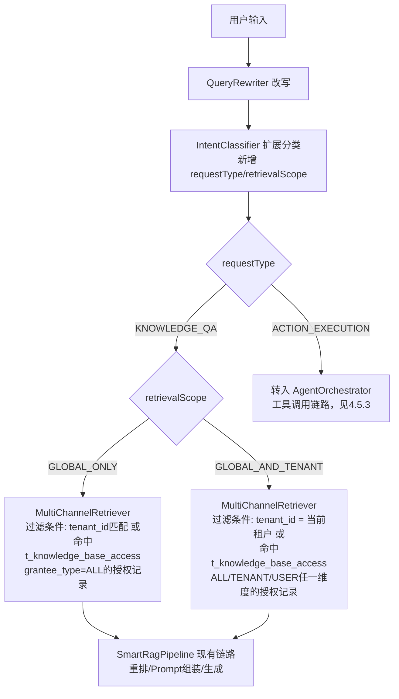

实现方式：建议在 `IntentClassifier` 现有的同一次 LLM 调用输出结构中一并要求返回 `requestType` 字段（而不是新增一次独立 LLM 调用增加延迟），`IntentResult`（`intent/model/IntentResult.java`）需要相应扩展 `requestType`/`retrievalScope` 两个新字段。解析失败时延续现有"静默降级"模式，降级后默认按 `KNOWLEDGE_QA` + `GLOBAL_ONLY` 处理（最保守范围，不会因分类失败而意外扩大到租户私有数据、也不会误触发动作执行）。

检索范围过滤条件落地在 `MultiChannelRetriever` 层，依赖两个前提：模块二的租户上下文（`TenantContextHolder`，见 4.2.3）与"知识库访问授权"信息。**全局知识库的实现方式老大已拍板确认，放弃原先候选的 `is_public` 布尔标志位方案，改为"访问授权表 + 申请单"模型**：新增 `t_knowledge_base_access` 表（`kb_id`/`grantee_type`（ALL/TENANT/USER）/`grantee_id`（`grantee_type=ALL` 时为空）/`granted_by`/`create_time`），owner 主动插入一条 `grantee_type=ALL` 的记录即等价于原来的 `is_public=true`，同时天然支持"只共享给某个租户"或"只共享给某个用户"这类更细粒度的授权（`is_public` 布尔方案做不到）。GLOBAL_ONLY 场景的过滤条件相应变为"命中 `grantee_type=ALL` 授权记录"，GLOBAL_AND_TENANT 场景则再叠加"当前 `tenant_id` 匹配 或 命中 `TENANT`/`USER` 维度的授权记录"，具体表结构与申请单设计见 4.5.4。

#### 4.5.3 工具调用能力设计

`pom.xml` 已锁定 Spring AI 1.0.0（`spring-ai-starter-model-openai`/`spring-ai-alibaba-starter-dashscope` 等），原生支持 `@Tool` 注解与 `ToolCallback`/`FunctionCallback` 机制，不需要为此新增依赖。落地要点：

- 现有链路里的 LLM 调用大多是直接 `ChatModel.call(new Prompt(...))`（如 `IntentClassifier`、`RoutingChatService` 内部），这种方式不会自动处理工具调用——Tool Calling 是 `ChatClient` 或显式向 `ChatOptions` 传入 `ToolCallback` 列表时才会触发的能力。因此"动作执行"链路建议新增一个独立的 `AgentOrchestrator` 服务，内部使用 `ChatClient.builder(chatModel).build()` 并通过 `.tools(agentToolService)` 注册工具 Bean，而不是直接复用现有那种"裸 `ChatModel.call`"调用方式——这是相对现有代码风格的新增模式，实现阶段需评估是否要把 `IntentClassifier`/`RoutingChatService` 也统一迁移到 `ChatClient`，还是让两套调用方式并存（分别服务于分类/生成 与 工具编排 两类不同场景）。
- 工具方法用 `@Tool(description = "...")` 标注在新增的 `AgentToolService` 组件里，入参用 `@ToolParam(description = "...")` 描述，Spring AI 会自动根据方法签名生成 JSON Schema 提供给 LLM，由 LLM 决定何时调用、传什么参数，调用结果会自动封装回传给 LLM 生成最终自然语言回复，不需要手写函数分发逻辑。
- **v1.3 新增（已确认）**：`AgentOrchestrator` 在"二次确认"通过、真正调用 Tool 之前，需要新增一步"动作策略判定"逻辑——查询 `t_agent_action_policy` 判断当前动作类型（`applyTenant`/`applyRolePermission`/`applyKnowledgeBaseAccess` 对应的 `action_type`）在当前作用域下是否命中 `AUTO_EXECUTE` 策略，命中则跳过二次确认阻塞、直接执行 Tool（或仅做最小化的一次提示，不阻塞主流程）；未命中（含没有任何匹配策略记录的默认情况）则走本节已有的"二次确认 + 写入审批表"流程。详细设计与判定流程图见 4.5.8。

示例方法签名：

```java
@Component
public class AgentToolService {

    @Tool(description = "为指定用户发起新租户开通申请，写入待审批记录，不会立即创建租户")
    public ApplyResultVO applyTenant(
            @ToolParam(description = "申请人用户ID") Long applicantUserId,
            @ToolParam(description = "拟开通的租户名称") String tenantName,
            @ToolParam(description = "申请理由，从用户对话中提取") String reason) {
        // 内部：写入 t_tenant_apply（status=PENDING），返回申请单号与受理提示文案
    }

    @Tool(description = "为指定租户申请角色权限，写入待审批记录，不会立即授予权限")
    public ApplyResultVO applyRolePermission(
            @ToolParam(description = "目标租户ID") Long tenantId,
            @ToolParam(description = "申请人用户ID") Long applicantUserId,
            @ToolParam(description = "申请的角色编码，如 ADMIN/KB_MANAGER") String roleCode,
            @ToolParam(description = "申请理由") String reason) {
        // 内部：写入 t_role_apply（status=PENDING），返回申请单号与受理提示文案
    }

    @Tool(description = "为指定用户申请指定知识库的访问权限，写入待审批记录，审批人是该知识库的 owner 而非平台管理员")
    public ApplyResultVO applyKnowledgeBaseAccess(
            @ToolParam(description = "目标知识库ID") Long kbId,
            @ToolParam(description = "申请人用户ID") Long applicantUserId,
            @ToolParam(description = "申请理由，从用户对话中提取") String reason) {
        // 内部：写入 t_kb_access_apply（status=PENDING），返回申请单号与受理提示文案
    }
}
```

三个工具方法内部都只做"写入待审批记录"这一件事，不直接修改 `t_tenant`/`t_user_role`/`t_knowledge_base_access` 等最终生效的数据——真正的租户创建、角色授予、知识库授权动作延后到审批通过之后才执行（见 4.5.4/4.5.5），这是为了保证"Agent 发起的操作必须经过人工审批才真正生效"这一安全边界，避免 Agent 误判后直接造成不可逆的业务变更。调用 Tool 之前的二次确认交互见 3.3 节风险说明。

#### 4.5.4 审批实体设计

```
t_tenant_apply（租户开通申请表）
  id BIGINT PK
  applicant_user_id BIGINT      -- 申请人，关联 t_user.id（模块一）
  tenant_name VARCHAR(128)      -- 拟开通的租户名称
  reason VARCHAR(512)           -- 申请理由（Agent 从用户对话中提取）
  status VARCHAR(32) DEFAULT 'PENDING'  -- PENDING/APPROVED/REJECTED
  approver_id BIGINT            -- 审批人，关联 t_user.id（模块一，具备平台管理员权限点的用户）
  approve_time TIMESTAMP
  reject_reason VARCHAR(512)
  create_time / update_time / deleted

t_role_apply（角色权限申请表）
  id BIGINT PK
  tenant_apply_id BIGINT        -- 若由链式衔接自动发起，关联触发它的 t_tenant_apply.id；用户直接发起的角色申请该字段为空
  tenant_id BIGINT              -- 目标租户，关联 t_tenant.id（模块二，租户申请审批通过后才会有值）
  applicant_user_id BIGINT      -- 申请人，关联 t_user.id（模块一）
  role_code VARCHAR(64)         -- 申请的角色编码，关联 t_role.role_code（模块一）
  reason VARCHAR(512)
  status VARCHAR(32) DEFAULT 'PENDING'  -- PENDING/APPROVED/REJECTED
  approver_id BIGINT            -- 审批人，关联 t_user.id（模块一，具备平台管理员权限点的用户）
  approve_time TIMESTAMP
  reject_reason VARCHAR(512)
  create_time / update_time / deleted

t_knowledge_base_access（知识库访问授权表，v1.2 拍板：全局知识库最终方案）
  id BIGINT PK
  kb_id BIGINT              -- 关联 t_knowledge_base.id
  grantee_type VARCHAR(16)  -- ALL/TENANT/USER，ALL 表示"全员可读"（等价于原候选 is_public=true）
  grantee_id BIGINT         -- grantee_type=TENANT 时为 t_tenant.id，=USER 时为 t_user.id，=ALL 时为空
  granted_by BIGINT         -- 发起授权的知识库 owner，关联 t_user.id
  create_time TIMESTAMP

t_kb_access_apply（知识库访问申请表，v1.2 拍板：全局知识库最终方案）
  id BIGINT PK
  kb_id BIGINT                   -- 目标知识库，关联 t_knowledge_base.id
  applicant_user_id BIGINT       -- 申请人，关联 t_user.id（模块一）
  applicant_tenant_id BIGINT     -- 申请人所属租户，关联 t_tenant.id（模块二，便于按租户维度授权）
  apply_reason VARCHAR(512)
  status VARCHAR(32) DEFAULT 'PENDING'  -- PENDING/APPROVED/REJECTED
  approver_id BIGINT             -- 审批人 = 该知识库 owner（见下方关键区分点），关联 t_user.id
  approve_time TIMESTAMP
  create_time / update_time / deleted
```

与模块一 RBAC 表的关联关系：`applicant_user_id`/`approver_id` 均指向 `t_user.id`；`t_role_apply.role_code` 指向 `t_role.role_code`；审批通过后的"落地动作"（真正 `INSERT t_tenant`、真正维护 `t_user_role`/`t_role_permission` 关联、真正 `INSERT t_knowledge_base_access`）由 4.5.5 节的链式衔接机制触发执行，`t_tenant_apply`/`t_role_apply`/`t_kb_access_apply` 本身只是过程记录，不是最终生效数据。此外，这三张申请表本身**不建议**被模块二的 `TenantLineInnerInterceptor` 自动按 `tenant_id` 过滤（需要配置 `@InterceptorIgnore`）——因为"申请开通新租户"这个动作发生在租户尚不存在或申请人可能跨租户申请的场景下，强行套用租户过滤会导致查询逻辑本末倒置。

**关键区分点（审批人来源不同）**：`t_tenant_apply`/`t_role_apply` 的审批人是具备相应权限点的**平台管理员**（`approver_id` 解析逻辑是"查询具备 `tenant:approve`/`role:approve` 等权限点的用户"），而 `t_kb_access_apply` 的审批人是**该知识库的 owner 本人**（`approver_id` 解析逻辑是 `approver = kb.createdBy` 对应的用户，`createdBy` 在模块一改造后指向真实创建人用户 ID），这是两套完全不同的审批人来源，实现阶段必须在 `ApplyController`/审批列表查询逻辑里分别处理，不能假设所有申请单都走同一套"查平台管理员"的审批人解析逻辑，否则知识库访问申请会因为找不到"平台管理员"而永远得不到审批。

#### 4.5.5 多步骤链式衔接机制：候选方案对比（待老大确认，见 3.5 AGENT-04）

该机制不仅要支持老大给出的"租户开通→角色权限"链路（审批人=平台管理员），也要支持"知识库访问申请"链路（审批人=资源 owner，见 4.5.4 关键区分点），因此下述候选方案的设计都需要按"申请单类型"解析出对应的下一步动作与审批人，而不能假设审批人来源单一。

| 候选 | 优点 | 缺点 |
|---|---|---|
| ①定时任务/轮询扫描 APPROVED 状态触发下一步 | 实现简单，与模块三若选定预聚合方案会引入的 `@Scheduled` 定时任务基础设施可复用同一套技术栈；即使进程重启，只要状态还停留在中间态，下次扫描仍能补上，天然具备"至少一次"的可靠性 | 存在轮询间隔导致的衔接延迟（用户体感"审批通过了但过了几分钟才看到角色申请被自动发起"）；随着申请记录增长，需要额外的"是否已衔接"标记字段和索引，否则会重复触发 |
| ②审批操作触发事件/回调，事件监听器编排下一步（本方案推荐） | 实时衔接，审批人点击"通过"的瞬间即触发下一步动作，用户体验最贴合老大原始诉求中"自动继续申请、无需用户重新开口"的描述；逻辑内聚在审批动作旁边，代码可读性好 | 需要正确处理事务边界（审批更新与事件发布不在同一事务提交后触发会读到脏数据，需用 `@TransactionalEventListener(phase = AFTER_COMMIT)`）；是"至多一次"语义，若监听器执行时抛异常或进程崩溃，链路会中断且不会自动重试，需要额外补偿机制兜底；若未来审批服务与 Agent 服务拆分为独立进程部署，需要引入消息队列（当前项目未引入任何 MQ 组件），属于新增技术栈 |
| ③依赖用户重新发起对话触发下一步 | 实现成本最低，不需要事件或定时任务基础设施 | 完全不满足老大原始诉求"审批通过后 Agent 自动继续申请角色权限，无需用户重新开口"的核心要求，仅作为兜底价值有限 |

本方案推荐**方案②（事件驱动）作为主链路 + 方案①（低频轮询）作为补偿兜底**的组合：事件驱动满足"自动、实时衔接"的核心诉求，补偿轮询解决事件驱动"至多一次、无重试"的可靠性缺口（类似支付回调 + 对账单的经典组合设计）。`ApplyApprovedListener` 需要按事件类型（`TenantApplyApprovedEvent`/`RoleApplyApprovedEvent`/`KbAccessApplyApprovedEvent`/`ActionPolicyApplyApprovedEvent`，v1.3 新增最后一种）分别编排各自的下一步动作与结果回传逻辑。是否采纳该组合方案、以及补偿轮询的扫描频率，最终选型待老大确认（见 3.5 AGENT-04）。

#### 4.5.6 完整链路示例

**示例一：申请租户 → 自动衔接申请角色权限（审批人=平台管理员）**

以老大给出的"申请一个新租户"完整示例还原如下：

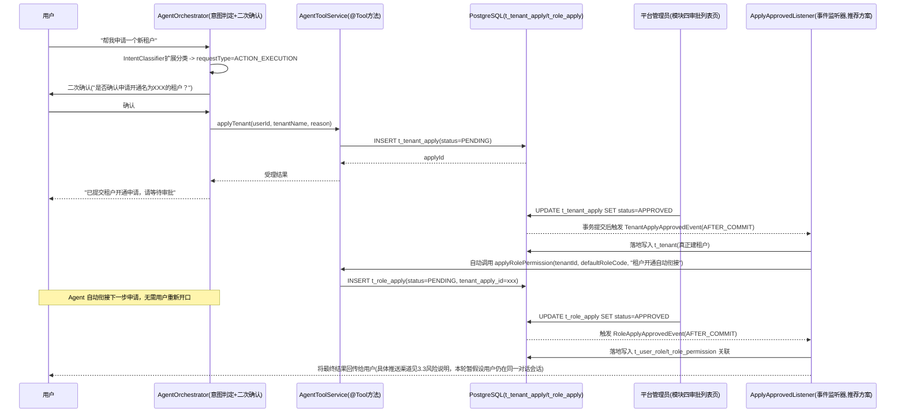

若中间任一环节被 REJECTED，链路在该步骤终止，不触发后续步骤，具体终止语义见 3.3 节风险说明。

**示例二：知识库访问申请 → 自动重放原始查询（审批人=资源 owner）**

与示例一的核心差异在于**审批人来源**——本示例的审批人是知识库 owner 本人，不是平台管理员（见 4.5.4 关键区分点），因此审批发生在"知识库管理页"而非"模块四统一审批列表页"（或审批列表页内单独区分出的"待我审批"视图，已确认需要独立页面见 3.5 AGENT-02，具体页面形态仍受链式衔接机制选型影响，见 3.5 AGENT-04）：

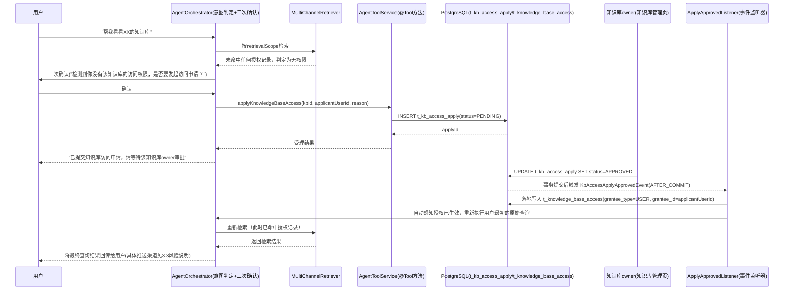

若 `t_kb_access_apply` 被 REJECTED，链路在该步骤终止，Agent 需将拒绝结果回传用户，不做重放查询，具体终止语义见 3.3 节风险说明。

#### 4.5.7 MCP 说明（技术路线取舍）

MCP（Model Context Protocol）是用于标准化 LLM 应用与外部工具/数据源之间连接的开放协议，Spring AI 生态也提供了 MCP Client/Server 适配（`spring-ai-mcp` 系列 starter，当前 `pom.xml` 尚未引入）。与本节采用的 Spring AI 原生 `@Tool`/`ToolCallback` 方案相比：

- `@Tool` 方案：工具与调用方（本项目自身的 Spring Boot 进程）强绑定，直接以 Java 方法形式暴露，适合"工具就是本项目自己的业务方法"这种场景（如本模块的申请租户/申请角色权限/申请知识库访问），接入成本最低，不需要额外进程/协议开销。
- MCP 方案：把工具能力封装成独立的 MCP Server 进程，可被任意支持 MCP 协议的客户端复用（不仅是本项目的 Agent，也可以是 Claude Desktop 等外部工具），适合"工具需要跨项目/跨团队共享"或"需要接入现成的第三方 MCP Server"（如社区已发布的文件系统、数据库、Git 等 MCP Server）的场景。

结论：本模块当前的三个 Tool（申请租户、申请角色权限、申请知识库访问）都强内聚于本项目自身业务逻辑，不存在跨项目复用或对接第三方现成 MCP Server 的需求，本轮推荐直接采用 Spring AI 原生 `@Tool` 方案落地；MCP 仅作为技术选型广度展示点在方案中提及，不纳入本轮实现范围。若后续项目需要对接外部系统（如企业内部已有的工单系统、OA 审批系统的 MCP Server），可再考虑引入 `spring-ai-mcp-client` 依赖。

#### 4.5.8 动作类型白名单/黑名单治理设计（v1.3 新增，已确认，见 3.5 AGENT-03）

**背景与默认行为不变**：3.3 节风险说明已指出，Agent 存在把普通知识问答误判为动作执行、进而误触发审批流程的风险；反过来，若所有动作型请求不做任何区分地"一刀切"走审批，未来动作种类增多后也会给低风险、高频动作（例如一些只读性质的查询类 Tool，若后续扩展）带来不必要的审批负担。老大就此拍板：**默认行为保持不变**——所有动作型请求依然全部写入待审批记录、不直接生效；在此基础上新增一套可配置的"动作类型白名单/黑名单"机制，允许对**特定**动作类型开例外，且这套配置机制本身的变更也是敏感操作，必须走审批，不允许用户/租户自助修改。

**表设计一：`t_agent_action_policy`（动作策略配置表）**

```
t_agent_action_policy（动作策略配置表）
  id BIGINT PK
  action_type VARCHAR(64)   -- 动作类型，如 TENANT_APPLY/ROLE_APPLY/KB_ACCESS_APPLY，对应 AgentToolService 的 applyTenant/applyRolePermission/applyKnowledgeBaseAccess 三个 @Tool 方法
  scope_type VARCHAR(16)    -- GLOBAL/TENANT，标识这是"全局默认策略"还是"某个租户的专属策略"
  scope_id BIGINT           -- scope_type=TENANT 时为 t_tenant.id；scope_type=GLOBAL 时为空
  mode VARCHAR(32)          -- AUTO_EXECUTE（自动执行，无需审批）/ REQUIRE_APPROVAL（需要审批）
  updated_by BIGINT         -- 最近一次变更该记录的用户，关联 t_user.id
  update_time TIMESTAMP
```

**安全兜底（务必明确）**：`AgentOrchestrator` 按 `action_type` + `scope_type`/`scope_id` 查询本表，**没有匹配到任何策略记录时，一律按 `REQUIRE_APPROVAL` 处理**——即"未配置 = 需要审批"，而不是"未配置 = 默认放行"，避免因为漏配置策略而被意外当成自动放行，这是本机制最关键的安全边界。查询优先级建议为"先查 `scope_type=TENANT` 且 `scope_id=当前租户` 的专属策略，未命中再查 `scope_type=GLOBAL` 的全局默认策略，仍未命中则按 `REQUIRE_APPROVAL` 兜底"。

**表设计二：`t_action_policy_apply`（策略变更申请表）**

```
t_action_policy_apply（策略变更申请表）
  id BIGINT PK
  applicant_user_id BIGINT   -- 申请人，关联 t_user.id（模块一）
  action_type VARCHAR(64)    -- 拟变更的动作类型
  scope_type VARCHAR(16)     -- GLOBAL/TENANT
  scope_id BIGINT            -- scope_type=TENANT 时为 t_tenant.id
  target_mode VARCHAR(32)    -- 申请把该动作类型改成 AUTO_EXECUTE 还是 REQUIRE_APPROVAL
  reason VARCHAR(512)
  status VARCHAR(32) DEFAULT 'PENDING'  -- PENDING/APPROVED/REJECTED
  approver_id BIGINT         -- 审批人 = 平台管理员，与 t_tenant_apply/t_role_apply 同源（"平台管理员审批"），区别于 t_kb_access_apply 的"资源 owner 审批"，见 4.5.4 关键区分点
  approve_time TIMESTAMP
  create_time TIMESTAMP
```

**审批通过后的落地动作**：与 4.5.4/4.5.5 的既有模式一致，`t_action_policy_apply` 本身只是过程记录，审批通过后由 `ApplyApprovedListener` 新增的 `ActionPolicyApplyApprovedEvent` 分支负责把结果写入/更新 `t_agent_action_policy`（若已存在匹配的 `action_type`+`scope_type`+`scope_id` 记录则更新 `mode`/`updated_by`/`update_time`，否则新建一条）。这套"策略变更本身需要审批"的设计**复用**文档已有的申请/审批基础设施（`ApplyController`、`ApplyApprovedListener` 事件驱动机制），作为**第四种申请类型**加入，不另起一套治理机制。

**`AgentOrchestrator` 判定流程**（在 4.5.3 已调用 Tool 前新增的一步）：

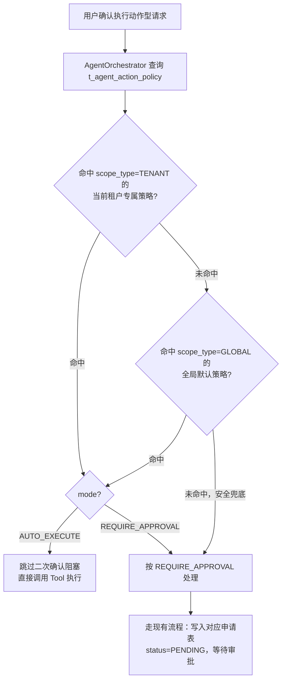

**风险提示**：见 3.3 节模块五风险说明新增条目——`t_agent_action_policy` 一旦被误配置（例如误将租户开通、角色授权这类高风险动作设为 `AUTO_EXECUTE`），会直接绕过人工审批造成不可逆变更，因此策略变更本身走审批是这套机制能够安全落地的前提，不能被简化或跳过。

### 4.6 总体路线图与模块依赖顺序

五个模块之间存在明确的强依赖关系，不能完全并行推进：模块二依赖模块一提供的"用户"概念（租户归属最终要挂在用户身上）；模块三的"按租户过滤看板"能力依赖模块二；模块四的每个页面都依赖对应后端模块的接口就绪；模块五依赖模块一提供的审批表基础（`t_tenant_apply`/`t_role_apply` 与 `t_user`/`t_role` 的关联）、模块二提供的租户隔离能力（检索范围过滤、`t_role_apply.tenant_id`）、以及现有 RAG 主链路（意图分类扩展是在 `IntentClassifier` 基础上做的增量修改），因此建议排在模块一/二之后启动。但也存在可以并行的部分：模块三的"数据采集"部分本来就已经完成，其"统计聚合层"的开发不强依赖模块一/二（可以先做"全局看板"，等模块二完成后再补充"按租户过滤"能力）；模块四的前端脚手架、登录页之外的页面骨架（路由、UI 布局）可以在后端接口没有完全就绪时基于契约先行开发。

**v1.4 新增模块六~九的依赖关系分析**（详细设计见 4.7~4.13）：

- **模块六（RAG 检索链路增强）**：不依赖模块一~五中的任何一个，只依赖现有 `MultiChannelRetriever`/`DocumentReranker`/`RAGPromptService`，可以与模块一~五完全并行、随时启动，是本轮新增模块中依赖最弱的一个。
- **模块七（查询改写增强/HyDE）**：依赖模块六（HyDE 多路召回的检索结果需要接入模块六的 RRF 融合逻辑做二次融合），建议排在模块六之后启动；不依赖模块一~五。
- **模块八（长期用户记忆体系）**：不直接依赖模块一~五，但与《知识库入库与对话记忆Redis改造执行计划.md》的"短期记忆 Redis 化"改造在概念上需要划清边界（已确认，见 3.5 MEMORY-01），若该方案与模块八同期实施，需要协调 `ChatMemory` 相关配置（`ChatClientConfig`）避免两边同时改动同一处装配代码产生冲突。
- **模块九（Agent 工程化评测与成本治理）**：Token 埋点部分依赖 `trace/` 现有表结构（与模块三共享同一批表，建议排在模块三"trace 表补充字段"阶段一并做迁移，避免同一张表被两个模块分两次加字段）；评估 Harness 部分（路由准确率评测）依赖模块五的意图分类扩展（`requestType`/`retrievalScope`）已经落地，否则"路由准确率"无从谈起；因此模块九建议拆分两条子线：Token 埋点可与模块三/六同期推进，评估 Harness 需要排在模块五之后。
- 模块六/七/八/九均**不依赖模块一（RBAC）、模块二（多租户隔离）**，可以视团队并发能力提前启动，不必等待整个 RBAC/租户基座落地——这与模块一~五"强依赖用户/租户基座"的特点形成对比，也是本轮新增模块相对独立、可以灵活插入排期的原因。

#### 阶段划分表

| 阶段 | 内容 | 依赖前置条件 | 可并行的工作 |
|---|---|---|---|
| **阶段 0：契约先行** | 明确模块一/二/三/五的接口契约（请求/响应结构），产出 OpenAPI/Swagger 文档草案 | 无（基于本方案 3.5 节问题得到老大答复后即可开始） | 模块四可基于契约草案启动脚手架搭建、路由骨架、UI 布局，无需等后端代码落地；**模块六（RAG 检索链路增强）不依赖本阶段，可随时并行启动** |
| **阶段 1：模块一落地** | 用户注册/登录、RBAC 五表、Sa-Token 接入与配置、登录拦截器、权限注解接入现有接口 | 阶段 0 契约确认 | 模块三的"全局看板"（不含租户过滤）统计聚合层可以并行开发，因为它只依赖已存在的 `trace/` 数据，不依赖模块一；**模块六、模块七（HyDE，依赖模块六）可并行推进** |
| **阶段 2：模块二落地** | 租户模型建表、`tenant_id` 落地、租户上下文拦截器、多租户插件接入、存量数据迁移 | 阶段 1 完成（需要"用户"实体已存在） | 模块四的登录页可以在阶段 1 后期开始联调；知识库/聊天页面的页面骨架可以先做，租户过滤生效后再联调验证；**模块八（长期用户记忆体系）可并行推进（需与模块二同期推进的短期记忆 Redis 化方案协调 `ChatMemory` 装配代码，避免冲突）** |
| **阶段 3：模块三补全** | `trace` 表已确认新增 `tenant_id`/`user_id`（见 3.5 DASH-01），看板接口按 4.3.2 设计增加 `dimension`/`tenantId`/`userId` 参数；**同期一并完成模块九的 Token 埋点字段迁移（复用同一次 `trace` 表结构变更）** | 阶段 2 完成 | 模块四的看板页面可以先用阶段 1 并行开发的"全局看板"（`dimension=GLOBAL`）接口联调基础图表，TENANT/USER 维度就绪后再补充筛选交互与刷新模式选择器（见 4.4.3） |
| **阶段 4：模块五落地** | 意图分类扩展、`AgentToolService`/`AgentOrchestrator`、`t_tenant_apply`/`t_role_apply` 建表、链式衔接机制、审批操作接口 | 阶段 1（审批表关联的用户/角色体系）+ 阶段 2（租户隔离与检索范围过滤）完成 | 模块四的审批列表页可以先做页面骨架，待 `ApplyController` 就绪后联调 |
| **阶段 5：模块九评估 Harness 落地** | 构建评估数据集、实现路由准确率/Hit Rate/MRR 计算，看板接入 Token/成本统计维度（v1.4 新增阶段） | 阶段 4 完成（依赖模块五 `requestType`/`retrievalScope` 已落地，否则路由准确率无法评测） | 成本治理（Redis 缓存改写/分类结果）可与本阶段并行 |
| **阶段 6：模块四收尾联调** | 知识库管理页、对话聊天页、RBAC 管理页、监控看板页、审批列表页全部与真实后端接口联调，替换 mock 数据 | 阶段 1/2/3/4/5 均完成 | - |

#### 里程碑甘特图（示意，非精确工期估算，具体人天由小银拆分任务时结合团队情况估算）

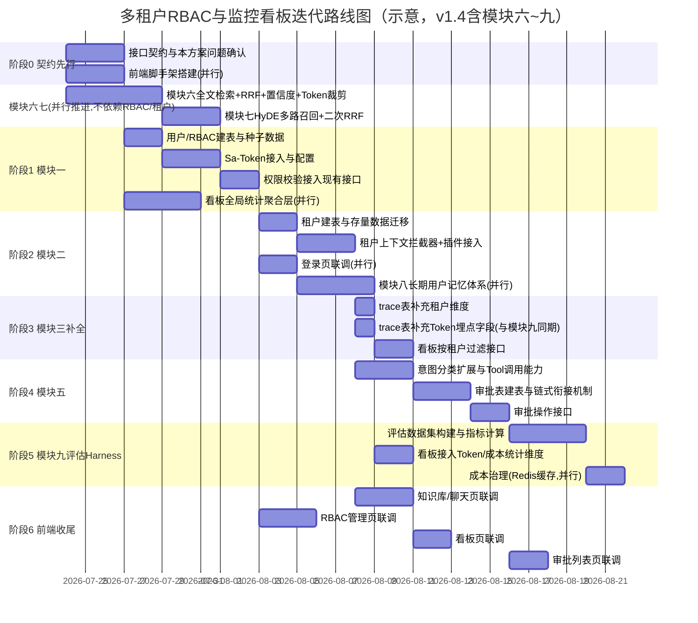

### 4.7 现状核对：参考项目能力与当前代码的差距（v1.4 新增）

本节逐项核实参考项目"智能销售数据分析 Agent"描述中体现的通用 Agent 工程能力，在 `zuo-ai-agent` 当前代码中的实际落地程度（均已实际读代码/grep 确认，非假设）：

| 参考项目能力点 | 当前代码现状（已核实） | 差距结论 |
|---|---|---|
| 向量+全文检索并行召回 | `rag/MultiChannelRetriever.java`：双通道并行检索，但**两个通道都是向量相似度检索**（`globalSearch` 全量向量检索 + `intentDirectedSearch` 按 `kb_id` 过滤的向量检索），没有全文检索（`tsvector`/ES）通道 | **真增量**：需要新增第三路全文检索通道，见模块六 |
| RRF 融合 | `MultiChannelRetriever.merge()`：把"意图定向结果"作为 `priority` 直接放在结果前部，"全局结果"按 `document.getId()` 去重后追加在后面，是简单的**优先级拼接去重**，不是基于排名倒数求和的 RRF 融合 | **真增量**：需要引入 RRF 算法替换现有 merge 逻辑，见模块六 |
| 置信度过滤 | `rag/DocumentReranker.java`：LLM 逐文档打分（0~10）后按分数降序取 Top-K，**没有绝对分数阈值过滤**——即使所有文档得分都很低（如全部为 0 分），依然会返回 Top-K 个 | **真增量**：需要新增独立于 Top-K 截断的置信度阈值过滤，见模块六 |
| Token 预算裁剪 | 全仓库检索 `token`/`Token` 关键字，`trace/`、`pipeline/` 目录下均无命中；`prompt/RAGPromptService` 组装 Prompt 时直接拼接全部 `finalDocs` 内容，无任何长度/Token 预算控制 | **真增量**：需要新增 Token 预算裁剪环节，见模块六 |
| 查询改写 + HyDE 多路召回 | `rag/QueryRewriter.java`：单次 LLM 调用做**单一改写**（原始问题 → 一个改写后的查询），失败降级返回原始 query；全仓库检索 `HyDE`/`hyde`/`假设文档`/`假设答案` 均无命中 | **真增量**：需要新增多路等价查询改写与 HyDE 假设文档生成能力，见模块七 |
| 短期对话记忆 | `chatmemory/DbBasedChatMemory.java`：`DEFAULT_HISTORY_KEEP = 20`（历史保留最近 20 条消息）+ 超过 `summaryStartTurns*2` 时触发摘要压缩，与参考项目"窗口限制 20 条"的描述**已经高度吻合**，且另有独立方案（`docs/知识库入库与对话记忆Redis改造执行计划.md`）在推进其 Redis 化改造 | **无增量**：短期记忆本身已具备且另有专项方案在推进，本轮不重复设计 |
| 长期用户记忆 | 全仓库检索无任何"用户偏好抽取"/"用户画像"/长期记忆相关代码或表结构（`chatmemory/` 三个实现类均只处理会话内历史） | **真增量（确认为 0 基础）**：需要从零设计，见模块八 |
| Token 埋点/成本治理 | `trace/entity/RagTraceRunDO.java`/`RagTraceNodeDO.java` 仅有耗时（`durationMs`）、状态（`status`）、输入输出 JSON 字段，**无任何 Token 用量字段**；全仓库无成本统计代码 | **真增量（确认为 0 基础）**：需要新增 Token 埋点字段与统计能力，见模块九 |
| 评估 Harness（路由准确率/Hit Rate/MRR） | 全仓库检索 `HitRate`/`hit_rate`/`MRR`/`评估`/`evaluat` 均无实质命中（唯一命中是 `docs/markdown2/宪法学.md` 知识库文档内容，与代码无关） | **真增量（确认为 0 基础）**：需要从零设计评估数据集与指标计算，见模块九 |
| LangChain4j 依赖 | `pom.xml` 全文检索 `langchain4j`/`LangChain4j` 均无命中，仅有 Spring AI 1.0.0 系列依赖（`spring-ai-starter-model-openai`/`spring-ai-alibaba-starter-dashscope`/`spring-ai-pgvector-store` 等） | 属于技术选型广度问题，非能力缺口，见 4.12（TECH-01，待确认） |
| 编排层四类执行链路/无硬编码 Worker | `pipeline/SmartRagPipeline.java`：严格线性流水线（改写→分类→短路判断→检索→重排→Prompt组装→流式推送），路由分支（短路判断）是 `if (intentResult.isSystem())` 硬编码分支，不存在"Worker 注册表"这类可插拔抽象；模块五规划的路由是 `KNOWLEDGE_QA`/`ACTION_EXECUTION` 两类，也是通过字段判断分支，同样是硬编码分支模式 | 属于编排设计增强/是否投入可插拔机制的选型问题，非简单缺口，见 4.13（ORCH-01，待确认） |
| 数据权限硬约束（ThreadLocal + KB 双重校验） | 模块二已设计 `TenantContextHolder`（ThreadLocal）+ `TenantLineInnerInterceptor`；模块五已设计 `t_knowledge_base_access` 访问授权表 + `MultiChannelRetriever` 检索阶段过滤 | 基本已被模块二/五现有设计覆盖，仅需补充"两层校验点"关系说明，非新增模块，见 4.13 |

### 4.8 模块六：RAG 检索链路增强（v1.4 新增）

#### 4.8.1 现状与目标

现状见 4.7：`MultiChannelRetriever` 的"多通道"目前实际是"两路都做向量检索、只是过滤条件不同"，`merge()` 是优先级拼接去重而非真正的排名融合算法；`DocumentReranker` 只做 Top-K 截断，没有绝对质量兜底；Prompt 组装阶段没有任何 Token 预算意识。目标：在不破坏现有两路向量检索的前提下，新增全文检索通道、引入 RRF 融合、新增置信度过滤与 Token 预算裁剪，形成"召回更全、排序更准、上下文更可控"的检索链路。

#### 4.8.2 全文检索通道技术选型（待确认，见 3.5 RAGENH-01）

| 候选 | 优点 | 缺点 |
|---|---|---|
| **PostgreSQL 原生全文检索**（`tsvector`/`tsquery` + GIN 索引，推荐） | 零新增基础设施，与现有 PGVector 同库同事务，实现成本低（`ALTER TABLE ... ADD COLUMN content_tsv tsvector`，触发器或生成列自动维护，`CREATE INDEX ... USING GIN`）；查询语法 `to_tsquery`/`ts_rank` 可直接给出相关性分数用于 RRF 排名输入 | 中文分词依赖 `zhparser` 等扩展（PostgreSQL 官方默认分词对中文支持较弱），需要额外安装配置；检索能力（同义词、模糊匹配）弱于专业搜索引擎 |
| 引入 Elasticsearch | 检索能力更强（IK 分词、更丰富的查询 DSL、更好的相关性算分），是业界全文检索的事实标准，面试展示价值更高 | 新增一套独立基础设施（本地开发环境需要额外部署 ES），需要维护知识库文档与 ES 索引的双写一致性（每次入库/更新/删除都要同步 ES），复杂度显著高于 PostgreSQL 方案 |

本方案倾向 Phase 1 采用 PostgreSQL 原生全文检索方案（复用现有数据库、复杂度可控），Elasticsearch 可作为后续技术广度加分项，但不代为拍板，最终选型见 RAGENH-01。

#### 4.8.3 RRF 融合设计

RRF（Reciprocal Rank Fusion）的核心思想是：对每个通道各自返回的排名列表，文档 `d` 在通道 `i` 中的排名为 `rank_i(d)`（从 1 开始），融合得分为：

```
score(d) = Σ 1/(k + rank_i(d))   （对 d 出现过的每个通道 i 求和，k 为经验常数，默认 60）
```

未出现在某通道结果中的文档，该通道对其融合得分贡献为 0（不参与求和）。融合后按 `score(d)` 降序重新排列，替代现有 `merge()` 方法"意图定向优先 + 全局去重追加"的固定优先级逻辑——RRF 的优势在于不需要不同通道的原始分数（向量余弦相似度与全文 `ts_rank` 分数量纲完全不同、不可直接比较），只需要排名信息即可公平融合多个异构通道的结果。

#### 4.8.4 置信度过滤与 Token 预算裁剪设计

- **置信度过滤**：在 `DocumentReranker` 现有 LLM 打分（0~10 分）基础上，新增一个可配置的绝对分数阈值（如 3.0）。当前逻辑无论分数高低都会返回 Top-K，新逻辑改为"先按阈值过滤掉低于阈值的文档，再对剩余文档取 Top-K"——如果所有文档都被过滤掉，Prompt 组装阶段走现有 `PromptScene.EMPTY_RETRIEVAL` 场景（该场景已存在，见 `SmartRagPipeline.executePromptBuild`），不需要新增 Prompt 场景。
- **Token 预算裁剪**：新增 `TokenBudgetTrimmer` 组件，在 `RAGPromptService.build()` 拼装文档内容之前，按预估 Token 数（可用字符数估算或引入轻量 Tokenizer 库精确计算）从高分到低分依次累加文档内容，一旦累计预估 Token 数超过预算上限（如 4000 tokens），后续文档不再拼入，避免"文档多、上下文超限或调用成本失控"的问题；该组件同时也是模块九 Token 成本治理的关键一环（预算裁剪本身就是最直接的成本控制手段）。

#### 4.8.5 检索链路增强示意

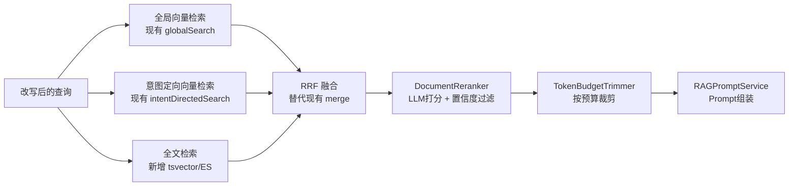

### 4.9 模块七：查询改写增强 - HyDE 多路召回 + 二次 RRF 融合（v1.4 新增）

#### 4.9.1 现状与目标

现状见 4.7：`QueryRewriter.rewrite()` 是单次 LLM 调用，输入原始问题、输出一个改写后的查询，失败时静默降级返回原始问题，不存在多路查询扩展或假设文档生成机制。目标：在原始改写基础上，新增"生成 N 个语义等价的查询改写"与"生成 1 个假设答案文档（HyDE）"两种能力，多路查询各自送入模块六的检索链路并行检索，再对多路检索结果做二次 RRF 融合，缓解"用户提问表述方式与知识库文档表述方式不一致导致召回不足"的问题。

#### 4.9.2 设计方案

- **等价查询改写（Query Expansion）**：复用现有 `QueryRewriter` 的 Prompt 调用模式，新增一个模板（可复用 `prompts/query-rewrite.st` 并调整输出格式要求为"输出 N 个不同表述的等价问题"，而不是新建一套调用链路），一次 LLM 调用即可返回 N 个改写（用换行或 JSON 数组分隔），避免为每个等价改写单独调用一次 LLM。
- **HyDE 假设文档生成**：新增 `prompts/hyde-generate.st` 模板，让 LLM"假设自己知道这个问题的答案，直接生成一段该答案的内容"（不要求真实准确，只要求语义上贴近真实答案的表述），再用这段假设答案（而非原始问题）作为向量检索的 query——因为假设答案在向量语义空间中通常比"问题本身"更接近"真正相关的文档内容"，这是 HyDE 方法的核心原理。
- **多路检索与二次融合**：`原始改写查询` + `N 个等价改写查询` + `HyDE 假设答案` 一共 `N+2` 路查询，分别调用模块六的检索链路（各自完成"向量+全文三通道 RRF 融合"得到各自的融合排名列表），再对这 `N+2` 个融合排名列表做**二次 RRF 融合**（同一套 RRF 公式，只是这次融合的对象是"已经融合过一次的排名列表"，而不是原始通道排名），得到最终排名结果，再送入 `DocumentReranker`。
- 是否启用该能力建议做成开关（如 `enableHyde`/`enableQueryExpansion`，仿照现有 `RagPipelineContext.isEnableRewrite()`/`isEnableRerank()` 的开关模式），默认关闭，按需在请求参数中开启，避免默认路径的延迟/成本上升（是否接受这一取舍见 3.5 HYDE-01）。

#### 4.9.3 HyDE 多路召回示意

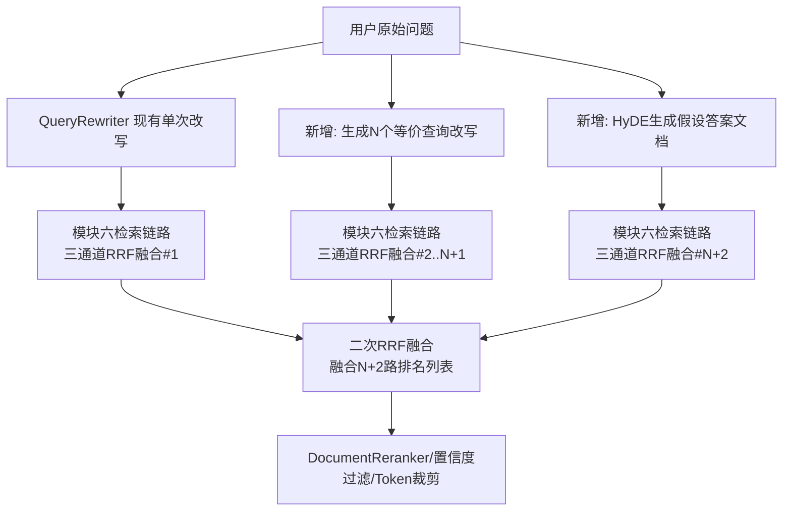

### 4.10 模块八：长期用户记忆体系（v1.4 新增）

#### 4.10.1 现状与目标

现状见 4.7：`chatmemory/` 目录三个实现类（`DbBasedChatMemory`/`FileBasedChatMemory`/`MapBasedChatMemory`）全部只处理"单次会话内的消息历史"，不存在任何跨会话、跨请求持久化的"用户是谁、偏好什么"这类结构化事实，是完全空白的能力。目标：新增一套独立于短期会话记忆的长期用户记忆体系，从对话中抽取用户偏好等结构化事实，构建用户记忆文档，并按路由决策注入 Prompt。

#### 4.10.2 与短期记忆的边界（已确认，见 3.5 MEMORY-01）

| 维度 | 短期对话记忆（另一份方案，Redis 化改造中） | 长期用户记忆（本模块） |
|---|---|---|
| 存储粒度 | 单次会话（`conversationId`） | 单个用户（`userId`，依赖模块一提供的用户体系） |
| 生命周期 | 随会话/压缩自然滚动，压缩后旧消息即被摘要替代 | 跨会话持久保存，不因任何单次会话的压缩/清空而丢失 |
| 存储介质 | Redis List 队列（热数据）+ MySQL 双表（冷数据审计） | 独立的用户记忆文档表（`t_user_memory_profile`，选型见 4.10.3） |
| 内容形态 | 原始对话消息 + LLM 生成的摘要（自然语言） | 从对话中抽取的结构化事实（如默认知识库范围、语言偏好、常用统计粒度等 key-value 或文本片段） |
| 注入 Prompt 的时机 | `ChatMemory` 接口天然承载，每轮对话自动携带 | 由路由决策显式判断当前问题是否需要用户偏好上下文，非每次都注入，避免无关历史/偏好污染当前问题 |

两者是完全独立的两套机制，互不重复、互不依赖，本方案不会用长期记忆替代短期记忆，也不会把长期记忆存储塞进短期记忆的 Redis 队列中。

#### 4.10.3 长期记忆存储与检索方式选型（待确认，见 3.5 MEMORY-02）

| 候选 | 优点 | 缺点 |
|---|---|---|
| **结构化字段表**（`t_user_memory_profile`：`user_id`/`memory_key`/`memory_value`/`update_time`，推荐） | 实现简单，查询直接（`WHERE user_id = ?`），可解释性强，便于在前端做"用户记忆管理"页面展示/编辑 | 新增偏好类型需要约定新的 `memory_key`，本质是 EAV（实体-属性-值）模式，复杂查询/统计能力弱 |
| 向量化存入 PGVector 独立 collection | 可以对"用户记忆"做语义检索（例如"这个用户之前提到过类似需求吗"），复用现有 PGVector 基础设施和向量检索代码模式，技术风格与知识库检索保持一致 | 引入了"记忆检索"这一新的检索链路，需要理清与知识库检索（模块六/七）的关系（是否共用同一个 `MultiChannelRetriever`、是否共用同一个 collection），设计复杂度更高，对于"结构化偏好"这类简单场景可能是过度设计 |

本方案倾向优先落地结构化字段表（更贴合"用户偏好"这类结构化事实的本质，复杂度更低），向量化方案可作为后续如果需要"语义检索历史偏好"场景的扩展选项，最终选型见 MEMORY-02。

#### 4.10.4 长期记忆抽取与注入示意

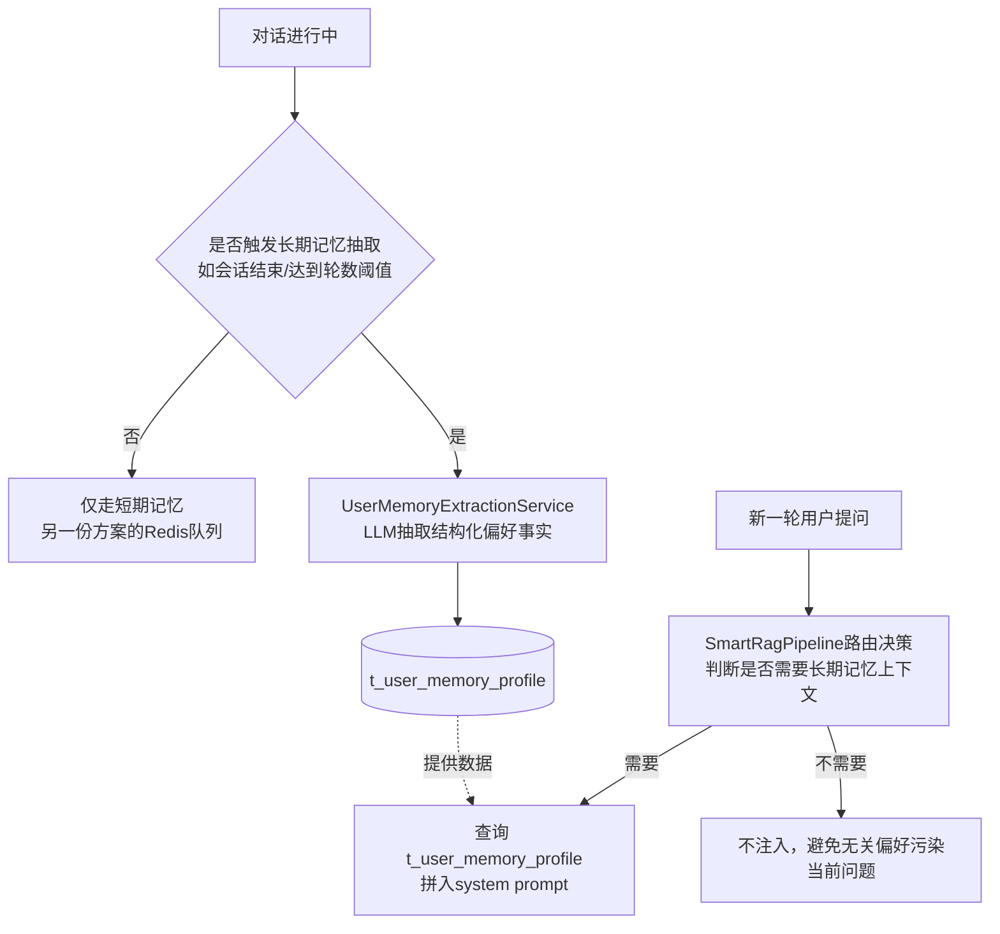

### 4.11 模块九：Agent 工程化评测与成本治理（v1.4 新增）

#### 4.11.1 现状与目标

现状见 4.7：`trace/` 模块的两张表只记录耗时、状态、输入输出 JSON，完全没有 Token 用量字段；全仓库没有任何评估数据集、指标计算代码、评测 Harness 的痕迹，是完全空白的能力。目标：补齐 Token 埋点、成本治理与"路由准确率 + 检索 Hit Rate/MRR"评估 Harness 两块工程化能力。

#### 4.11.2 是否独立成模块的判断说明

本方案判断将"Agent 工程化评测与成本治理"设为**独立的模块九**，而不是并入模块三（全链路监控看板），理由：

- **数据消费方式不同**：模块三面向的是"线上真实调用流量"的实时/近实时统计（成功率、P95 耗时、调用量趋势），是持续运行的在线统计能力；评估 Harness 面向的是"离线评估数据集"的跑批评测（路由是否分类正确、检索是否命中预期文档），是按需触发的离线工具，两者的数据来源、触发方式、消费场景均不同。
- **但两者并非完全无关**：Token 埋点属于"在现有 `trace` 表结构上新增字段并统计"，与模块三共享同一批表、同一套 `dimension`(GLOBAL/TENANT/USER) 参数化统计设计，这部分工作强烈建议与模块三"trace 表补充字段"阶段合并实施（见 4.6 路线图阶段 3），避免同一张表被拆成两次不相关的迁移；因此模块九在**表结构和统计接口层面复用模块三的基础设施**，但在**评估 Harness（路由准确率/Hit Rate/MRR）这一独立能力**上，与模块三是完全不同的两套系统，值得单独归为一个模块以便清晰追踪任务状态和风险。

#### 4.11.3 Token 埋点设计

在 `RagTraceNodeDO` 新增 `promptTokens`/`completionTokens`（或统一为一个 `tokenUsageJson` 字段存储更灵活的结构）；各 LLM 调用节点（`rewrite`/`classify`/`rerank`/新增的 HyDE 生成/新增的长期记忆抽取/最终生成）在调用 `ChatModel`/`ChatClient` 后，从响应的 `Usage`（Spring AI 的 `ChatResponse.getMetadata().getUsage()`）中读取实际 Token 用量并记录，而不是自行估算——这是比 4.8.4 节 Token 预算裁剪阶段"预估 Token 数"更精确的**事后统计**，两者用途不同（裁剪阶段需要在调用前预估以控制成本，埋点阶段是调用后的精确记账）。

#### 4.11.4 评估 Harness 设计（待确认落地范围，见 3.5 EVAL-01）

- **评估数据集**：人工构造一批"问题 → 期望 `requestType`/`retrievalScope`（用于评测路由准确率）"与"问题 → 期望命中的知识库文档 ID 列表（用于评测检索 Hit Rate/MRR）"的标注数据，存储为 `eval/entity/EvalDatasetItemDO` 对应的表或直接维护为 JSON/YAML 配置文件（视数据量决定，数据量小时用配置文件足够，不必强行建表）。
- **指标计算**：
  - 路由准确率 = 分类结果与期望 `requestType`/`retrievalScope` 一致的样本数 / 总样本数。
  - Hit Rate@K = 检索结果 Top-K 中命中期望文档的样本数 / 总样本数。
  - MRR（Mean Reciprocal Rank）= 对每个样本取"期望文档在检索结果中的排名倒数"（未命中记为 0），取平均值。
- **落地范围**（待老大确认，见 EVAL-01）：轻量方案是提供一个可手动触发的评测脚本/接口，跑一次输出报告；重量方案是接入 CI，每次代码变更自动跑一遍并对指标做阈值告警，两者工程量差异较大，本方案不代为拍板。

#### 4.11.5 成本治理设计

结合 Redis 缓存（对相同或高度相似的 `query` 的改写/分类结果做短期缓存，命中缓存则跳过对应 LLM 调用）与模块六已设计的 Token 预算裁剪，构成"减少调用次数 + 控制单次调用的上下文长度"两个维度的成本治理组合拳；Redis 缓存基础设施可直接复用另一份方案（`docs/知识库入库与对话记忆Redis改造执行计划.md`）即将引入的 Redis 连接配置，不需要为此单独引入新的中间件。

#### 4.11.6 评测与成本治理链路示意

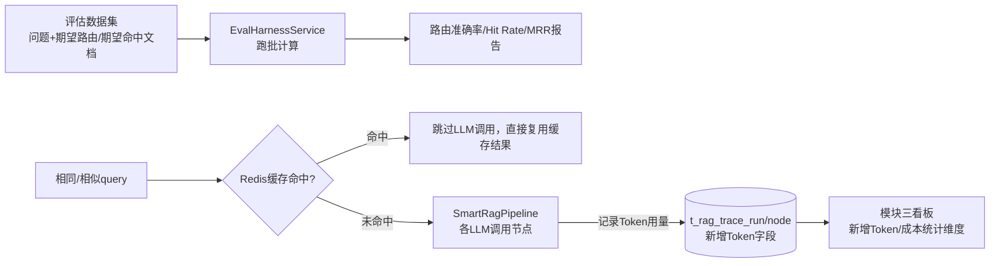

### 4.12 技术选型广度问题：是否引入 LangChain4j（模块五扩展讨论，v1.4 新增）

现有模块五（4.5.3）已基于 Spring AI 1.0.0 原生 `@Tool`/`ChatClient` 机制设计工具调用编排（`AgentOrchestrator` 通过 `ChatClient.builder(chatModel).tools(agentToolService)` 注册工具）。参考项目额外强调"基于 LangChain4j 构建 Agent……Agent 通过 ReAct 循环自主规划工具调用链路"，是否要为此额外引入 LangChain4j，候选对比如下（待确认，见 3.5 TECH-01，本方案不代为拍板）：

| 候选 | 优点 | 缺点 | 与现有 Spring AI 方案的关系 |
|---|---|---|---|
| **不引入，维持 Spring AI 原生方案**（现状） | 无新增依赖，`ChatModel`/`ChatClient`/`@Tool` 已经统一贯穿全项目（`IntentClassifier`/`QueryRewriter`/`DocumentReranker`/模块五工具调用均基于 Spring AI），技术栈单一、维护成本最低 | 无法展示"两套 Agent 框架对比"这一面试话题 | 无需讨论替代/共存问题 |
| 引入 LangChain4j，**替代**模块五的 `AgentOrchestrator` | LangChain4j 的 `AiServices`/ReAct Agent 抽象更贴近"自主规划工具调用链路"的描述，面试可讲述"ReAct 循环原理"、"两大 Java LLM 框架的设计取舍对比"，技术广度展示价值高 | 项目内同时维护 Spring AI（`IntentClassifier`/`QueryRewriter`/`DocumentReranker`/RAG主链路）与 LangChain4j（Agent 工具编排）两套框架的 `ChatModel` 抽象、Prompt 模板机制、Tool 注解体系互不通用，学习/维护成本上升，且"为什么只有工具调用这一处用了不同框架"容易被面试官追问，需要有清晰的技术判断依据支撑，而不是"为了展示而展示" |
| 引入 LangChain4j，与 Spring AI **共存**（LangChain4j 仅用于模块五工具编排，其余链路保持 Spring AI 不变，与上一行方案实质相同，仅措辞区分"替代"与"新增一条独立技术路径"两种叙事） | 同上，且不需要"替代"已经写好的 `AgentOrchestrator` 代码，风险更低 | 同上，且"共存"本身容易被质疑"为什么不统一技术栈"，需要在方案/简历中讲清楚这是有意为之的技术广度展示，而非架构混乱 |

本方案态度：这是一个纯粹的"技术选型广度 vs 技术栈统一性"的取舍问题，没有绝对正确答案，最终是否引入、如何引入，由老大结合面试叙事策略确认。

### 4.13 编排层扩展点与模块二/五现有设计的补充说明（v1.4 新增）

#### 4.13.1 编排层"多类执行链路"增强说明与可插拔 Worker 扩展点（待确认，见 3.5 ORCH-01）

参考项目强调"轻量 Orchestrator-Worker 模式，问题分类路由为四类执行链路……组合式 Agent 协作而非写死的单一问答流程"。现状核对（见 4.7）确认：现有 `SmartRagPipeline` 的短路判断（`if (intentResult.isSystem())`）与模块五规划的 `requestType` 判断（`KNOWLEDGE_QA`/`ACTION_EXECUTION`）本质上都是**硬编码的 if-else 分支**，不存在"Worker 注册表 + 动态查找调用"这类可插拔编排抽象。这与参考项目"无硬编码流程控制"的描述存在设计层面的差距，但需要注意：**该差距的产生原因是当前只有两类分支、复杂度尚未达到需要抽象出注册机制的程度**，而不是遗漏设计。

是否需要为此设计一个通用的可插拔 Worker 注册机制（例如定义统一接口 `AgentWorker { boolean supports(IntentResult); void execute(RagPipelineContext, SseEmitter); }`，`KNOWLEDGE_QA` 对应的现有主链路、`ACTION_EXECUTION` 对应的 `AgentOrchestrator` 各自实现为一个 `AgentWorker`，`SmartRagPipeline` 改为持有 `List<AgentWorker>` 并按 `supports()` 动态查找调用，而非 if-else），本方案**不实现真实的销售 Worker**，仅评估是否要做这一层抽象作为"组合式 Agent 协作、无硬编码流程控制"的技术能力展示。是否值得投入这部分工程量（当前只有两类分支，抽象收益有限；但面试可讲述"策略模式/责任链模式在 Agent 编排中的应用"），需要老大确认，见 ORCH-01。

#### 4.13.2 数据权限收敛与知识库权限双重校验补充说明

参考项目强调"基于 ThreadLocal 用户上下文按角色层级收敛数据范围，知识库侧在编排入口和检索阶段双重校验 KB 权限"。现状核对确认，这两点已经基本被现有设计覆盖，不需要新增模块或新的机制，仅需补充以下设计说明：

- **"按角色层级收敛数据范围"** ⟺ 模块二已设计的 `TenantContextHolder`（ThreadLocal）+ `TenantLineInnerInterceptor`（自动按 `tenant_id` 过滤）+ 模块一的 Sa-Token 权限点体系（`@SaCheckPermission`）组合，已经能实现"当前登录用户只能操作自己权限范围/租户范围内的数据"，本轮不新增机制。
- **"编排入口 + 检索阶段双重校验 KB 权限"** ⟺ 结合模块五 4.5.2 的设计，这两层校验点应分别落在：
  - **编排入口层**：`SmartRagPipeline` 在调用 `MultiChannelRetriever` 之前，根据 `IntentResult` 的 `retrievalScope`（`GLOBAL_ONLY`/`GLOBAL_AND_TENANT`）与当前用户的租户上下文，决定本次请求"允许检索的范围边界"，这一层是"请求级别"的粗粒度校验。
  - **检索阶段层**：`MultiChannelRetriever` 内部按 `retrievalScope` 传入的边界条件，结合 `t_knowledge_base_access` 授权表做**文档级别**的细粒度过滤（每一篇候选文档是否命中授权记录），这一层是即使编排入口判断有误也能兜底的"最后一道防线"。
  - 两层校验点缺一不可：只做编排入口层校验，如果判断逻辑有 bug（如 `retrievalScope` 解析错误），会导致检索阶段"全盘放行"；只做检索阶段校验，则每次请求都要做一次完整的授权子查询，性能上不如编排入口先做粗粒度收窄再做细粒度过滤。该设计已经隐含在模块五 4.5.2/4.5.6 的过滤条件描述中，本次仅做补充说明使其显性化，不新增代码任务量之外的内容（对应 3.2 节 5-14 任务）。

---

## 五、Result（结果/结论）

本阶段产出：本执行计划文档 v1.3，覆盖用户登录鉴权+RBAC、多租户数据隔离、全链路监控看板（后端统计聚合层）、Vue3 前端工程、智能助手 Agent 化改造五个独立模块的现状分析、方案设计、候选对比、风险说明与依赖路线图。v1.1 已同步老大对 4 项问题的拍板（鉴权框架选型确定为 Sa-Token，即 RBAC-01；租户模型锁定为独立租户实体，即 TENANT-01；与上一轮方案的协调方式确定为"提前预留 `tenant_id` 字段"，即 TENANT-02；前端仓库组织方式确定为当前仓库内 `web/` 子目录，即 WEB-01），且 RBAC-01 的拍板联动解决了登录态方案（RBAC-02）、方法级权限校验方式（RBAC-03），故 v1.1 共确认 6 项决策。v1.2 新增"全局知识库实现方式"（采用访问授权表+申请单模型，即 AGENT-01）已确认决策，累计 7 项。**v1.3 版本老大就其中 5 项进一步拍板确认**：多租户隔离落地方式（TENANT-03，确认采用 MyBatis-Plus 官方 `TenantLineInnerInterceptor` 插件为主 + 对已知手写 SQL 做专项补漏）、看板多维度统计（DASH-01，确认新增 `tenant_id`/`user_id` 并支持 GLOBAL/TENANT/USER 三维度聚合查询）、看板刷新模式（DASH-02，确认后端 Phase 1 沿用实时查询 + 新增前端手动/自动刷新交互设计）、审批流是否需要独立 UI 页面（AGENT-02，确认需要，沿用已规划的 4-9 任务与 `web/src/views/apply/` 目录）、动作型请求是否分风险等级（AGENT-03，确认默认全部审批 + 新增可配置白名单/黑名单例外机制，且该机制本身的变更也需审批，详细设计见 4.5.8）。截至 v1.3，**已确认决策累计 12 项**（详见 3.5.1），**待老大确认的问题剩余 4 项**（详见 3.5.2）。

**v1.3 编号体系变更（重要）**：自本版本起，3.5 节待确认问题不再使用每次修订都从 1 开始重新连续编号的 `Qx` 方式，改为"模块前缀 + 固定序号"（`RBAC-`/`TENANT-`/`DASH-`/`WEB-`/`AGENT-`/`GLOBAL-`），编号一旦分配，后续版本不再重排，避免同一个编号在不同版本里指代不同问题。3.5.1 已确认决策表与 3.5.2 待确认问题表均已按此规则重新编号，文档内其余引用具体问题编号的位置（3.2 任务表、3.3 风险说明、3.4 文件清单、4.2.4、4.3.2、4.3.3、4.5 各小节）也已同步替换为新编号。历史版本中出现的 `Qx` 编号仅在该版本上下文中有效，不再具备跨版本追溯意义。

**v1.4 版本**：老大以另一份"智能销售数据分析 Agent"简历/面试项目描述作为灵感参考，要求在**不实现其销售业务领域本身**（不新增订单/客户画像/跟进/客户洞察相关表与 Worker）的前提下，评估该参考项目所体现的**通用 Agent 工程能力**能否移植到本项目现有的"知识问答 + 审批动作执行"场景，并直接并入本文档（不新建文档）。本阶段先逐项核实现有代码（4.7 节，均已实际读代码/grep 确认），确认 RAG 检索链路增强（全文检索通道、RRF 融合、置信度过滤、Token 预算裁剪）、查询改写增强（HyDE+多路召回+二次 RRF）、长期用户记忆体系、Agent 工程化评测与成本治理四项均为真实缺口（模块六~九），同时确认短期对话记忆窗口机制已基本具备（另有专项方案在推进，不重复设计）、数据权限收敛与知识库双重校验已基本被现有模块二/五设计覆盖（仅需 4.13.2 补充说明，未单独成模块）。v1.4 新增 2 项已确认决策（GLOBAL-02 本轮范围排除销售业务领域、MEMORY-01 长期记忆与短期记忆为独立不冲突机制），新增 6 项待确认问题（RAGENH-01 全文检索技术选型、HYDE-01 是否接受 HyDE 额外调用成本/延迟、MEMORY-02 长期记忆存储方式、EVAL-01 评估 Harness 落地范围、TECH-01 是否引入 LangChain4j、ORCH-01 是否设计可插拔 Worker 扩展点）。截至 v1.4，**已确认决策累计 14 项**（详见 3.5.1），**待老大确认的问题累计 10 项**（v1.3 遗留 4 项 + v1.4 新增 6 项，详见 3.5.2）。

尚未进行的工作（不在本阶段范围内）：

- 未编写任何业务代码。本阶段仅产出/修订文档：本文档升级至 v1.4，此前 v1.1 阶段同步修订过 `docs/知识库入库与对话记忆Redis改造执行计划.md`（补充 `tenant_id` 预留字段说明），v1.2/v1.3/v1.4 修订未再变更该文档或其他现有文件。
- 未对 3.5.2 节列出的 4 个 v1.3 遗留待确认问题（TENANT-04 存量数据默认租户归属策略、DASH-03 看板可见范围、GLOBAL-01 本轮范围确认、AGENT-04 模块五多步骤链式衔接机制选型）做出决定，这些问题需要老大在评审时逐一给出结论后，才能进入正式编码阶段。
- 未涉及扫描报告 H4/H5 的具体修复动作，仅在 4.2.5 指出其与本方案模块二/一的技术关联，修复时机由老大另行安排（见 GLOBAL-01）。
- 未涉及上一轮"知识库入库异步化 + 对话记忆 Redis 改造"方案的具体实现，两轮方案已就表结构交叉点（`tenant_id` 预留）达成一致并同步修订完成，其余实现细节仍按两份独立文档各自推进，无需强绑定实施顺序（见 GLOBAL-01）。
- 模块五当前仅完成设计与候选方案对比，`AgentToolService`/`AgentOrchestrator`/审批表/动作策略配置表（`t_agent_action_policy`/`t_action_policy_apply`）/链式衔接机制均未落地编码；全局知识库实现方式（AGENT-01）、动作型请求风险分级治理机制（AGENT-03）已由老大拍板确认，不再是待确认前提，但链式衔接机制选型（见 3.5 AGENT-04）仍待确认，实现细节可能随该问题的最终结论调整。
- **v1.4 新增模块六~九当前均只完成现状核对与方案设计，未落地编码**：全文检索通道/RRF融合/置信度过滤/Token预算裁剪（模块六）、HyDE与多路召回（模块七）、长期用户记忆抽取与存储（模块八）、Token埋点与评估Harness（模块九）均待 RAGENH-01/HYDE-01/MEMORY-02/EVAL-01 等问题拍板后才能进入编码；TECH-01（是否引入 LangChain4j）与 ORCH-01（是否设计可插拔 Worker 扩展点）是更上位的技术路线问题，其结论会影响模块五后续实现方式及模块九 Harness 的路由评测口径，建议优先于其余细节问题给出结论。

下一步建议：老大/浩浩审阅本文档，对 3.5.2 节累计 10 个悬而未决问题（v1.3 遗留 TENANT-04、DASH-03、GLOBAL-01、AGENT-04；v1.4 新增 RAGENH-01、HYDE-01、MEMORY-02、EVAL-01、TECH-01、ORCH-01）给出结论后，即可视为满足"任务 ≥2 个独立模块必须先完成需求文档才能开始编码"的前置条件，进入任务调度阶段（由小银按 4.6 节的阶段划分拆分子任务并派发给哈吉聂/哈吉霞，建议按阶段 0→1→2→3→4→5→6 的顺序、结合可并行部分动态调整并发度，其中模块六七可与模块一~五并行启动）。

---

## 汇总总结（STAR 压缩版）

- **S**：项目当前完全没有用户/鉴权/租户基础设施，`trace/` 模块已完整采集 RAG 全链路数据但从未被统计消费，整个项目还是纯后端形态、没有任何前端页面，且智能助手只能"一问一答"、不具备理解意图后执行真实业务动作的能力；老大提出要一次性补齐登录鉴权+RBAC、多租户隔离、监控看板、Vue3 前端四大模块，v1.0 版本据此产出执行计划并留下 12 项待拍板问题；后续在评审"全局知识库"设计时，老大进一步提出模块五"智能助手 Agent 化改造"的范围扩展，要求并入同一份文档。v1.3 老大就多租户落地方式、看板多维度统计与刷新模式、审批流 UI、动作风险分级五项进一步拍板，累计确认决策增至 12 项。v1.4 老大以另一份"智能销售数据分析 Agent"简历项目为灵感，要求在**不实现销售业务领域本身**的前提下，评估其 RAG 检索链路增强、查询改写增强（HyDE）、长期用户记忆、Agent 工程化评测与成本治理四项通用能力能否移植到本项目现有场景，同样要求并入同一份文档。
- **T**：v1.1 版本的目标是根据老大已拍板的 4 项决策（鉴权框架选型、租户模型、与上一轮方案的协调方式、前端仓库组织方式）修订执行计划；v1.2 版本的目标是在不新起文档的前提下，为方案补齐第五个模块——把 Agent 从"知识问答"升级为"能理解意图并调用工具/MCP 执行业务动作、且能衔接模块一审批流"的企业内部通用组件 Agent，同时保持文档已有的 STAR 结构、编号体系与写作风格一致。v1.3 版本的目标是把已拍板的 5 项决策落实到多租户隔离方式、看板统计维度与刷新交互、审批流 UI、动作风险分级治理的具体设计中。**v1.4 版本的目标**是先逐项核实（非假设）现有 RAG/检索/记忆/追踪代码与参考项目通用能力的实际差距，在明确排除销售业务领域的前提下，为真实存在的差距新增模块六（RAG检索链路增强）、模块七（查询改写增强HyDE）、模块八（长期用户记忆体系）、模块九（Agent工程化评测与成本治理）四个独立模块的设计，并厘清与已有短期记忆方案、模块二/五现有权限设计的边界，避免重复造轮子。
- **A**：v1.1 阶段逐节走查 v1.0 文档，将鉴权框架、登录态方案、权限校验方式、租户模型、前端仓库路径等候选对比改写为确定方案，重新梳理 3.5 节问题编号；v1.2 阶段在 `IntentClassifier`/`IntentResult` 现状代码分析基础上，设计"知识问答 vs 动作执行"意图维度与"仅全局库/全局+个人库"检索范围细分（全局知识库最终采用"访问授权表 + 申请单"模型——`t_knowledge_base_access` + `t_kb_access_apply`，老大已当场拍板确认，不再是待确认项），基于 Spring AI 1.0.0 原生 `@Tool` 机制设计 `AgentToolService`/`AgentOrchestrator` 与三个工具方法签名（申请租户、申请角色权限、申请知识库访问），设计 `t_tenant_apply`/`t_role_apply`/`t_knowledge_base_access`/`t_kb_access_apply` 审批表结构及其与模块一 RBAC 表的关联，并明确区分"平台管理员审批"（租户/角色申请）与"资源owner审批"（知识库访问申请）两套不同的审批人来源，对比三种多步骤链式衔接候选方案（要求同时支持两种审批人来源）并给出"事件驱动+补偿轮询"的推荐组合，用 mermaid 时序图还原"申请租户→审批→自动衔接申请角色权限→审批→返回结果"与"知识库访问申请→owner审批→自动重放原始查询"两条完整链路，简要说明 MCP 与 `@Tool` 的技术取舍；同步在 3.2/3.3/3.4 补充模块五的任务表、风险说明、关键文件清单，在 3.5.1 追加"全局知识库实现方式"已确认决策、在 3.5.2 追加 Q7-Q9，在 4.6（原 4.5）路线图中补充模块五的阶段依赖与甘特图，在模块四页面清单中补充"审批列表/审批操作"页面。**v1.4 阶段**先实读 `MultiChannelRetriever`/`DocumentReranker`/`QueryRewriter`/`IntentClassifier`/`IntentResult`/`SmartRagPipeline`/`DbBasedChatMemory`/`RagTraceNodeDO`/`pom.xml` 等核心文件核实现状差距并写入新增小节 4.7；据此设计模块六（全文检索通道+RRF融合替代现有优先级拼接+置信度过滤+Token预算裁剪）、模块七（等价查询改写+HyDE假设文档生成+多路二次RRF融合，扩展现有 `QueryRewriter`）、模块八（长期用户记忆体系，与短期对话记忆按存储粒度/生命周期/注入时机划清边界）、模块九（判断其相对模块三监控看板的独立性并给出理由，设计Token埋点字段与评估Harness的Hit Rate/MRR计算方式、成本治理组合拳）四个模块的详细设计（4.8-4.11），并将"是否引入LangChain4j"（4.12）、"是否设计可插拔Worker扩展点"（4.13.1）列为不代为拍板的技术选型问题，将"数据权限收敛与知识库双重校验"（4.13.2）明确为对模块二/五现有设计的补充说明而非新模块；同步更新 3.1-3.5 节任务表/风险/文件清单/决策与问题、4.6 路线图依赖分析与甘特图。
- **R**：产出 v1.2 版本执行计划文档，覆盖五个独立模块；v1.1 确认的 6 项技术选型/组织方式决策继续有效，v1.2 新增"全局知识库实现方式（访问授权表+申请单模型）"作为第 7 项已确认决策，模块五其余设计标注为待评审内容，3.5.2 节保留 9 项需要老大确认的悬而未决问题（Q1-Q6 沿用、Q7-Q9 新增：链式衔接机制选型、审批流 UI 页面是否需要、动作型请求是否按风险分级），在这些问题得到结论之前不建议进入编码阶段。v1.3 版本老大就其中 5 项拍板确认，累计已确认决策达 12 项，剩余 4 项待确认（TENANT-04/DASH-03/GLOBAL-01/AGENT-04）。**v1.4 版本**新增 4 个独立模块（模块六~九），新增 2 项已确认决策（GLOBAL-02 排除销售业务领域、MEMORY-01 长期短期记忆为独立机制），累计已确认决策达 **14 项**；新增 6 项待确认问题（RAGENH-01 全文检索选型、HYDE-01 是否接受HyDE成本延迟、MEMORY-02 长期记忆存储方式、EVAL-01 评估Harness落地范围、TECH-01 是否引入LangChain4j、ORCH-01 是否设计可插拔Worker扩展点），累计待确认问题达 **10 项**（4 项v1.3遗留 + 6 项v1.4新增）；其中 HYDE-01 与 TECH-01 影响面最大，建议老大优先给出结论，其余问题得到结论之前，模块六~九均不建议进入编码阶段。
