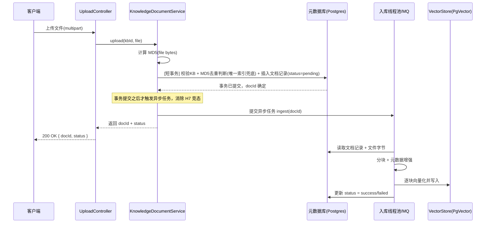
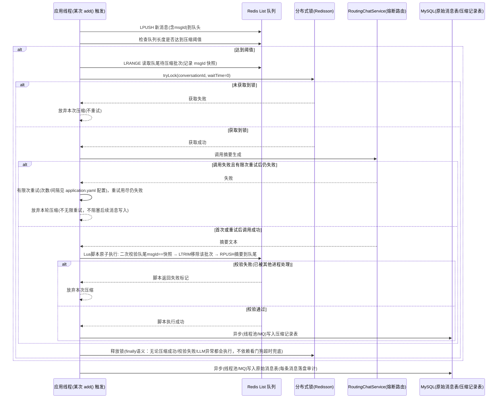

# 知识库入库异步化与对话记忆 Redis 化改造 —— 执行计划与需求策划汇总

- **作者**：浩浩
- **创建时间**：2026-07-22
- **最新更新时间**：2026-07-27
- **版本号**：v1.2

> 说明：本文档同时承担标准五阶段流程中"执行计划"（阶段二）与"需求策划汇总"（阶段三）两个产出物的角色，不再另建独立需求文档文件；第三节内容即为供小银任务调度阶段引用的需求策划汇总。

---

## 一、Situation（背景/现状）

`docs/代码问题扫描报告.md` 已识别出与本次改造相关的四个正确性问题：H7（上传事务与异步入库竞态）、M5（对话记忆压缩非原子）、M2（部分 RAG 组件硬编码 `@Qualifier("dashscopeChatModel")` 绕开熔断路由）、M1（候选队列并发下可能误判"全部候选失败"）。

在扫描之后，老大与浩浩进一步澄清、扩展了改造范围，**本文档以下述最新需求为准**，不再局限于扫描报告的问题描述：

1. **知识库入库模块**（`knowledge/`）：上传流程全链路异步化、基于文件内容 MD5 的去重、向量化异步方案重新评估（线程池 vs MQ）。
2. **对话记忆模块**（`chatmemory/`）：用 Redis List 队列 + 分布式锁彻底重新设计对话历史存储与摘要压缩机制，MySQL 落盘拆为"原始消息表 + 压缩记录表"两张表，持久化本身也要异步。
3. **其余遗留问题**（优先级低于上述两个模块）：M2 熔断路由收口、M1 候选队列并发修复、若干死代码（`RoutingEmbeddingService`、`FileBasedChatMemory`、`MapBasedChatMemory`）的去留。

项目同时是老大的简历/面试作品集（`docs/简历版-项目介绍.md`、`docs/面试版-项目详解.md`），技术选型需要在"正确性优先"的前提下适度兼顾技术广度展示，因此本计划对涉及技术选型的地方（MQ、分布式锁库）给出候选方案对比，而非直接拍板，最终选型留待老大在评审时确认。

本文档仅覆盖上述范围，**不包含**扫描报告中 H1/H2/H3（仓库卫生、密钥泄漏）、H4/H5（CORS + 越权）等安全与仓库清理类问题，这些问题的处理时机需要老大另行决策，避免与本轮范围混淆。

## 二、Task（目标/待解决问题）

### 总体目标

在不引入新的正确性问题的前提下，把知识库入库流程改造为"全链路异步 + 内容去重"，把对话记忆改造为"Redis 队列做热数据 + 分布式锁保证压缩互斥 + MySQL 双表做冷数据落盘"的架构，并顺带收口现有的熔断路由绕过与并发队列问题。

### 分模块目标

- **模块一（知识库入库）**：修复 H7 竞态，新增 MD5 去重能力，明确向量化与落盘的异步执行方案。
- **模块二（对话记忆）**：修复 M5 非原子压缩问题，落地"Redis 队列 + 分布式锁 + 二次校验 + MySQL 双表"的完整新架构，为老大在本地/生产环境引入 Redis 做准备。
- **模块三（遗留问题，优先级更低）**：收口 M2（熔断路由绕过）、修复 M1（候选队列并发竞争），并对死代码给出去留建议。

按团队协作机制的约定，本任务涉及 2 个独立模块（知识库入库、对话记忆），已满足"需求文档"前置条件，因此本文档第三节按职责二产出需求策划汇总内容，供小银后续拆分子任务时直接引用。

---

## 三、需求策划汇总（职责二）

### 3.1 总体目标描述

一句话概括：让知识库入库"不阻塞、不重复、可异步扩展"，让对话记忆"存取分离、压缩互斥、双写可靠"，同时不破坏现有的多候选熔断路由体系。

### 3.2 模块划分、功能清单与任务状态

> 状态字段初始值统一为"等待"，由小银在任务调度阶段更新。

#### 模块一：知识库入库异步化与去重

| 序号 | 任务 | 状态 |
|---|---|---|
| 1-1 | 修复 `upload()` 事务边界，消除 H7 竞态（事务提交后才触发异步入库） | 等待 |
| 1-2 | 新增文件内容 MD5 计算与去重逻辑（去重粒度待老大确认，见 3.5 Q1/Q2） | 等待 |
| 1-3 | `t_knowledge_document` 新增 `content_md5` 字段与唯一索引；评估 `t_knowledge_document_file` 是否也做全局内容去重 | 等待 |
| 1-4 | 确定向量化异步执行方案（线程池扩展 vs 引入 MQ，见 3.5 Q3） | 等待 |
| 1-5 | 确定持久化（消息落盘、文档状态落盘）异步执行方案（与模块二共用选型结论） | 等待 |
| 1-6 | 上传接口响应结构调整（若采用两阶段异步上传，需要返回 `docId + 处理中状态`） | 等待 |

#### 模块二：对话记忆 Redis 化改造

| 序号 | 任务 | 状态 |
|---|---|---|
| 2-1 | 引入 Redis 依赖与本地/生产部署方案（docker-compose 或本地安装） | 等待 |
| 2-2 | 设计并实现 Redis List 对话历史队列（消息序列化格式，含唯一消息 ID） | 等待 |
| 2-3 | 引入分布式锁库并实现"tryLock 立即放弃"语义（选型见 3.5 Q5） | 等待 |
| 2-4 | 实现压缩流程：获取锁 → 二次校验队尾一致性 → 调用 LLM 摘要 → 原子移除+回填 | 等待 |
| 2-5 | 设计并建表：原始消息记录表 + 压缩历史记录表 | 等待 |
| 2-6 | 压缩结果、原始消息的持久化改为异步（复用模块一 1-5 的选型结论） | 等待 |
| 2-7 | `ChatClientConfig` 切换 `ChatMemory` Bean 装配，处理与旧 `t_chat_memory`/`DbBasedChatMemory` 的过渡关系 | 等待 |
| 2-8 | 死代码处理：`FileBasedChatMemory`、`MapBasedChatMemory` 去留（见 3.5 Q8） | 等待 |

#### 模块三：其余遗留问题（优先级低于模块一/二）

| 序号 | 任务 | 状态 |
|---|---|---|
| 3-1 | M2：`QueryRewriter`/`DocumentReranker`/`IntentClassifier`（以及分析中新发现的 `MyDocumentEnricher`、`ChatClientConfig#chatMemory`）改为接入 `RoutingChatService` | 等待 |
| 3-2 | M1：`ChatModelFactory`/`EmbeddingModelFactory` 共享队列并发竞争修复 | 等待 |
| 3-3 | 死代码处理：`RoutingEmbeddingService`（H6 bug，但未被任何调用方使用）去留 | 等待 |

### 3.3 已知风险与异常情况说明

**知识库入库模块**

- MD5 去重存在"内容相同但业务上不应视为重复"的边界情况（如同一份内容以 `.txt` 和 `.md` 两种格式上传，分块策略不同，是否仍算重复需要业务定义，见 Q2）。
- 若采用"应用层先查询再插入"的去重判断，高并发下两个相同内容的上传请求会形成 TOCTOU 竞态（都查询到"不存在"后各自插入），必须依赖数据库唯一索引兜底并捕获唯一约束冲突，而不能只依赖应用层查询。
- 若把"文件字节写入 + 记录插入"也整体挪到异步执行，上传接口将无法在响应中返回最终 `fileUrl`/`status`，前端交互方式需要同步调整为"轮询/推送文档状态"，这是一个有 API 契约影响的变更，需要老大确认是否接受。
- 线程池方案下，应用重启/宕机会丢失内存队列中尚未执行的入库任务（文档记录已落库为 `pending`，但永远不会被处理，需要额外的"启动时扫描 pending 文档补偿"机制兜底）。

**对话记忆模块**

- Redis 队列与 MySQL 两张表之间是**最终一致**而非强一致：Redis 写入成功后若异步持久化任务丢失（线程池方案下进程崩溃即丢失、MQ 方案下取决于消息持久化配置），会出现"Redis 有数据但 MySQL 无记录"的不一致，需要明确该风险是否可接受，或后续补偿方案（如定时对账任务）。
- 分布式锁失效场景：Redis 主从切换/脑裂情况下理论上存在双主并发持锁的可能（Redisson 默认单机模式不能完全避免，需要 RedLock 多实例方案才能进一步加固，但会显著增加部署复杂度）；本次按老大给出的"未获取到锁直接放弃"语义，即使出现锁失效导致并发压缩，最坏后果是同一批消息被压缩两次（需要靠"二次校验队尾一致性"这一步来兜底缩小影响面，但不能做到 100% 杜绝）。
- "未获取到锁直接放弃、不重试"的设计下，如果同一会话持续高频并发写入且锁长期被占用，可能长时间无法完成压缩，导致 Redis 队列无限增长、后续拼装 Prompt 时上下文过长。建议增加队列长度硬上限作为安全阀（超过硬上限时同步阻塞压缩或拒绝新增），需要老大确认是否需要这个兜底。
- Redis 作为"热数据"唯一实时来源，如果 Redis 未开启 AOF/RDB 持久化或配置不当，重启会导致尚未落盘 MySQL 的对话历史彻底丢失（双重丢失：Redis 丢 + MySQL 异步任务还没执行）。
- 消息落盘顺序风险：如果落盘操作放入线程池异步执行，多线程调度可能导致 `t_chat_message_raw` 表插入顺序与实际对话顺序不一致；需要以消息自带的顺序号/时间戳排序展示，而不能依赖 MySQL 自增主键顺序。
- 新架构与现有 `t_chat_memory`（`DbBasedChatMemory`）表数据是否需要迁移，是尚未讨论的存量数据处理问题（见 Q6）。

**通用/选型风险**

- 若引入 MQ，会给本地开发环境和部署引入新的基础设施依赖（老大本地目前也没有安装 Redis/MQ），需要评估团队接受度。
- 若坚持只用线程池，需要接受"进程内内存队列，重启丢任务"的可靠性上限，并靠"补偿扫描"弥补，这本身也是一项新增工作量。

### 3.4 涉及的关键文件清单

**模块一：知识库入库**

| 文件 | 改动类型 |
|---|---|
| `src/main/java/com/example/zuoaiagent/knowledge/service/impl/KnowledgeDocumentServiceImpl.java` | 修改（事务边界拆分、MD5 去重、异步触发方式） |
| `src/main/java/com/example/zuoaiagent/knowledge/ingestion/DocumentIngestionService.java` | 视选型可能修改（若切换为 MQ 消费者模式） |
| `src/main/java/com/example/zuoaiagent/knowledge/entity/KnowledgeDocumentDO.java` | 修改（新增 `contentMd5` 字段） |
| `src/main/resources/sql/knowledge.sql` | 修改（新增列 + 唯一索引，评估文件表是否也加 `content_md5`） |
| `src/main/java/com/example/zuoaiagent/config/AsyncConfig.java` | 修改（若线程池方案，新增 `persistenceExecutor`） |
| 新增：MQ 相关配置类/生产者/消费者（若 MQ 方案） | 新增 |
| 新增：短事务持久化组件，如 `KnowledgeDocumentPersistenceService`（负责"文件字节写入 + 记录插入"这一独立事务，供 `upload()` 编排方法通过依赖注入调用，规避 AOP 自调用陷阱） | 新增 |

**模块二：对话记忆**

| 文件 | 改动类型 |
|---|---|
| `src/main/java/com/example/zuoaiagent/chatmemory/DbBasedChatMemory.java` | 废弃或保留作过渡（待定，见 Q6） |
| `src/main/java/com/example/zuoaiagent/chatmemory/FileBasedChatMemory.java`、`MapBasedChatMemory.java` | 删除或保留（待定，见 Q8） |
| `src/main/java/com/example/zuoaiagent/config/ChatClientConfig.java` | 修改（切换 `ChatMemory` Bean 装配） |
| `src/main/resources/sql/chat-memory.sql` | 修改/新增（原始消息表 + 压缩记录表，评估是否保留旧表） |
| `src/main/resources/application.yaml` | 修改（新增 Redis/Redisson 连接配置） |
| `pom.xml` | 修改（新增 `spring-boot-starter-data-redis` 和/或 `redisson-spring-boot-starter`；若选 MQ 还需新增对应 starter） |
| 新增：`RedisChatMemory`（或类似命名，实现 `ChatMemory` 接口） | 新增 |
| 新增：对话压缩编排服务（负责加锁、二次校验、调用 LLM、原子回填） | 新增 |
| 新增：`RedisConfig`/`RedissonConfig` | 新增 |
| 新增：原始消息表对应 DO/Mapper、压缩记录表对应 DO/Mapper | 新增 |

**模块三：遗留问题**

| 文件 | 改动类型 |
|---|---|
| `src/main/java/com/example/zuoaiagent/rag/QueryRewriter.java`、`DocumentReranker.java`、`MyDocumentEnricher.java` | 修改（改注入 `RoutingChatService`） |
| `src/main/java/com/example/zuoaiagent/intent/service/IntentClassifier.java` | 修改（同上） |
| `src/main/java/com/example/zuoaiagent/config/ChatClientConfig.java` | 修改（`chatMemory` Bean 中生成摘要用的 `ChatModel` 同样存在硬编码 `@Qualifier`，需一并收口） |
| `src/main/java/com/example/zuoaiagent/chat/ChatModelFactory.java`、`chat/RoutingChatService.java` | 修改（并发队列改造） |
| `src/main/java/com/example/zuoaiagent/knowledge/embedding/EmbeddingModelFactory.java` | 修改（同上问题模式） |
| `src/main/java/com/example/zuoaiagent/knowledge/embedding/RoutingEmbeddingService.java` | 删除或保留（待定） |

### 3.5 需要老大确认的悬而未决问题

| 编号 | 问题 | 说明 |
|---|---|---|
| Q1 | MD5 去重粒度：同一知识库内去重，还是全局去重？ | 建议：业务层去重（跳过重复入库/复用已有文档）按**同一知识库内**去重，因为向量元数据以 `kb_id` 分区，跨知识库的"重复"内容其实是两条独立的检索资产；如果目的是节省存储，可以在 `t_knowledge_document_file`（文件字节表）单独做**全局**内容去重。两者是否都要做，需要老大定夺。 |
| Q2 | "重复"的判定范围与命中后的行为 | 仅比较文件字节 MD5，还是还要求文件类型一致？命中重复后是"直接拒绝上传并提示"，还是"静默复用已有文档、不新建记录"？ |
| Q3 | 向量化 + 持久化异步方案最终选型 | 候选：现有线程池模式扩展 / RabbitMQ / RocketMQ / Kafka，见第四节 4.3 详细对比，本计划倾向"本轮先线程池落地、MQ 作为后续可选加分项"，但最终以老大决定为准。 |
| Q4 | 若引入 MQ，本地开发与 CI 环境是否接受新增基础设施（docker-compose） | 涉及团队本地开发体验，需要确认。 |
| Q5 | 分布式锁库选型 | Redisson（默认推荐）vs 手写 `SETNX` + Lua，见 4.2.2(d) 对比。 |
| Q6 | 新旧对话记忆数据的过渡策略 | 现有 `t_chat_memory` 表数据是否需要迁移到新的两张表？`DbBasedChatMemory` 是否保留作为回滚预案？ |
| Q7 | 压缩触发阈值的定义方式 | 沿用现有 `chat.memory.summary-start-turns`（按轮数）语义，还是改为"按 Redis 队列长度/字节数"触发？ |
| Q8 | `FileBasedChatMemory`、`MapBasedChatMemory`、`RoutingEmbeddingService` 是否删除 | 三者均为死代码（前两者仅 `demo/Demo04.java` 引用，`RoutingEmbeddingService` 无任何调用方且自身有 H6 路由 bug）。建议删除以减少维护负担和面试时被追问"这段代码为什么没用"的风险，但删除属于破坏性操作，需要老大明确同意。 |
| Q9 | 本轮范围确认 | 确认本轮不处理扫描报告中的 H1/H2/H3（仓库卫生/密钥）、H4/H5（CORS/越权）、M3/M4/M6、L1~L3，避免遗漏或误认为已覆盖。 |
| Q10（已确认） | 两张对话记忆新表是否预留 `tenant_id` 列？ | 已确认：本轮不加，留到《多租户RBAC与全链路监控看板迭代方案》评审落地时再通过 `ALTER TABLE` 补充，避免本轮做无法验证是否合适的预先设计。 |

---

## 四、Action（执行计划：现状分析与实现思路）

### 4.1 模块一：知识库入库

#### 4.1.1 现状代码分析

`KnowledgeDocumentServiceImpl.upload()`（第 49-99 行）当前逻辑：

```
@Transactional
upload(kbId, file):
    校验 KB 存在、文件非空
    生成 storageKey（UUID + 原始文件名）
    jdbcTemplate 写入文件字节到 t_knowledge_document_file      // 同步，DB IO
    documentMapper.insert(documentDO)  // status = pending      // 同步
    ingestionService.ingest(docId)     // @Async("ingestionExecutor")
    return VO
```

问题（对应扫描报告 H7）：`ingest()` 虽然标注 `@Async`，但因为 `upload()` 整体处于同一个 Spring 事务中，事务真正提交发生在 `upload()` 方法返回、AOP 事务拦截器完成 commit 之后。而 `@Async` 提交的任务在**独立线程池**中几乎立刻开始执行，存在提交时序竞态：异步线程执行 `documentMapper.selectById(docId)` 时，主线程的事务可能尚未提交，导致 `doc == null`，触发 `[入库] 文档 {} 不存在，跳过` 的静默失败（`DocumentIngestionService.ingest()` 第 128-132 行）。

此外，当前上传流程本身没有任何去重能力：`storageKey` 由 `UUID.randomUUID()` 生成，同一份文件内容重复上传两次会产生两条独立的 `t_knowledge_document` 记录、两份独立的文件字节存储、两份重复的向量写入，既浪费存储也污染检索结果（同一内容被召回两次）。

#### 4.1.2 改造设计

**a) 上传流程异步化与事务竞态修复**

两个层次的问题需要分开解决：

1. **必须解决**：H7 竞态本身。推荐方案是把"文件字节写入 + 记录插入"的**短事务方法**与"触发异步入库"的**编排方法**拆开——编排方法本身不加 `@Transactional`，调用短事务方法完成持久化并等其返回（此时事务已经通过代理提交），再调用 `ingestionService.ingest(docId)`。这与全局编码规范中"资源获取方法 / 核心执行方法"的拆分思路一致，也比 `TransactionSynchronizationManager.registerSynchronization(afterCommit)` 更直观、更易于单测（`registerSynchronization` 方案功能等价，但要求调用方清楚知道自己身处事务上下文，可读性略差，可作为备选）。
   > **补充风险（浩浩复核发现）**：如果这个"短事务方法"与编排方法（`upload()`）写在**同一个类**里，编排方法用 `this.xxx()` 方式自调用，该调用不会经过 Spring AOP 代理，`@Transactional` 会被**静默忽略**，事务完全不生效，反而彻底丢失原子性——这是 Spring AOP 自调用的经典陷阱，比"不拆分"更隐蔽，容易在代码走查时被忽略。已与老大确认结论：**采用"拆到独立 Bean"方案**，把短事务方法抽取到一个新的、独立的 Spring 管理的类/组件里（例如 `KnowledgeDocumentPersistenceService`，具体命名交由后续编码阶段定），编排方法通过依赖注入调用该组件方法，天然经过代理，`@Transactional` 生效，不存在自调用问题。

2. **可选/需确认**：老大提出"文件上传流程改为异步处理"，如果理解为**整个上传请求都不等待落盘完成**，则需要更大的结构调整：接口先同步生成 `docId`（MyBatis-Plus `ASSIGN_ID` 可在内存生成雪花 ID，不需要额外 DB 往返）并插入一条 `status=uploading` 的轻量记录，文件字节写入、MD5 计算、去重判断、状态流转全部丢进线程池异步执行；接口立即返回 `{docId, status: uploading}`，前端改为轮询或后续推送获知最终状态。这个方案对现有 API 契约有影响（老代码里 `upload()` 直接同步返回带 `fileUrl` 的完整 VO），需要老大确认是否要做到这一步，还是维持"记录同步落库、仅入库流水线异步"的现状结构（即只解决 H7，不改变响应契约）。

**b) MD5 去重设计**

- 上传时先读取 `file.getBytes()` 计算 MD5（可用 Hutool `SecureUtil.md5(bytes)`，项目已有 Hutool 依赖）。
- `t_knowledge_document` 新增 `content_md5 CHAR(32)` 列，建立 `UNIQUE INDEX (kb_id, content_md5) WHERE deleted = 0`（参照现有 `uk_knowledge_base_name` 的部分唯一索引写法，兼容逻辑删除）。
- 去重判断**不能只靠"先查询再插入"**：高并发下两个相同内容的请求可能都查不到重复记录、都继续插入，最终违反唯一索引。正确做法是：应用层查询仅作为"快速路径"（命中则直接返回已有文档，避免重复解析文件），真正的一致性保证依赖数据库唯一索引——插入时捕获 `DuplicateKeyException`，转而查询并返回已存在的记录，这是并发安全的标准模式。
- 去重粒度、命中后的行为，见 3.5 节 Q1/Q2，本计划不代为决定。

**c) 向量化异步方案选型**

见 4.3 节统一分析。

**d) 持久化异步方案**

与模块二共用同一套选型结论，见 4.3 节。

#### 4.1.3 异步入库全链路示意



#### 4.1.4 关键文件改动清单

见 3.4 节"模块一：知识库入库"表格。

---

### 4.2 模块二：对话记忆 Redis 化改造

#### 4.2.1 现状代码分析

`DbBasedChatMemory.tryCompress()`（第 130-174 行）当前逻辑：查总数 → 查最旧 half 条 id → 按 id 查内容 → 调用 LLM 生成摘要 → **两条独立的非事务 SQL**（`DELETE ... WHERE id IN (...)` 和 `INSERT INTO ...`）。这正是扫描报告 M5 指出的问题：删除与插入之间没有事务包裹（`DbBasedChatMemory` 没有走 Spring 事务管理，直接用 `JdbcTemplate`），进程在两条 SQL 之间崩溃会导致旧消息已删但摘要未写入，历史彻底丢失。此外整个 `tryCompress` 也没有任何互斥机制，两个并发请求同时触发压缩会重复读取、重复生成摘要、重复删除（其中一次 `DELETE ... WHERE id IN (...)` 会静默影响 0 行，不会报错，但会产生两条重复摘要）。

`FileBasedChatMemory`、`MapBasedChatMemory` 经确认均为死代码：仅在 `demo/Demo04.java` 中被直接 `new` 出来演示，`ChatClientConfig` 里实际装配的 `ChatMemory` Bean 是 `DbBasedChatMemory`（第 37-41 行），两者从未被 Spring 容器管理为生产可用的 Bean。`FileBasedChatMemory.add(String, Message)` 是空方法、`get(String)` 恒返回空列表（对应扫描报告 H8），`MapBasedChatMemory` 存在 `containsKey` + `get`/`put` 的 check-then-act 竞态（M4），两者都不建议直接修复后启用，而是评估删除。

#### 4.2.2 新架构设计

**a) Redis 数据结构设计**

- 每个会话一个 Redis List，key 建议形如 `chatmemory:queue:{conversationId}`。
- 队列语义：`LPUSH` 新消息到队头（最新），队尾（`RPOP`/`LRANGE -N -1` 方向）是最旧消息，与老大给出的语义一致。
- 每条队列元素不是裸文本，而是序列化后的消息对象（建议 JSON），至少包含：`msgId`（全局唯一，建议雪花 ID，用于精确匹配/移除）、`role`、`content`、`timestamp`。这是"二次校验队尾一致性"和"按消息 ID 移除"两个需求点的前提——如果只存裸文本，无法可靠区分"内容恰好相同的两条不同消息"。

**b) 压缩触发与分布式锁流程**

关键设计点逐一对应老大的需求描述：

- 触发条件：每次 `add()` 写入后检查队列长度（或按现有 `summary-start-turns` 语义换算为消息条数阈值，见 Q7），达到阈值则尝试压缩。
- **获取锁**：使用分布式互斥锁，key 建议 `chatmemory:lock:{conversationId}`，**以非阻塞方式尝试获取**（Redisson 对应 `tryLock(waitTime=0, unit)`，**不传 `leaseTime`**，理由见 4.2.2(d) 表格说明）。未获取到直接放弃本次压缩，不重试、不等待——这与老大的描述完全一致。
- **锁释放与异常兜底（浩浩复核补充）**：无论压缩成功、二次校验/Lua 脚本比对失败，还是调用 LLM 过程中抛出异常，锁都必须在 `finally` 块中显式 `unlock()`，不能依赖看门狗超时兜底作为唯一的释放手段（看门狗只负责"业务未结束时自动续期"，不负责"业务结束后主动释放"）。
- **LLM 调用失败处理（浩浩复核补充）**：调用 `RoutingChatService` 生成摘要失败时，进行**有限次重试**，重试次数与重试间隔通过 `application.yaml` 做成可配置项（默认值建议在编码阶段结合实际 LLM 响应时间和熔断路由重试策略统一评估，通过配置项暴露，本文档不写死具体数值）。重试次数用尽后仍失败，则在 `finally` 中释放锁并放弃本轮压缩，不无限重试、不阻塞后续消息写入。
- **二次校验**：加锁前先读取一次"待压缩批次"的 `msgId` 列表作为快照；加锁成功后，再次读取队尾同等数量的 `msgId` 列表，与快照比较。不一致说明这批消息已被其他进程处理过（或队列发生了非预期变化），直接放弃本次压缩并释放锁。
- **原子移除 + 回填**：校验通过后，需要"按消息 ID 移除队尾对应消息" + "把压缩结果放回队尾方向"这两步在 Redis 层面**合并为一个原子操作**，而不是分成两次独立命令。推荐用一段 Lua 脚本在 Redis 侧完成：脚本入参为快照的 `msgId` 列表和压缩摘要内容，脚本内部再次读取当前队尾等长片段并逐条比对 `msgId`（这一步实质上是把"二次校验"下沉到 Redis 原子执行，比纯应用层校验更严格，杜绝了"应用层校验通过"和"Lua 脚本执行"之间的时间窗口风险），比对通过则执行 `LTRIM` 移除该批次、`RPUSH` 追加摘要到新的队尾。比对失败则脚本直接返回失败标记，应用层视为放弃本次压缩。

  > 备选方案：完全在应用层用 `MULTI/EXEC` 事务或直接调用 `LTRIM` + `RPUSH` 两条命令（不做 Lua 内二次校验），实现更简单、更贴近老大原话描述的"应用层三步流程"，但存在校验和写入之间的极小时间窗口风险。是否要用 Lua 脚本做更严格的原子保证，属于实现细节，建议采纳 Lua 方案，但不强制。

- 压缩结果同时**同步**写回 Redis 队列（保证下一次 `get()` 能立刻读到"新消息 + 压缩摘要混合队列"），**异步**写入 MySQL 压缩记录表（见 4.3 节持久化异步方案）。

**c) MySQL 双表设计（草案，供哈吉聂细化字段类型）**

- 原始消息记录表（例如 `t_chat_message_raw`）：`id`、`msg_id`（Redis 队列中使用的唯一 ID）、`conversation_id`、`role`、`content`、`create_time`。每条通过 `ChatMemory.add()` 写入 Redis 的消息，异步落一条到此表，作为永久审计记录（不因队列压缩而删除）。
- 压缩记录表（例如 `t_chat_message_compression`）：`id`、`conversation_id`、`summary_content`、`source_msg_ids`（被压缩的原始消息 ID 列表，JSON/文本存储）、`source_count`、`create_time`。每次压缩成功后异步落一条。
- 这两张表与现有 `t_chat_memory` 单表结构不同，是否要迁移存量数据、是否保留旧表，见 Q6。

**d) 分布式锁库选型**

| 候选 | 优点 | 缺点 | 面试展示价值 |
|---|---|---|---|
| **Redisson**（默认推荐） | Spring 生态集成成熟（`redisson-spring-boot-starter`）；内置看门狗自动续期，避免业务执行时间超过锁 TTL 导致锁提前释放；`tryLock(waitTime, unit)` 天然支持"立即放弃"语义 | 引入一个较重的客户端库（内部依赖 Netty），学习成本略高于手写方案 | 业界标准方案，面试中可讲"看门狗续期机制"、"可重入锁"等进阶话题 |
| 手写 `SETNX` + Lua | 无额外依赖（只需 `Jedis`/`Lettuce` 客户端），实现透明、便于讲清楚每一行加锁/解锁逻辑 | 需要自己处理锁续期（业务执行时间不可预知时容易锁提前过期导致并发问题）、需要自己写好"解锁校验持有者"的 Lua 脚本，容易踩坑 | 能展示"手写分布式锁"的原理理解，适合面试被追问"如果不用现成库你会怎么实现" |

> **Redisson leaseTime 与看门狗互斥说明（浩浩复核补充）**：Redisson 只有在 `tryLock(waitTime, unit)`（**不传 `leaseTime`**）时才会启用看门狗默认 30s 自动续期机制；一旦显式传入 `leaseTime` 参数（如 `tryLock(waitTime, leaseTime, unit)`），看门狗对本次加锁不再生效，锁会在固定的 `leaseTime` 后到期。压缩流程中"获取锁 → 调用 LLM（耗时不可预测）→ 回填"这一段如果按固定 `leaseTime` 加锁，锁可能在 LLM 返回前就过期，导致后续 Lua 脚本原子写回时已无锁保护。本方案**采用不传 `leaseTime` 的调用方式以启用看门狗**，避免 LLM 调用耗时不可预测导致锁提前过期；相应地必须保证锁在 `finally` 中显式释放（见 4.2.2(b)），而不是依赖 `leaseTime` 到期自动释放。

本计划推荐 Redisson 作为默认实现（工程可靠性更高），同时在文档/面试材料中可以补充说明"手写方案的原理与权衡"作为加分项，无需真的实现两套。最终选型见 Q5。

**e) Redis 引入与本地部署方案**

项目目前无 Redis 依赖与配置。建议：

- 依赖：`spring-boot-starter-data-redis`（用于基础 `RedisTemplate`/序列化配置）+ `redisson-spring-boot-starter`（分布式锁）。
- 本地开发：提供 `docker-compose.yml` 片段，一条命令拉起 Redis（`redis:7-alpine`），并建议开启 AOF（`appendonly yes`）降低数据丢失风险；或者提供 macOS `brew install redis && brew services start redis` 的替代说明供不使用 Docker 的场景。
- 生产环境：沿用现有"环境变量注入连接信息"的风格（参照 `DASHSCOPE_API_KEY` 等），新增 `REDIS_HOST`/`REDIS_PORT`/`REDIS_PASSWORD` 等环境变量。

**f) 死代码清理建议**

`FileBasedChatMemory`、`MapBasedChatMemory` 建议随本次改造一并删除（理由见 3.5 Q8），如老大希望保留作为"多种存储策略对比"的教学/面试素材，可以移动到 `demo/` 包下并在类注释中明确标注"仅用于演示，未接入生产"，避免继续留在 `chatmemory/` 生产包下造成误解。

#### 4.2.3 压缩流程时序图



#### 4.2.4 关键文件改动清单

见 3.4 节"模块二：对话记忆"表格。

---

### 4.3 线程池 vs MQ：统一选型分析

该问题同时出现在"向量化异步"（模块一）和"消息/压缩记录持久化"（模块二）两处，为避免重复决策，统一在此分析。

**现状约束**：`pom.xml` 未引入任何 MQ 依赖，`application.yaml` 无相关配置；已有 `AsyncConfig` 基于 `ThreadPoolTaskExecutor` 的线程池模式（`ingestionExecutor`、`retrievalExecutor`），团队本地环境也未安装任何 MQ。

| 候选 | 优点 | 缺点 | 落地成本 | 面试展示价值 |
|---|---|---|---|---|
| **线程池扩展**（复用现有 `AsyncConfig` 模式） | 零新增依赖；与项目现有异步风格一致；本地/生产部署无额外基础设施 | 任务队列在 JVM 内存中，进程崩溃/重启会丢失未执行任务；无法跨实例负载均衡；需要额外的"启动时补偿扫描"兜底可靠性 | 低 | 有限（仅体现线程池参数调优、拒绝策略设计） |
| **RabbitMQ** | 轻量成熟，支持消息持久化、ACK 确认、死信队列；本地可用 docker-compose 一键起，附带管理 UI | 引入新的基础设施依赖；需要处理消费者幂等（同一消息重复投递） | 中 | 较高（可讲消息确认机制、死信队列、可靠投递） |
| **RocketMQ** | 阿里生态，原生支持事务消息（正好契合"落库 + 触发下游"这类场景）、顺序消息（利于保证消息落盘顺序） | 部署相对重（NameServer + Broker），本地开发成本高于 RabbitMQ | 较高 | 较高，尤其若目标岗位 JD 偏阿里技术栈，展示价值更突出 |
| **Kafka** | 吞吐量最大 | 本场景消息量级小、无需多消费者组重放/流处理，属于"杀鸡用牛刀"，运维复杂度最高 | 高 | 与本系统场景契合度低，容易被面试官追问"为什么这里要用 Kafka"而难以自圆其说 |

**本计划建议（非最终决定）**：

- Phase 1（本轮建议落地）：向量化异步与持久化异步都先用**线程池方案**（复用 `AsyncConfig` 模式，新增 `persistenceExecutor`），保证功能正确、部署简单，不给团队本地环境增加新的基础设施负担；同时为"进程重启丢任务"的可靠性短板补一个启动时补偿扫描（如扫描 `status = pending` 超过一定时间的文档重新触发入库）。
- Phase 2（可选，作为后续技术广度加分项，非本轮强制）：如果老大希望在简历/面试中展示 MQ 相关经验，可以在本轮线程池方案跑通之后，把"持久化"这条链路替换为 **RabbitMQ**（本地部署成本相对最低、消息确认机制足够展示消息队列基本功）；如果目标岗位明确偏向阿里技术栈，也可以替换为 **RocketMQ**。建议在代码结构上预留一个"持久化端口"接口（例如 `MessagePersistencePort`），线程池实现和 MQ 实现都实现该接口，方便未来切换而不用重写业务逻辑。
- 最终选型（是否要在本轮就引入 MQ、选哪一个）交由老大确认，见 Q3/Q4。

---

### 4.4 其余修复项（优先级低于模块一/二）

**M2：熔断路由绕过收口**

现状确认：`QueryRewriter`、`DocumentReranker`、`IntentClassifier`、`MyDocumentEnricher` 均通过构造器 `@Qualifier("dashscopeChatModel")` 直接注入底层 `ChatModel`；分析过程中还发现 `ChatClientConfig#chatMemory` Bean 内用于生成对话摘要的 `ChatModel` 也是同样的硬编码方式（第 38-40 行）——这意味着老架构下如果 DashScope 故障，摘要压缩本身也会失败，属于同一类问题，建议一并收口，纳入本次修复范围。

修复思路：这些组件改为注入 `RoutingChatService`，调用其 `chat(prompt, conversationId, systemPrompt, vectorStore)` 方法（不需要 RAG/记忆能力的场景可传 `null` 跳过对应 advisor，`RoutingChatService.chat()` 已支持 `vectorStore == null` 跳过 `QuestionAnswerAdvisor`；`conversationId` 若无实际会话语义可用固定占位值，具体如何适配需要哈吉聂结合各组件实际用途细化）。

**M1：候选队列并发竞争修复**

现状确认：`ChatModelFactory`/`EmbeddingModelFactory` 用共享 `ArrayDeque` + `synchronized poll()/offerTail()`，`RoutingChatService`/`RoutingEmbeddingService` 的调用模式是"取出候选 → 调用（耗时，不在锁内）→ 放回候选"，取出到放回之间该候选不在队列中，且循环次数由 `factory.size()` 决定——并发请求会互相"借走"对方的候选，导致本该还有候选可用时提前判定"全部候选失败"。

推荐修复方向：**去掉共享可变队列，改为不可变的按优先级排序的候选列表**（应用启动时构建一次，之后只读），配合已经独立按 `id` 维护状态的熔断器（`ChatCircuitBreaker`/`EmbeddingCircuitBreaker`）做跳过判断。因为熔断状态本来就是按候选 `id` 独立维护、不存在"借用"语义的必要性，去掉可变队列后并发请求之间不再互相干扰，且实现更简单。

备选方向（如果由于某些原因需要保留"轮转"语义）：给每个候选加信号量/租约（例如每个候选允许的最大并发调用数），或者把"取出 → 调用 → 放回"整体包装为对该候选加锁的临界区，但这会限制同一候选的并发调用能力，不如直接去掉共享队列彻底。具体取舍留给哈吉聂在编码阶段结合现有测试用例评估。

**死代码处理**

- `RoutingEmbeddingService`：确认全仓库无任何调用方（仅在注释和自身类中出现），且自身有 H6 路由 bug（无论候选 provider 是什么，统一调用 `ollamaEmbeddingModel`）。建议直接删除，避免后续被误用或在代码审查中造成困惑。
- `FileBasedChatMemory`、`MapBasedChatMemory`：见 4.2.1、4.2.2(f)、3.5 Q8。

---

## 五、Result（结果/结论）

本阶段产出：本执行计划文档，覆盖知识库入库、对话记忆两个独立模块的现状分析、改造设计、风险与待确认问题，并顺带给出了模块三遗留问题的修复思路。文档第三节已按需求策划汇总的格式要求给出模块清单、任务状态（均为"等待"）、风险说明、关键文件清单与待确认问题，可直接供小银在任务调度阶段引用拆分。

尚未进行的工作（不在本阶段范围内）：

- 未编写任何业务代码，未修改任何现有文件。
- 未对 3.5 节列出的 9 个待确认问题做出决定，这些问题需要老大在评审时逐一给出结论后，才能进入正式编码阶段。
- 未涉及扫描报告中 H1/H2/H3/H4/H5/M3/M4/M6/L1~L3，这些问题的处理时机由老大另行安排。

下一步建议：老大/浩浩审阅本文档，对 3.5 节的悬而未决问题给出结论后，即可视为满足"任务 ≥2 个独立模块必须先完成需求文档才能开始编码"的前置条件，进入任务调度阶段（由小银拆分子任务并派发给哈吉聂/哈吉霞）。

---

## 变更记录

**v1.2（2026-07-27）**：浩浩对 v1.1 做独立复核（对照源码逐项核实技术描述，均准确），并额外发现 5 项文档未覆盖的问题，已与老大逐一对话确认结论，本次修订落地：

1. H7 修复方案补充 Spring AOP 自调用陷阱风险，确认采用"拆到独立 Bean"（如 `KnowledgeDocumentPersistenceService`）承载短事务方法。
2. 修正 Redisson `tryLock` 与看门狗自动续期的互斥关系，确认采用不传 `leaseTime` 的调用方式以启用看门狗，避免 LLM 调用耗时不可预测导致锁提前过期。
3. 明确本文档同时承担"执行计划"与"需求策划汇总"两个产出物角色，不再另建独立需求文档文件，避免小银找错文件。
4. 补齐压缩流程异常路径：锁必须在 `finally` 中显式释放；LLM 调用失败进行有限次可配置重试，用尽仍失败则放弃本轮压缩。
5. 两张对话记忆新表本轮不预留 `tenant_id` 列，推迟到《多租户RBAC与全链路监控看板迭代方案》评审落地时再通过 `ALTER TABLE` 补充。

---

## 汇总总结（STAR 压缩版）

- **S**：项目在扫描报告基础上，老大进一步细化了知识库入库与对话记忆两个模块的改造需求，且明确要兼顾简历/面试的技术广度展示。
- **T**：产出覆盖两个独立模块的执行计划与需求策划汇总，为异步入库、MD5 去重、Redis 队列 + 分布式锁压缩机制、MySQL 双表落盘等设计给出具体方案，并标注需要老大拍板的技术选型与业务判断点。
- **A**：逐文件分析现有上传流程（H7 竞态根因）、对话记忆压缩逻辑（M5 非原子根因）、候选路由队列（M1/M2 根因）与死代码现状，结合老大的最新设计要求，给出两个模块的分阶段实现思路、时序图，以及"线程池优先、MQ 作为后续加分项"的统一选型建议。
- **R**：产出本执行计划文档，识别出 9 项需要老大确认的悬而未决问题（去重粒度、MQ 选型、分布式锁选型、新旧数据过渡、死代码去留等），在这些问题得到结论之前不建议进入编码阶段。
